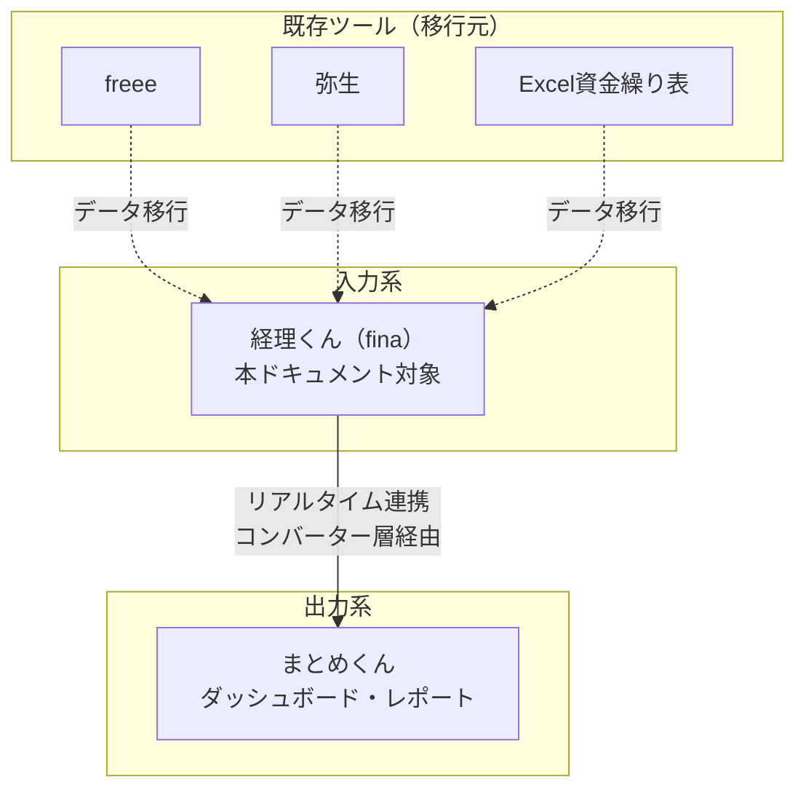

# 経理くん（fina）ユーザー要求定義書

| 項目 | 内容 |
|---|---|
| ドキュメントID | UR-001 |
| バージョン | 1.0 |
| 作成日 | 2026-05-14 |
| 想定読者 | 兵頭代表、経理担当者、業務責任者 |
| 出典 | docs/requirements.md, docs/USER_MANUAL.md, docs/dashboard-data-design.md, docs/pdf_vs_implementation_diff.md |
| ステータス | 統合版（既存4ドキュメントを正規化） |

---

## 1. プロジェクト概要

### 1.1 背景（なぜ経理くんを作るのか）

兵頭代表のグループ12社は、建設業7社・広告業2社・その他3社が混在する複合企業群である。各社の経理運用が個別ツール（freee/弥生/Excel）に分散しており、以下の業務課題が顕在化している（出典: requirements.md §1, §2）。

- **資金状況の可視化遅延**: 12社合算の現金見通しを把握するのに、各社からのExcel回収と手集計が必要。
- **会社間取引の不整合**: グループ会社間の貸借・サービス相殺が、各社個別入力で二重計上・片落ちが発生。
- **証憑管理の非効率**: 紙の請求書・通帳照合がボトルネックとなり、月締めが遅延。
- **権限分離の欠如**: 経費入力担当者に口座残高・他社情報まで見えてしまうリスク。
- **法令対応の負担**: 電子帳簿保存法・インボイス制度に対する既存ツールの対応が個社ばらつき。

経理くんは、これらの課題を「現金主義の単一資金管理システム」として集約し、ダッシュボード（まとめくん）へリアルタイムにデータを連携することで解決する。

### 1.2 目的・ゴール

| ゴール | 達成指標（KPI候補）[要確認] |
|---|---|
| 12社の現金フローを単一DBで管理 | 全社の月末残高が翌営業日までに確定 |
| 経費・売上・原価・給与の入力導線を業務役割に合わせて分離 | 入力者が他社/口座残高を一切閲覧不可 |
| 月締め業務を月次5営業日以内に完了 | 月締めボタン押下から60秒以内にロック |
| 電子帳簿保存法・インボイス制度対応 | 証憑PDF・インボイス番号の必須項目化 |
| 会社間取引の片落ち防止 | グループ間入力1回で両社へ自動反映 |

### 1.3 対象12グループ会社一覧と特徴

出典: requirements.md §2, dashboard-data-design.md §1.1

#### 建設業（7社）

| # | 会社名 | 略称 | 業種 | 決算月 | 経理運用の特徴 |
|---|---|---|---|---|---|
| 1 | 起工業 | 起工業 | 建設業 | 3月 | [要確認] |
| 2 | 起グループ | 起グループ | 建設業 | 3月 | [要確認] |
| 3 | 松村建設 | 松村建設 | 建設業 | 3月 | [要確認] |
| 4 | 佐藤建設工業 | 佐藤建設 | 建設業 | 3月 | [要確認] |
| 5 | 吉川建設 | 吉川建設 | 建設業 | 3月 | [要確認] |
| 6 | 建設サポート | 建設サポート | 建設業 | 3月 | [要確認] |
| 7 | エイトグループ | エイトG | 建設業 | 3月 | [要確認] |

#### 広告業（2社）

| # | 会社名 | 略称 | 業種 | 決算月 | 経理運用の特徴 |
|---|---|---|---|---|---|
| 8 | WINNERS | WINNERS | 広告業 | 3月 | WINNERS立替営業交通費の自動仕訳ルールあり |
| 9 | CAREECH | CAREECH | 広告業 | 3月 | [要確認] |

#### その他（3社）

| # | 会社名 | 略称 | 業種 | 決算月 | 経理運用の特徴 |
|---|---|---|---|---|---|
| 10 | WINNERS CLUB | W-CLUB | その他 | 3月 | [要確認] |
| 11 | G-FARM | G-FARM | その他 | 3月 | [要確認] |
| 12 | インフィニティグループ | インフィニティ | その他 | 3月 | [要確認] |

[要確認] 各社個別の経理運用ルール詳細（給与区分23件の各社配分、原価支払の業界特性、特殊な控除カテゴリ等）は要ヒアリング。建設業7社では「外注費・労務費・材料費・現場経費」の原価4分類が固定的に運用される想定（出典: dashboard-data-design.md §4）。

---

## 2. ステークホルダー

出典: requirements.md §4, USER_MANUAL.md §3

| 役割 | 関心事 | 意思決定権限 | 想定担当 |
|---|---|---|---|
| **代表者（兵頭氏）** | グループ全体の資金状況、戦略的意思決定 | システム最終承認、月締め解除承認 | 兵頭代表 |
| **経理責任者（ADMIN）** | 全社のマスタ管理、月締め、確定操作 | 全機能の実行権限、ユーザー追加、科目作成、月締め解除 | グループ経理責任者 |
| **経理担当者（OPERATOR）** | 担当会社の経費・売上入力、証憑添付 | 自分の入力データの作成・編集（確定前まで）、準備完了遷移 | 各社経理スタッフ |
| **資金繰り閲覧者（VIEWER）** | 残高確認、通帳照合 | 閲覧のみ、通帳照合点（照合ライン）設定可 | 監査担当、経営者 |
| **給与管理者（給与専用ロール）** [要確認] | 給与確定 | 給与の確定操作 | 給与計算担当者 |

> [要確認] 「給与管理者ロール」は requirements.md §6.4 に言及があるが、3ロール体系（ADMIN/OPERATOR/VIEWER）の中で独立ロールとして実装されるか、ADMINに包含されるかは未確定。

---

## 3. 業務上の課題（As-Is）

### 3.1 現行業務フロー

出典: requirements.md §1, USER_MANUAL.md §1

### 3.2 現行ツールと不満点

| ツール | 利用範囲 | 不満点 |
|---|---|---|
| freee | 一部の会社の会計 | 12社横断のキャッシュフローが見えない、会社間取引の入力が二重 |
| 弥生 | 一部の会社の会計 | UIが入力者に最適化されていない、口座残高が誰でも見える |
| Excel | 資金繰り表、給与計算 | 月末の通帳照合が手作業、繰り延べ機能なし、Mermaid的な視覚化ゼロ |
| 紙の現金出納帳 | 一部小規模会社 | 集計に時間、検索不可、電帳法非対応 |

[要確認] 各社で実際に使われているツールの内訳・移行範囲は未確定。

---

## 4. 実現したい姿（To-Be）

### 4.1 業務イメージ

出典: USER_MANUAL.md §6

- **月初**: 定期テンプレートから固定取引を自動生成
- **日々**: 受領BOXで請求書を1件ずつ処理→ステータスを進める
- **支払日**: FB（全銀）データ出力→銀行へアップロード
- **月末**: 通帳と照合→月締めボタンで翌月繰越

### 4.2 想定利用シーン（ペルソナ別）

| ペルソナ | 主な利用シーン |
|---|---|
| **経理担当者（建設業）** | 工事原価の人工・法定福利費・材料費・消費税の4列固定入力、控除内訳の登録、現金引出バッチ作成 |
| **経理担当者（広告業）** | 売上請求・入金消込、控除（振込手数料・前倒し入金・値引）の管理 |
| **経理責任者** | 全社マスタ管理、月末照合、月締め、グループ集約レポート確認、まとめくん連携監視 |
| **代表者** | ダッシュボードで各社メイン口座の直近入出金（前3行＋後5行）を確認、全社合計タイル閲覧 |
| **税理士・社労士** [要確認] | レポート出力（残高一覧、項目別集計）、監査ログ閲覧 |

---

## 5. 機能要望一覧

出典: requirements.md §6-§12, dashboard-data-design.md, pdf_vs_implementation_diff.md

| ID | 機能名 | 優先度 | 要望元/根拠 |
|---|---|---|---|
| REQ-001 | 経費入力（単票形式、固定/変動/臨時の3タブ） | Must | requirements.md §6.1 |
| REQ-002 | 経費確定BOX（権限制限・受領日管理） | Must | requirements.md §4追補, expense_fix_tasks.md T-04 |
| REQ-003 | 売上入力（請求＋分割入金＋控除内訳） | Must | requirements.md §6.2 |
| REQ-004 | 原価支払入力（計上額＋振込額の二段管理） | Must | requirements.md §6.3 |
| REQ-005 | 給与入力（合計入力テンプレ、社保15%/消費税10%自動積立） | Must | requirements.md §6.4-§6.5 |
| REQ-006 | 資金繰り表（会社×口座×月、ドラッグ並替、即時残高再計算） | Must | requirements.md §7 |
| REQ-007 | 同日同時ルール（引落→振込→入金順） | Must | pdf_vs_implementation_diff.md P1 |
| REQ-008 | 通帳照合点（照合ライン）機能 | Must | requirements.md §4追補, expense_fix_tasks.md T-08 |
| REQ-009 | 月締め・月締め解除（理由必須、監査ログ） | Must | requirements.md §4追補 |
| REQ-010 | 会社間資金移動（双方向自動生成） | Must | requirements.md §8.1 |
| REQ-011 | 同一会社内資金移動（A→B、二重保持なし） | Must | requirements.md §8.2 |
| REQ-012 | グループ間入力メニュー | Must | requirements.md §6追補, pdf_vs_implementation_diff.md P7 |
| REQ-013 | 定期支払テンプレート（頻度・休日調整・金額タイプ） | Must | requirements.md §9 |
| REQ-014 | 借入管理（元金均等/据置/一括、金利変更履歴） | Must | requirements.md §10 |
| REQ-015 | リース管理（単純スケジュール、車両分類） | Must | requirements.md §11, pdf_vs_implementation_diff.md P9 |
| REQ-016 | 現金引出（親子明細＋金種表、最小枚数提案） | Must | requirements.md §4追補 |
| REQ-017 | 印刷・検索・フィルター（全体/部分、Ctrl+F相当） | Must | requirements.md §7.5 |
| REQ-018 | 繰り延べ機能（翌月へ） | Must | requirements.md §7.4 |
| REQ-019 | マスタ管理（会社/口座/取引先/科目/給与グループ/控除カテゴリ） | Must | requirements.md §12, requirements.md追補 |
| REQ-020 | 仮取引先名フィールド（マスタ未登録時の入力許可） | Must | expense_fix_tasks.md T-01 |
| REQ-021 | 仮振込先口座（銀行/支店/種別/口座番号/名義カナ） | Must | expense_fix_tasks.md §4.2 |
| REQ-022 | 取引先正規化（仮→正規への紐付け、監査ログ） | Must | expense_fix_tasks.md T-13 |
| REQ-023 | 証憑PDF添付（複数添付、後日追添付ハイライト） | Must | requirements.md §6.1, expense_fix_tasks.md T-10 |
| REQ-024 | 証憑メタ情報（取引日/取引先/金額）＋検索 | Should | expense_fix_tasks.md T-11 |
| REQ-025 | 受領日管理（証憑添付で自動セット、手修正可） | Must | expense_fix_tasks.md T-02 |
| REQ-026 | 証憑なしOKフラグ（管理者のみ付与） | Must | expense_fix_tasks.md T-03 |
| REQ-027 | 今月のみ例外フラグ（次月以降の繰り返しに影響させない） | Must | expense_fix_tasks.md T-09 |
| REQ-028 | 自動仕訳マッピング（給与控除→対応カテゴリ） | Must | requirements.md §6.5 |
| REQ-029 | 銀行・支店マスタ（全銀コード初期同梱） | Must | requirements.md追補 |
| REQ-030 | 手数料マスタ（出金口座×本支店/他支店/他行×金額帯） | Must | requirements.md追補 |
| REQ-031 | FB（全銀）データ出力（総合振込/給与/賞与） | Must | requirements.md追補 |
| REQ-032 | 振込バッチ管理（確認済→FB出力→振込済の状態管理） | Must | requirements.md追補 |
| REQ-033 | 納税予定表（法人税・消費税の中間納税自動生成） | Should | pdf_vs_implementation_diff.md P9 |
| REQ-034 | カード明細管理（Excel取込、引落取引へ転記） | Should | pdf_vs_implementation_diff.md P9 |
| REQ-035 | 会社グループ管理（持株会社単位等のグループ化） | Should | pdf_vs_implementation_diff.md P10 |
| REQ-036 | 売上項目マスタ（対象会社チェック、デフォルト区分） | Should | pdf_vs_implementation_diff.md P10 |
| REQ-037 | 業種マスタ（建設/広告/その他、追加可） | Should | pdf_vs_implementation_diff.md P10 |
| REQ-038 | ダッシュボード（メイン口座の前3行＋後5行表示） | Must | requirements.md追補 |
| REQ-039 | グループ別サマリ（全社合計タイル＋グループ別カード） | Must | pdf_vs_implementation_diff.md P1 |
| REQ-040 | グループ間入金/出金の区別表示（紫の左ボーダー＋G間バッジ） | Must | pdf_vs_implementation_diff.md Phase4 |
| REQ-041 | 未達表示（予定日超過・未確定の薄色＋未達バッジ） | Must | pdf_vs_implementation_diff.md Phase4 |
| REQ-042 | 帳票作成（資金移動・振込・現金+金種表のA4印刷HTML） | Must | pdf_vs_implementation_diff.md Phase4 |
| REQ-043 | 会社情報パネル（法人番号/設立日/資本金/e-Tax/経理担当） | Must | pdf_vs_implementation_diff.md Phase4 |
| REQ-044 | Excel/CSV取込（売上・原価・給与・カード明細） | Must | pdf_vs_implementation_diff.md Phase2 |
| REQ-045 | 仮想口座（社会保険積立・消費税積立、デフォルト非表示） | Must | requirements.md §5.1, requirements.md追補 |
| REQ-046 | 監査ログ（変更前後・操作者・日時、月締め後変更ログ） | Must | requirements.md追補, expense_fix_tasks.md T-06 |
| REQ-047 | DX外部API連携 | Could | requirements.md §16, pdf_vs_implementation_diff.md（Excel取込で代替） |
| REQ-048 | まとめくんへのリアルタイムデータ連携（コンバーター層） | Must | requirements.md §13 |
| REQ-049 | パスワードリセット機能 | Should [要確認] | USER_MANUAL.md §2（現在未実装） |
| REQ-050 | メール通知（請求書受領、月締めリマインド等） | Could [要確認] | 出典なし |

---

## 6. 非機能要望

出典: requirements.md §15, USER_MANUAL.md 付録, DEPLOYMENT.md

### 6.1 性能

| 項目 | 要望 | 根拠 |
|---|---|---|
| 月次データ量 | 数千件規模 | requirements.md §15 |
| 残高再計算 | 即時（ドラッグ操作と同時） | requirements.md §15 |
| ページレスポンス | [要確認] 2秒以内目標 | 出典なし |
| 同時接続数 | [要確認] 50ユーザー想定 | 出典なし |
| 関数タイムアウト | 30秒（Vercel maxDuration） | DEPLOYMENT.md トラブルシューティング |

### 6.2 セキュリティ

| 項目 | 要望 | 根拠 |
|---|---|---|
| 認証 | メール＋パスワード（Better Auth） | DEPLOYMENT.md, requirements.md追補 |
| セッション保持 | 30日間（チェックを外せば都度） | USER_MANUAL.md §2 |
| ロール制御 | ADMIN/OPERATOR/VIEWERの3段階 | USER_MANUAL.md §3 |
| 権限分離 | OPERATORは口座残高・他社情報を閲覧不可 | requirements.md §4追補 |
| 監査ログ | 操作者・日時・変更前後を保持 | requirements.md §16, expense_implementation_audit.md §3.10 |
| 月締め後の変更 | 摘要・科目のみ可（金額・取消不可）、変更ログ必須 | requirements.md追補 |
| 月締め解除 | ADMIN限定、理由必須 | requirements.md追補 |

### 6.3 可用性・運用

| 項目 | 要望 | 根拠 |
|---|---|---|
| ホスティング | Vercel（Production/Preview/Development） | DEPLOYMENT.md |
| DB | Supabase（PostgreSQL + Storage） | DEPLOYMENT.md |
| バックアップ | [要確認] Supabaseの自動バックアップに依存 | 出典なし |
| 災対 | [要確認] | 出典なし |
| 監視・アラート | [要確認] | 出典なし |

### 6.4 法令対応

| 項目 | 要望 | 根拠 |
|---|---|---|
| 電子帳簿保存法 | 証憑PDFのストレージ保管、検索可能 | requirements.md §16, requirements.md追補 |
| インボイス制度 | 会社マスタにインボイス登録番号、取引先にも対応 [要確認] | requirements.md追補, dashboard-data-design.md §1 |
| 消費税区分 | 課税/非課税の管理 [要確認] | requirements.md追補 |
| 監査ログ保持期間 | 無期限 | db_design.md 4.8 |

### 6.5 UI/UX

| 項目 | 要望 | 根拠 |
|---|---|---|
| 言語 | 日本語UI | requirements.md §15 |
| 通貨表示 | 円（¥）、千円区切り | requirements.md §15 |
| テーマ | ダーク/ライトモード対応 | requirements.md §15 |
| レスポンシブ | モバイル対応（証憑写真撮影等） | requirements.md §15, USER_MANUAL.md §1 |
| 推奨ブラウザ | Chrome / Edge / Safari の最新版 | USER_MANUAL.md 付録 |
| 推奨画面サイズ | 1280×800以上 | USER_MANUAL.md 付録 |

---

## 7. スコープ外（やらないこと）

出典: requirements.md §1, requirements.md §16

| # | スコープ外項目 | 理由 |
|---|---|---|
| OOS-01 | ダッシュボード・レポート表示の本格機能 | まとめくんの役割（経理くんは入力・管理に特化） |
| OOS-02 | 個人単位の給与明細管理 | 給与グループ単位の合計入力で代替 |
| OOS-03 | 元利均等返済の借入計算 | 初期対象外（元金均等/据置/一括のみ） |
| OOS-04 | 銀行借入の高度な利息自動計算（変動金利・不定期返済） | 工数大、Phase 2以降の検討 |
| OOS-05 | DX外部API連携（リアルタイム） | 仕様未定、Excel/CSV取込で代替実装済み |
| OOS-06 | 連結資金繰り/集計くん連携I/F詳細 | Phase 2 検討事項 |
| OOS-07 | OCRによる証憑自動読み取り | [要確認] 検討事項 |
| OOS-08 | 仕訳の発生主義モード | 経理くんは現金主義で運用 |

---

## 8. 制約条件

出典: DEPLOYMENT.md, requirements.md, USER_MANUAL.md

| カテゴリ | 制約内容 |
|---|---|
| **予算** | [要確認] |
| **期間** | [要確認] Phase 1〜4 が 2026-05-12〜2026-05-14 で実装済み（出典: pdf_vs_implementation_diff.md） |
| **技術スタック** | Next.js 15 / React 19 / TypeScript / Tailwind CSS / shadcn/ui / Prisma / PostgreSQL（Supabase）/ Better Auth / Supabase Storage（証憑PDF） |
| **インフラ** | Vercel（Hobby はタイムアウト10秒制限、Pro以上推奨） |
| **既存連携先** | まとめくん（コンバーター層経由でリアルタイム送信） |
| **会計基準** | 現金主義（実際の入出金日で計上） |
| **マルチテナント** | 1DB内に全12社、`companyId` で分離 |
| **金額型** | BigInt（円単位、小数点なし） |
| **削除方針** | マスタは物理削除しない（isActive=false で無効化） |

---

## 9. 未確定事項・要確認リスト

出典: requirements.md §16, requirements.md追補 末尾

| # | 未確定事項 | 重要度 | 担当 |
|---|---|---|---|
| Q-01 | 各社個別の経理運用ルール（給与区分23件の配分、特殊控除カテゴリ） | High | 経理責任者 |
| Q-02 | 「給与管理者ロール」の独立実装 vs ADMIN包含 | Medium | 経理責任者 |
| Q-03 | 各マスタ画面（取引先/契約地点/給与グループ/控除カテゴリ/銀行・支店/手数料）の登録フロー詳細 | High | UI担当 |
| Q-04 | 証憑PDFの一括取込・閲覧UI詳細 | Medium | 業務責任者 |
| Q-05 | FB（全銀）データ出力のフォーマット（総合振込/給与振込、文字種、テスト手順） | High | 経理責任者 |
| Q-06 | 監査ログの粒度（最終更新者・更新日時のみ／変更前後の履歴／理由必須など）の最終決定 | Medium | 法務・監査 |
| Q-07 | 連結資金繰り/集計くん連携I/F詳細（出力形式、タイミング、エラー処理） | Medium | システム連携責任者 |
| Q-08 | 銀行借入の利息自動計算・変動金利・不定期返済の実装範囲 | Low | 経理責任者 |
| Q-09 | ダッシュボード（各社メイン口座の直近入出金表示ルール、表示件数、フィルタ）の最終仕様 | Medium | 業務責任者 |
| Q-10 | 各種一覧/レポート（会社別残高、口座別残高、グループ全体残高、項目別集計）の画面配置と出力仕様詳細 | High | 業務責任者 |
| Q-11 | パスワードリセット機能の実装方針（メール認証 vs 管理者リセット） | Medium | システム管理者 |
| Q-12 | メール通知の対象イベント（請求書受領、月締めリマインド、未達アラート等） | Low | 業務責任者 |
| Q-13 | 借入計算式の精密検証（`借入額÷回数=100未満切捨 返済額×(回数-1)=元金調整額`） | Medium | 経理責任者 |
| Q-14 | 取引先のグループ共通化（現状 companyId で分離） | Low | 経理責任者 |
| Q-15 | 作業員給与の原価への自動反映ロジック | Medium | 経理責任者 |
| Q-16 | パスワードポリシー、二要素認証の実装可否 | Medium | システム管理者 |
| Q-17 | 同時接続数・性能目標値の明確化 | Medium | システム管理者 |
| Q-18 | バックアップ・災対方針 | Medium | システム管理者 |
| Q-19 | 課税/非課税区分の管理項目 | Medium | 経理責任者 |
| Q-20 | インボイス番号の取引先側管理（経過措置対応） | Medium | 経理責任者 |
| Q-21 | データ移行方針（既存freee/弥生からの取り込み手順とマッピング） | High | 業務責任者 |

---

## 10. 用語集（ユーザー向け）

出典: USER_MANUAL.md §8, requirements.md各セクション

| 用語 | 意味 |
|---|---|
| **資金繰り表** | 現金の出入りを時系列で一覧化した表（会社×口座×月の単位） |
| **月締め** | その月の取引を確定し、編集不可ロックすること |
| **計上月** | その取引を「何月分」として計上するか（YYYY-MM、実出納日とは別概念） |
| **予定日（実行予定日）** | 実際に出納される予定の日 |
| **実出納日** | 実際に出納が行われた日 |
| **照合点（通帳照合点・照合ライン）** | 通帳の実残高と一致した時点をマーキングする機能 |
| **証憑** | 取引の裏付けとなる書類（請求書・領収書PDF等） |
| **証憑なしOK** | 管理者のみ付与可能なフラグ。証憑なしでも準備完了・確定可能にする |
| **正規化** | 仮入力した取引先名を、マスタの正式取引先と紐付ける作業 |
| **FBデータ** | 全銀協フォーマットの振込データファイル |
| **同日同時ルール** | 同日内では「引落→振込/移動/現金→入金」順で並べる |
| **休日調整** | 支払予定日が祝日・土日の場合に前後の営業日へ自動移動（前営業日/次営業日/なし） |
| **準備完了（READY）** | 入力が完了して確定待ちの状態。OPERATORが遷移可能 |
| **確定（CONFIRMED）** | 取引を確定した状態。ADMINのみ遷移可能（経費の場合）。月締めまで編集可能 |
| **下書き（DRAFT）** | 入力途中の状態 |
| **仮取引先** | マスタ未登録の取引先名を一時的に保存できる仕組み（橙色＋「仮」バッジ表示） |
| **受領BOX（経費確定BOX）** | 請求書を受け取った時の最初の入り口画面。証憑＋金額＋取引先が揃ったら準備完了にできる |
| **支払月BOX** | `/expenses` の名称。実行予定日ベースで月選択して経費を一覧する画面 |
| **仮想口座** | 社会保険積立・消費税積立を会社ごとに自動付与する内部口座（デフォルト非表示） |
| **同日同時ルール** | 引落 > 資金移動/振込/現金 > 入金 の順で並べる |
| **グループ間取引** | グループ会社同士の貸付・配当・サービス相殺。グループ間入力メニューで一方が入力すると相手会社にも自動反映 |
| **金種表** | 現金引出時の1円〜1万円までの枚数明細表。最小枚数優先で自動提案 |
| **未達** | 予定日を超過しているのに未確定の取引（薄色＋「未達」バッジ表示） |
| **G間バッジ** | 資金繰り表の行に表示される、グループ間取引を示すバッジ（紫の左ボーダー付き） |
| **まとめくん** | 経理くんが連携する別システム。ダッシュボード・レポート表示を担当 |

---

## 11. 経理くんと既存システムの位置づけ

出典: requirements.md §1, §13

経理くんは「入力・管理に特化」し、可視化はまとめくん（別システム）が担当する分業構造。

---

## 12. 受入基準（UAT観点・業務側）

業務側の受入観点を以下に示す。詳細な技術受入基準は `02_system_requirements.md` §9 を参照。

| # | 受入観点 | 合格基準 |
|---|---|---|
| UAT-01 | OPERATORで他社・他口座が見えない | ログイン後、自分の担当会社のみ選択可能 |
| UAT-02 | 経費入力→受領BOX→準備完了→確定の一連 | 5分以内に完了 |
| UAT-03 | 売上の分割入金（3回分）が控除内訳と一致したら確定可能 | エラー表示なく確定ボタン押下可能 |
| UAT-04 | 月締め後に金額変更を試みると拒否される | エラーメッセージ表示 |
| UAT-05 | 月締め解除に理由を入れずに実行すると拒否される | バリデーションエラー |
| UAT-06 | グループ間入力1回で両社に取引が表示される | 両社の資金繰り表で確認可能 |
| UAT-07 | 給与の社保積立（15%）・消費税積立（10%）が自動計算される | 課税支給100万円→社保15万円・消費税10万円が仮想口座に反映 |
| UAT-08 | 同日内の取引が「引落→振込→入金」順で並ぶ | 資金繰り表の表示順を確認 |
| UAT-09 | 現金引出バッチで金種表合計＝引出金額にならないと確定不可 | エラー表示 |
| UAT-10 | 印刷ボタンから資金繰り表のA4印刷HTMLが開く | 別ウィンドウで印刷可能な形式で表示 |
| UAT-11 | 全社合計タイル＋グループ別カードが表示される | グループ別サマリページで月別表示 |
| UAT-12 | 通帳照合点を設定すると、残高不一致時に警告が出る | 残高アラート表示 |

---

**出典一覧:**
- docs/requirements.md（全836行）
- docs/USER_MANUAL.md（全396行）
- docs/dashboard-data-design.md（全640行）
- docs/pdf_vs_implementation_diff.md（全264行）
- docs/expense_fix_tasks.md（全181行）
- docs/expense_implementation_audit.md（全282行）
- docs/expense_implementation_plan.md（全553行）
- docs/db_design.md（全490行）
- docs/DEPLOYMENT.md（全73行）
