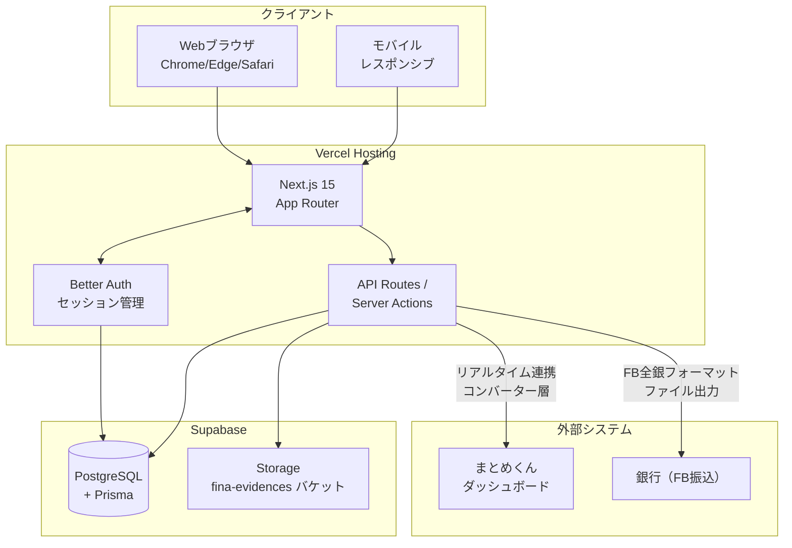

# 経理くん（fina）システム要件定義書

| 項目 | 内容 |
|---|---|
| ドキュメントID | SR-001 |
| バージョン | 1.0 |
| 作成日 | 2026-05-14 |
| 想定読者 | 開発ベンダー、社内エンジニア、システム責任者 |
| 出典 | docs/requirements.md, docs/db_design.md, docs/dashboard-data-design.md, docs/DEPLOYMENT.md, docs/pdf_vs_implementation_diff.md |
| 関連文書 | 01_user_requirements.md、03_screen_design.md、04_functional_spec.md |

---

## 1. システム化の目的とKPI

### 1.1 目的

グループ12社の財務データ入力・管理を一元化し、現金主義ベースの資金管理を実現する単一情報源（SSOT）を提供する。データは「まとめくん」へリアルタイム連携し、可視化はまとめくん側で行う（出典: requirements.md §1）。

### 1.2 KPI

| KPI | 目標値 | 測定方法 |
|---|---|---|
| 月締め所要日数 | 月次5営業日以内 | 月締めボタン押下日の集計 |
| 残高再計算レスポンス | 1秒以内 | ドラッグ操作→残高反映の時間 |
| ページ初期表示 | 3秒以内 [要確認] | Vercel Analytics |
| 関数タイムアウト | 30秒以内 | Vercel maxDuration |
| データ整合性 | 100%（会社間取引の片落ち0件） | linkedTransactionId 整合性監査 |
| 監査ログ漏れ | 0件 | Prisma Middleware自動記録 |

---

## 2. システム全体像

### 2.1 システム構成図



出典: requirements.md（技術スタック）, DEPLOYMENT.md, dashboard-data-design.md

### 2.2 外部連携

| 連携先 | 用途 | 方向 | 形式 | 状況 |
|---|---|---|---|---|
| **まとめくん** | ダッシュボード・レポート表示 | 経理くん → まとめくん | API（コンバーター層経由） | [要確認] I/F未定 |
| **銀行（全銀協）** | FBデータ振込 | 経理くん → 銀行 | 全銀協フォーマットファイル | Phase 2想定 |
| **国税庁API** | インボイス番号検証 | 経理くん → 国税庁 | REST API [要確認] | 出典なし／未実装 |
| **DX外部API** | 売上/原価/給与の自動取込 | DX → 経理くん | [要確認] | Excel/CSV取込で代替実装 |
| **Better Auth** | 認証基盤 | 内部利用 | DB方式セッション | 実装済み（NextAuth.js から移行済み） |
| **Supabase Storage** | 証憑PDF保管 | 経理くん → Supabase | S3互換API（バケット名 `fina-evidences`） | 実装済み |

---

## 3. 機能要件

### 3.1 機能一覧表

出典: requirements.md, USER_MANUAL.md §5, dashboard-data-design.md, pdf_vs_implementation_diff.md

| 機能ID | 機能名 | 概要 | 関連画面 | 関連API |
|---|---|---|---|---|
| F-DSB-001 | ダッシュボード | 会社ごとの概要画面（メイン口座残高、経費確定待ち件数、グループタイル） | `/dashboard` | `getDashboardSummary`, `getGroupDashboardSummary` |
| F-DSB-002 | グループ別サマリ | 全社合計＋グループ別カード、月切替 | `/dashboard`（拡張） | `getGroupDashboardSummary` |
| F-CFT-001 | 資金繰り表（メイン画面） | 会社×口座×月の取引一覧、ドラッグ並替、即時残高再計算 | `/cashflow-table` | `getCashFlowTable`, `updateRowOrder`, `closeMonth`, `reopenMonth` |
| F-CFT-002 | 同日同時ルール表示 | 引落→振込/移動/現金→入金 順 | `/cashflow-table` | `paymentPriority`（内部関数） |
| F-CFT-003 | 通帳照合点機能 | 照合点設定で残高一致確認 | `/cashflow-table` | `getCheckpoints`, `createCheckpoint`, `updateCheckpoint`, `deleteCheckpoint` |
| F-CFT-004 | 帳票作成（資金移動・振込・現金） | A4印刷HTML別ウィンドウ | `/cashflow-table` | `buildReportHtml`, `cashflow-reports` |
| F-CFT-005 | 翌月へ繰り延べ | 行選択→繰り延べボタン | `/cashflow-table` | `defer_transactions` |
| F-CFT-006 | 印刷・検索・フィルター | 全体/部分印刷、Ctrl+F相当 | `/cashflow-table` | – |
| F-CFT-007 | 未達表示 | 予定日超過・未確定の薄色＋未達バッジ | `/cashflow-table` | `getCashFlowTable`内 `isOverdue` 算出 |
| F-CFT-008 | グループ間入金/出金区別表示 | 紫の左ボーダー＋G間バッジ | `/cashflow-table` | `interGroupDeposit/Withdrawal` 集計 |
| F-EXP-001 | 経費入力 | 単票形式、固定/変動/臨時タブ | `/expenses` | `createTransaction`, `updateTransaction`, `deleteTransaction` |
| F-EXP-002 | 経費確定BOX（受領BOX） | 請求書受領の最初の入り口 | `/expense-box` | `getExpenseBoxItems`, `updateTransaction` |
| F-EXP-003 | 仮取引先入力 | マスタ未登録の取引先名を一時保存 | `/expenses`, `/expense-box` | `createTransaction`（`temporaryVendorName`） |
| F-EXP-004 | 仮振込先口座入力 | 銀行/支店/種別/口座番号/名義カナ | `/expenses` | `TemporaryBankAccount` モデル |
| F-EXP-005 | 取引先正規化 | 仮→正規への紐付け、監査ログ | `/expenses` | `normalizePartner` |
| F-EXP-006 | 証憑添付（複数） | PDF/画像、後日追添付ハイライト（48時間以内NEW） | `/expense-box`, `/expenses` | `uploadEvidence`, `deleteEvidence`, `updateEvidenceMeta` |
| F-EXP-007 | 証憑メタ情報検索 | 取引日/取引先名/金額で部分一致 | `/expense-box` | `searchEvidenceByMeta` |
| F-EXP-008 | 受領日管理 | 証憑添付で自動セット、手修正可 | `/expense-box` | `updateTransaction`（`receivedDate`） |
| F-SLS-001 | 売上入力 | 請求＋分割入金＋控除内訳 | `/sales` | `createSalesTransaction`, `addPayment`, `updateDeductions` |
| F-SLS-002 | 売上控除内訳（前月項目自動コピー） | 起動時に項目のみコピー、金額は0 | `/sales` | `copyPreviousDeductions` |
| F-COST-001 | 原価支払入力 | 計上額＋振込額の二段管理 | `/cost-payments` | `createCostPayment`, `updateCostPayment` |
| F-COST-002 | 原価支払の4列固定明細 | 労務費/法定福利/材料雑費/消費税 | `/cost-payments` | – |
| F-SLR-001 | 給与入力 | 合計入力テンプレ、社保15%/消費税10%自動積立 | `/salary` | `createSalaryEntry`, `updateSalaryEntry` |
| F-SLR-002 | 給与Excel取込 | 合計入力専用テンプレ | `/salary` | `salary-excel-import` |
| F-SLR-003 | 給与自動仕訳マッピング | 控除→対応カテゴリへ自動取引生成 | `/salary` | `salaryJournalMapping` |
| F-IG-001 | グループ間入力 | 双方向自動反映 | `/inter-group` | `createInterGroupTransaction`, `updateInterGroupTransaction`, `deleteInterGroupTransaction`, `ensureSameGroup` |
| F-FT-001 | 資金移動 | 口座間振替、双方向リンク | `/fund-transfers` | `createFundTransfer`, `updateFundTransfer`, `deleteFundTransfer` |
| F-CW-001 | 現金引出（親子明細＋金種表） | 最小枚数優先で自動提案 | `/cash-withdrawals` | `createCashWithdrawal`, `proposeDenomination` |
| F-LOAN-001 | 借入管理 | 元金均等/据置/一括、金利変更履歴 | `/loans` | `createLoanContract`, `generateSchedule`, `updateInterestRate` |
| F-LOAN-002 | 借入契約PDF印刷 | A4印刷HTML別ウィンドウ | `/loans` | `printLoanContract` |
| F-LEASE-001 | リース管理 | 単純スケジュール、車両分類 | `/leases` | `createLeaseContract`, `generateLeaseSchedule` |
| F-LEASE-002 | 車両支払シミュレーションマトリクス | 契約×月の表示 | `/leases` | `getVehicleLeaseMatrix` |
| F-TAX-001 | 納税予定表 | 法人税・消費税の中間納税自動生成 | `/tax-schedule` | `getTaxSchedule`, `generateInterimTaxSchedules` |
| F-CARD-001 | カード明細管理 | Excel取込、引落取引へ転記 | `/card-statements` | `importCardStatements`, `transferToTransactions` |
| F-RT-001 | 定期支払テンプレート | 頻度/休日調整/金額タイプ、月初一括生成 | `/recurring` | `createRecurringTemplate`, `generateRecurringTransactions`, `autoGenerateRecurringTransactions` |
| F-MC-001 | 月締め・解除 | ADMIN限定、解除は理由必須 | `/month-close` | `closeMonth`, `reopenMonth` |
| F-MST-001 | 会社マスタ | 会社情報・口座・代表者・インボイス番号等 | `/master/companies` | `getCompanies`, `createCompany`, `updateCompany` |
| F-MST-002 | 銀行口座マスタ | 会社×口座、FB設定・手数料設定 | `/master/accounts` [要確認] | `getAccounts`, `createAccount`, `updateAccount` |
| F-MST-003 | 取引先マスタ | タグ・複数振込先・デフォルト科目・契約地点 | `/master/partners` [要確認] | `getPartners`, `createPartner`, `updatePartner` |
| F-MST-004 | 勘定科目マスタ | 大6→中36→小67の3階層、ADMIN限定 | `/master/categories` | `getCategories`, `createMidCategory`, `updateMidCategory`, `createSubCategory`, `updateSubCategory` |
| F-MST-005 | 給与グループマスタ | 区分（原価/販管/外注）、支給日、控除セット | `/master/payroll-groups` [要確認] | – |
| F-MST-006 | 控除カテゴリマスタ | 売上用/原価用、デフォルト科目 | `/master/deduction-categories` [要確認] | – |
| F-MST-007 | 銀行・支店マスタ | 全銀コード初期同梱 | `/master/banks` | `getBanks`, `getBranches` |
| F-MST-008 | 業種マスタ | 建設/広告/その他、追加可 | `/master/industries` | `getIndustries`, `createIndustry`, `updateIndustry` |
| F-MST-009 | 会社グループマスタ | グループ化（持株会社単位等） | `/master/company-groups` | `getCompanyGroups`, `createCompanyGroup`, `updateCompanyGroup` |
| F-MST-010 | 売上項目マスタ | 対象会社チェック、デフォルト区分 | `/master/sales-items` | `getSalesItems`, `createSalesItem`, `getSalesItemsForCompany` |
| F-AUTH-001 | ログイン/ログアウト | メール＋パスワード、Better Auth | `/login`, `/register` | Better Auth標準 |
| F-AUTH-002 | ユーザー設定 | ロール・担当会社、UserProfile | `/master/users` [要確認] | `getCurrentUserProfile`, `updateUserProfile` |
| F-FB-001 | FBデータ出力 | 確認済バッチをFB全銀フォーマットで出力 | `/transfer-batches` [要確認] | `exportFB` [要確認] |
| F-AUDIT-001 | 監査ログ取得 | 全変更履歴の閲覧 | `/audit-logs` [要確認] | `getAuditLogs` |

### 3.2 各機能の入出力・前提条件・例外処理

#### F-CFT-001 資金繰り表
- **入力**: companyId, accountId, yearMonth, filters
- **出力**: CashFlowRow[], 期首/期末残高, 入金/支払合計, 予測月末残高, checkpoints[]
- **前提**: ログイン済み、担当会社へのアクセス権あり
- **例外**: 該当データなし→空配列、権限不足→403エラー

#### F-EXP-001 経費入力
- **入力**: companyId, accountId, partnerId/temporaryVendorName, scheduledDate, transactionDate(?), accountingMonth, amount, paymentMethod, classification, summary, details[], evidences[]
- **出力**: Transaction（status=DRAFT）
- **前提**: companyId へのアクセス権、accountId が companyId に属する、partnerId または temporaryVendorName のいずれか必須
- **例外**:
  - 金額0以下 → バリデーションエラー
  - 月締め後の作成 → 拒否
  - 必須項目欠落 → 行単位エラー表示

#### F-EXP-002 経費確定BOX
- **入力**: filters（受領日範囲、証憑あり/なし/OK、取引先、予定日、摘要部分一致）, page, pageSize
- **出力**: { data: Transaction[], total, totalPages }
- **対象明細の出し分け条件**（OR）:
  - 証憑が1つ以上添付済み（hasEvidence=true）
  - 受領日が入力済み（receivedDate IS NOT NULL）
  - 証憑なしOK（evidenceNotRequired=true）
- **前提**: 自分の担当会社のデータのみ取得
- **例外**: 検索条件全空時はデフォルト「未準備完了のみ」

#### F-SLR-001 給与入力
- **入力**: payrollGroupId, payMonth, payDate, taxablePayment, transportAllowance, miscExpenses, carryoverAdjust, advanceExpenses, deductions[], paymentDetails[]
- **出力**: SalaryEntry + SalaryDeduction[] + SalaryPaymentDetail[]
- **整合チェック（必須一致）**:
  - 総支給 − 控除合計 = 差引支給
  - 差引支給 = 支払内訳合計
- **自動計算**:
  - 社保積立 = 課税支給 × 15%
  - 消費税積立 = 課税支給 × 10%
- **準備完了条件**: 整合チェック2件が一致
- **確定条件**: 給与管理者ロールのみ
- **例外**: 整合不一致 → 準備完了不可

詳細は `04_functional_spec.md` §4 を参照。

---

## 4. データ要件

### 4.1 主要エンティティ一覧

出典: db_design.md §2

| カテゴリ | エンティティ | 役割 |
|---|---|---|
| **認証** | UserProfile | ユーザー拡張（役割・担当会社） |
| **マスタ** | Company | 会社マスタ（12社、増減可） |
| **マスタ** | Account | 銀行口座・仮想口座 |
| **マスタ** | AccountRole | 口座の役割（複数選択可） |
| **マスタ** | AccountCategoryMajor | 大項目（PL区分6件） |
| **マスタ** | AccountCategoryMid | 中項目（勘定科目36件） |
| **マスタ** | AccountCategorySub | 小項目（補助科目67件） |
| **マスタ** | TradingPartner | 取引先マスタ |
| **マスタ** | TradingPartnerBankAccount | 取引先の振込先口座（複数可） |
| **マスタ** | TradingPartnerDefault | 取引先デフォルト科目 |
| **マスタ** | TradingPartnerSite | 契約/地点テンプレ |
| **マスタ** | PayrollGroup | 給与グループマスタ |
| **マスタ** | DeductionCategory | 控除カテゴリ（売上用/原価用） |
| **マスタ** | BankMaster | 銀行マスタ（全銀コード初期同梱） |
| **マスタ** | BranchMaster | 支店マスタ（初期同梱） |
| **マスタ** | IndustryMaster | 業種マスタ（建設/広告/その他） |
| **マスタ** | CompanyGroup | 会社グループ |
| **マスタ** | CompanyGroupMember | 会社グループメンバー |
| **マスタ** | SalesItemMaster | 売上項目マスタ |
| **マスタ** | TemporaryBankAccount | 仮振込先口座 |
| **トランザクション** | Transaction | 取引データ（親子構造の親） |
| **トランザクション** | TransactionDetail | 取引明細（子、控除明細含む） |
| **トランザクション** | MonthlyBalance | 月次口座残高 |
| **トランザクション** | SalaryEntry | 給与入力データ |
| **トランザクション** | SalaryDeduction | 給与控除明細 |
| **トランザクション** | SalaryPaymentDetail | 給与支払内訳（出金イベント） |
| **トランザクション** | FundTransfer | 資金移動 |
| **トランザクション** | Evidence | 証憑ファイル |
| **トランザクション** | ReconciliationCheckpoint | 通帳照合チェックポイント |
| **バッチ** | CashWithdrawalBatch | 現金引出バッチ |
| **バッチ** | CashDenomination | 金種表 |
| **バッチ** | TransferBatch | 振込バッチ（FB出力用） |
| **バッチ** | TransferBatchItem | 振込バッチ明細 |
| **バッチ** | ImportBatch | インポートバッチ |
| **テンプレ** | RecurringTemplate | 定期支払テンプレート |
| **借入** | LoanContract | 借入契約 |
| **借入** | LoanSchedule | 借入返済スケジュール |
| **リース** | LeaseContract | リース契約 |
| **リース** | LeaseSchedule | リーススケジュール |
| **給与** | SalaryJournalMapping | 給与自動仕訳マッピング |
| **税** | TaxPaymentSchedule | 納税予定表 |
| **カード** | CreditCard | クレジットカード |
| **カード** | CardStatement | カード明細 |
| **運用** | MonthClose | 月締め管理 |
| **運用** | AuditLog | 監査ログ |

### 4.2 ERD（概略）

```mermaid
erDiagram
  Company ||--o{ Account : has
  Company ||--o{ TradingPartner : has
  Company ||--o{ Transaction : has
  Company ||--o{ PayrollGroup : has
  Company ||--o{ LoanContract : has
  Company ||--o{ LeaseContract : has
  Company ||--o{ RecurringTemplate : has
  Company ||--o{ MonthClose : has
  Company ||--o{ TaxPaymentSchedule : has
  Company ||--o{ CreditCard : has
  Company }o--o{ CompanyGroup : "via CompanyGroupMember"

  Account ||--o{ AccountRole : has
  Account ||--o{ MonthlyBalance : has
  Account ||--o{ Transaction : "used in"
  Account ||--o{ ReconciliationCheckpoint : has

  TradingPartner ||--o{ TradingPartnerBankAccount : has
  TradingPartner ||--o| TradingPartnerDefault : has
  TradingPartner ||--o{ TradingPartnerSite : has
  TradingPartner ||--o{ Transaction : "involved in"

  AccountCategoryMajor ||--o{ AccountCategoryMid : has
  AccountCategoryMid ||--o{ AccountCategorySub : has
  AccountCategoryMid ||--o{ TransactionDetail : "used in"
  AccountCategorySub ||--o{ TransactionDetail : "used in"

  Transaction ||--o{ TransactionDetail : has
  Transaction ||--o{ Evidence : has
  Transaction ||--o| Transaction : "parent (self-ref)"
  Transaction ||--o| Transaction : "linked (inter-company)"

  PayrollGroup ||--o{ SalaryEntry : has
  SalaryEntry ||--o{ SalaryDeduction : has
  SalaryEntry ||--o{ SalaryPaymentDetail : has

  LoanContract ||--o{ LoanSchedule : has
  LeaseContract ||--o{ LeaseSchedule : has

  CashWithdrawalBatch ||--o{ CashDenomination : has
  TransferBatch ||--o{ TransferBatchItem : has

  RecurringTemplate ||--o{ Transaction : "generates"
  DeductionCategory ||--o{ TransactionDetail : "categorizes"

  BankMaster ||--o{ BranchMaster : has

  UserProfile ||--o{ AuditLog : "creates"
```



詳細なフィールド定義は `04_functional_spec.md` §2 を参照。

### 4.3 データ移行方針

出典: requirements.md追補（インポート関連）, pdf_vs_implementation_diff.md Phase 2

| 既存システム | 移行対象 | 方式 | 状況 |
|---|---|---|---|
| freee | 取引・残高 | Excel/CSV取込（DX連携代替） | 実装済み |
| 弥生 | 取引・残高 | Excel/CSV取込 | 実装済み |
| Excel資金繰り表 | 取引・残高 | 手入力 + Excel取込 | 実装済み |
| 紙の現金出納帳 | 取引 | 手入力 | – |

**取込列仕様**（出典: pdf_vs_implementation_diff.md Phase 2）:
- **売上**: 予定入金日 / 元請会社名 / 請求金額（任意: 実入金日 / 実入金金額 / 摘要）
- **原価**: 予定支払日 / 支払先 / 計上額（任意: 実支払日 / 振込額 / 摘要）
- **カード明細**: 利用日 / 利用店名 / 金額（任意: カテゴリ / 摘要）

**未登録マスタの扱い**（出典: requirements.md追補）:
- 取引先/科目未登録時はインポートを一旦停止
- 自動作成可否を確認（変換マッピング or 自動作成）
- 自動作成時もプレビュー → 管理者承認後に登録
- カード明細: `{cardId, statementDate, storeName, amount}` のハッシュで重複排除
- 取引先名一致で既存マスタとリンク、未登録なら自動作成（売上→CUSTOMER、原価→SUBCONTRACTOR）

[要確認] freee/弥生からの初期一括移行の手順詳細・マッピングルール（科目変換テーブル等）。

---

## 5. 非機能要件

### 5.1 性能

| 項目 | 要件 | 根拠 |
|---|---|---|
| 月次データ量 | 数千件規模 | requirements.md §15 |
| 同時接続数 | [要確認] 50ユーザー想定 | – |
| ページ初期表示 | [要確認] 3秒以内 | – |
| ドラッグ&残高再計算 | 即時（1秒以内） | requirements.md §15 |
| Server Action タイムアウト | 30秒（Vercel maxDuration） | DEPLOYMENT.md |
| 大量データのページング | 100件/ページ | expense_implementation_plan.md U-5 |

### 5.2 セキュリティ

| 項目 | 要件 | 根拠 |
|---|---|---|
| 認証方式 | Better Auth（メール+パスワード、DB方式セッション） | DEPLOYMENT.md, requirements.md追補 |
| セッション保持 | 30日間（Remember Me可） | USER_MANUAL.md §2 |
| クッキー | `__Secure-better-auth.session_token`（Secure、HttpOnly） | DEPLOYMENT.md §5 |
| ロール制御 | ADMIN/OPERATOR/VIEWER + 給与管理者 [要確認] | USER_MANUAL.md §3 |
| 認可（API層） | `requireSession()` + `verifyCompanyAccess()` + ロール別ガード | expense_implementation_audit.md §3.1 |
| 認可（UI層） | `isOperator` 等の条件分岐で表示制御 | expense_implementation_audit.md §3.6 |
| マルチテナント分離 | `companyId` 必須フィルタ、UserProfile.assignedCompanyIds | requirements.md §3 |
| 監査ログ | Prisma Middlewareで自動記録（CREATE/UPDATE/DELETE/CONFIRM/UNCONFIRM/MONTH_CLOSE/MONTH_REOPEN/PARTNER_NORMALIZED） | db_design.md 4.8 |
| 月締め後制約 | 金額・取消変更禁止、摘要・科目変更ログ必須 | requirements.md追補 |
| 月締め解除 | ADMINのみ、理由必須 | requirements.md追補 |
| パスワードポリシー | [要確認] | – |
| 二要素認証 | [要確認] | – |
| 暗号化 | DB at rest（Supabase標準）, 通信HTTPS | DEPLOYMENT.md |
| 機密環境変数 | `SUPABASE_SERVICE_ROLE_KEY`, `BETTER_AUTH_SECRET` をSensitive扱い | DEPLOYMENT.md §2 |

### 5.3 可用性 / バックアップ / 災対

| 項目 | 要件 | 根拠 |
|---|---|---|
| ホスティング | Vercel（Production: fina-five.vercel.app） | USER_MANUAL.md §2, requirements.md trustedOrigins |
| DB | Supabase PostgreSQL（Transaction Pooler 6543 + Session Pooler 5432） | DEPLOYMENT.md §3 |
| ストレージ | Supabase Storage（バケット名: `fina-evidences`） | DEPLOYMENT.md §1 |
| バックアップ | [要確認] Supabaseの自動バックアップに依存 | – |
| 災対 | [要確認] | – |
| SLA | [要確認] | – |
| 監視・アラート | [要確認] | – |

### 5.4 運用保守

| 項目 | 要件 | 根拠 |
|---|---|---|
| デプロイ | GitHub push → Vercel自動ビルド（`vercel-build` スクリプト） | DEPLOYMENT.md §4 |
| ビルドコマンド | `prisma generate && next build`（migrate deploy は別途） | git log: `Vercel: vercel-build から prisma migrate deploy を外す` |
| マイグレーション | 開発時 `prisma migrate dev`、本番 `prisma migrate deploy` | db_design.md 7.5 |
| ロールバック | [要確認] DB破壊的変更は2段階方式 | requirements.md v1.2 §10.8 |
| ログ | Vercel Logs + Supabase Logs | DEPLOYMENT.md |
| 監査ログ保持 | 無期限 | db_design.md 4.8 |

---

## 6. 技術スタック前提

出典: requirements.md 末尾, DEPLOYMENT.md

| レイヤー | 技術 | 備考 |
|---|---|---|
| **フロントエンド** | Next.js 15 (App Router), React 19, TypeScript | App Router、Server Components |
| **UIライブラリ** | Tailwind CSS, shadcn/ui | テーマ対応 |
| **D&D** | dnd-kit | 資金繰り表の行並替 |
| **バックエンド** | Next.js API Routes (Route Handlers), Server Actions | – |
| **ORM** | Prisma | Middleware で監査ログ自動記録 |
| **DB** | PostgreSQL (Supabase) | スキーマ名 `fina`、Transaction Pooler + Session Pooler |
| **認証** | Better Auth | NextAuth.js から移行済み |
| **ファイルストレージ** | Supabase Storage（バケット `fina-evidences`） | 元仕様はAWS S3、実装はSupabase |
| **ホスティング** | Vercel | Production: fina-five.vercel.app |
| **CI/CD** | GitHub Actions [要確認] / Vercel自動ビルド | DEPLOYMENT.md |
| **祝日マスタ** | `lib/holidays.ts` | 2025-2028年分ハードコード + 春分秋分ルックアップ |

[要確認] 元のrequirements.md末尾では `AWS App Runner + CloudFront + Neon` と記述されているが、実装は Vercel + Supabase に変更済み。本書では実装に合わせる。

---

## 7. マルチテナント方針

出典: requirements.md §3, db_design.md 設計方針

### 7.1 分離方式

- **1DB / 1スキーマ（`fina`）内に全12社のデータを格納**
- 全テーブルが `companyId` カラムを持ち、アプリケーション層で必ずフィルタ
- `UserProfile.role` + 担当会社リスト（[要確認] 単一会社固定か複数会社可かは要確認）で許可範囲を制御

### 7.2 アクセス制御パターン

```typescript
// 全Server Actionの先頭で実施
async function someAction(companyId: string) {
  await requireSession()                  // ログイン必須
  await verifyCompanyAccess(companyId)    // 担当会社チェック
  // ADMINロール限定操作の場合
  const profile = await getCurrentUserProfile()
  if (profile?.role !== "ADMIN") throw new Error("管理者のみ実行できます")
  // ...
}
```

### 7.3 会社の増減

- 会社マスタで追加・修正・非表示が可能
- データ紐づきのない会社のみ削除可能（取引・口座・マスタ参照があれば削除不可、利用停止/非表示で運用）
- メイン口座は会社あたり原則1つ（会社マスタで必須）
- 会社登録時に仮想口座2つ（社保積立・消費税積立）を自動生成

---

## 8. 法令・会計基準対応

### 8.1 電子帳簿保存法

| 要件 | 実装方針 | 根拠 |
|---|---|---|
| 証憑PDFの保管 | Supabase Storage（バケット `fina-evidences`） | DEPLOYMENT.md |
| 検索可能 | 取引日/取引先名/金額のメタ情報＋全文検索 | expense_implementation_audit.md §3.7 |
| 訂正・削除履歴 | 監査ログ（AuditLog）に変更前後を保持 | db_design.md 4.8 |
| タイムスタンプ | [要確認] Trusted Timestamping認定TSAとの連携 | – |
| 検索要件（取引年月日・金額・取引先） | 検索フィルタで対応 | expense_implementation_audit.md §3.7 |

### 8.2 インボイス制度

| 要件 | 実装方針 | 根拠 |
|---|---|---|
| 会社マスタに登録番号 | `Company.invoiceNumber` | dashboard-data-design.md §1 |
| 取引先マスタに登録番号 | [要確認] | – |
| 経過措置（80%・50%控除）対応 | [要確認] | – |
| 課税/非課税区分 | [要確認] 取引明細レベルで管理 | – |

### 8.3 消費税区分

| 要件 | 実装方針 | 根拠 |
|---|---|---|
| 消費税の自動仕訳 | 給与: 課税支給×10%を自動積立 | requirements.md §6.5 |
| 原価支払の消費税列 | 4列固定（労務費/法定福利/材料雑費/**消費税**） | requirements.md §6.3 |
| 中間納税（48万/400万/4800万閾値） | 自動生成（消費税） | pdf_vs_implementation_diff.md P9 |

### 8.4 法人税対応

| 要件 | 実装方針 | 根拠 |
|---|---|---|
| 中間納税（20万閾値） | 自動生成 | pdf_vs_implementation_diff.md P9 |
| 納税予定表 | `/tax-schedule` ページ + `TaxPaymentSchedule` | pdf_vs_implementation_diff.md P9 |

---

## 9. 受入基準（UAT観点）

### 9.1 機能受入基準

| # | カテゴリ | 受入基準 |
|---|---|---|
| AC-01 | 認証 | ログイン→ダッシュボード表示が成功する。30日のセッション保持を確認 |
| AC-02 | 認可 | OPERATORで他社データ閲覧・編集が拒否される（403エラー） |
| AC-03 | 認可 | VIEWERで取引作成が拒否される。照合点設定は成功する |
| AC-04 | 認可 | OPERATORで月締め・科目変更が拒否される（「管理者のみ実行できます」） |
| AC-05 | 経費入力 | 仮取引先名のみで保存→準備完了が可能。マスタ正規化後に置き換わる |
| AC-06 | 経費入力 | 証憑添付時に受領日が自動セットされる。手修正も可能 |
| AC-07 | 経費入力 | 月締め後の金額変更が拒否される。摘要・科目変更はログ付きで成功する |
| AC-08 | 売上入力 | 分割入金3回が控除合計と一致しないと確定不可。一致すると確定成功 |
| AC-09 | 原価支払 | 分割支払中（未払残あり）は確定不可 |
| AC-10 | 給与 | 課税支給100万円→社保15万円・消費税10万円が自動計算される |
| AC-11 | 給与 | 整合チェック2件（総支給−控除合計=差引支給、差引支給=支払内訳合計）が一致しないと準備完了不可 |
| AC-12 | 資金繰り表 | 同日内が「引落→振込/移動/現金→入金」順で並ぶ |
| AC-13 | 資金繰り表 | ドラッグ&ドロップで行を並べ替え→残高が即時再計算される |
| AC-14 | 資金繰り表 | 通帳照合点を設定→残高不一致時に警告表示 |
| AC-15 | 資金繰り表 | 未達（予定日超過・未確定）が薄色＋未達バッジ表示される |
| AC-16 | 資金繰り表 | グループ間取引が紫の左ボーダー＋G間バッジ表示される |
| AC-17 | 資金移動 | 会社間移動入力1回で双方の資金繰り表に反映される |
| AC-18 | 現金引出 | 金種表合計≠引出金額の場合、確定不可 |
| AC-19 | 月締め | ADMINのみ実行可能。解除は理由必須 |
| AC-20 | グループ間入力 | 支払会社入力→受取会社に自動でミラー取引生成 |
| AC-21 | 借入 | 元金均等・据置・一括の各方式で返済表が正しく生成される |
| AC-22 | リース | 車両分類リースの車両マトリクス（契約×月）が表示される |
| AC-23 | 納税予定表 | 法人税20万・消費税48万閾値で中間納税が自動生成される |
| AC-24 | カード明細 | Excel取込→重複排除→引落取引へ転記が成功する |
| AC-25 | FB出力 | 確認済バッチからFB全銀フォーマットファイルが出力される [要確認] |
| AC-26 | まとめくん連携 | 取引保存時にリアルタイムでまとめくんへ送信される [要確認] |

### 9.2 非機能受入基準

| # | 観点 | 基準 |
|---|---|---|
| NF-01 | 性能 | 資金繰り表（500件）の表示が3秒以内 |
| NF-02 | 性能 | ドラッグ操作→残高再計算が1秒以内 |
| NF-03 | セキュリティ | OPERATORが直接APIを叩いて月締め実行を試みると拒否される |
| NF-04 | セキュリティ | パスワードがハッシュ化されてDBに保存される（Better Auth標準） |
| NF-05 | 監査 | 全変更操作がAuditLogに記録される（変更者・日時・変更前後） |
| NF-06 | UI | ダーク/ライトモード切替で全画面が崩れない |
| NF-07 | UI | モバイル（1280×800未満）でも主要操作が可能 |
| NF-08 | 法令 | 月締め後の取引にAuditLogでの完全な追跡可能性がある |

---

## 10. 関連ドキュメント

- 業務側要求 → `01_user_requirements.md`
- 画面詳細 → `03_screen_design.md`
- 機能・データ・API詳細 → `04_functional_spec.md`
- DB詳細スキーマ → `docs/db_design.md`（既存）
- デプロイ手順 → `docs/DEPLOYMENT.md`（既存）

---

**出典:**
- docs/requirements.md（特に §1-§16、追補2026-03-02）
- docs/db_design.md（特に §2、§4、§5、§6、§7）
- docs/USER_MANUAL.md（§2、§3、付録）
- docs/dashboard-data-design.md（§1、§10）
- docs/pdf_vs_implementation_diff.md（Phase 1-4 履歴）
- docs/DEPLOYMENT.md（§1-§6）
- docs/expense_implementation_audit.md（§3）
- docs/expense_implementation_plan.md（§3-§5）
