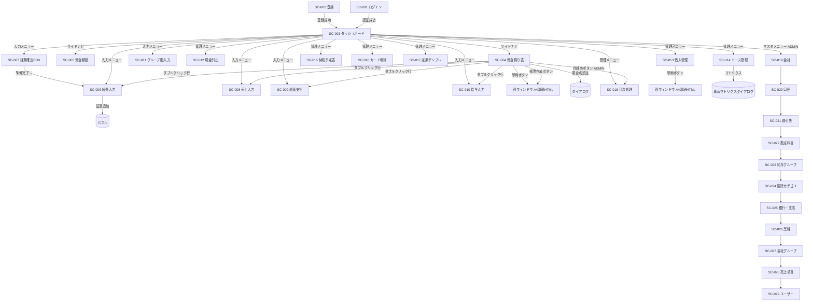

# 経理くん（fina）画面設計書

| 項目 | 内容 |
|---|---|
| ドキュメントID | SD-001 |
| バージョン | 1.0 |
| 作成日 | 2026-05-14 |
| 想定読者 | フロントエンド実装担当 |
| 出典 | docs/USER_MANUAL.md, docs/requirements.md, docs/pdf_vs_implementation_diff.md, docs/dashboard-data-design.md |

---

## 1. デザイン原則

### 1.1 配色

| トークン | 用途 | 値 |
|---|---|---|
| Primary | 主要アクション（保存、確定） | [要確認] shadcn/uiデフォルト |
| Destructive | 削除、月締め解除 | 赤系 |
| Warning | 未達、整合警告 | オレンジ系（要件「赤表示」 from requirements.md §9.3） |
| Inter-group | グループ間取引 | 紫（左ボーダー） |
| Reserve（仮想口座） | 社保積立・消費税積立 | [要確認] |
| Status DRAFT | 下書き | グレー |
| Status READY | 準備完了 | 青 |
| Status CONFIRMED | 確定 | 緑 |
| Status CANCELLED | 取消 | グレー（薄色） |

出典: requirements.md §15「ダーク/ライトモード対応」, pdf_vs_implementation_diff.md Phase4。

### 1.2 タイポグラフィ

| 用途 | 仕様 |
|---|---|
| 基本フォント | システムフォント（shadcn/ui標準） |
| 数値 | `font-mono` 等幅フォント（金額、日付） |
| 日本語 | 標準（Noto Sans JP等想定） [要確認] |
| 通貨表記 | `¥` + 千円区切り（`Intl.NumberFormat('ja-JP')`） |
| 日付表記 | `YYYY-MM-DD` / 日付列は `DD` のみ |

出典: requirements.md §15、db_design.md 7.2、expense_implementation_audit.md §3.2

### 1.3 コンポーネント方針

- shadcn/ui（Button, Card, Dialog, DropdownMenu, Input, Label, Select, Table, Tabs, Toast, Badge, Pagination等）をベースに利用
- 独自コンポーネント例: `EvidencePanel`, `DeductionDetailsPanel`, `VehicleMatrixDialog`, `Pagination`, `EvidenceSearch`
- ダーク/ライトモードはTailwind `dark:` プレフィックスで切替

### 1.4 レスポンシブ方針

| 画面サイズ | 対応 |
|---|---|
| デスクトップ（1280×800以上） | 主要対応 |
| タブレット（768-1279px） | サイドナビ折りたたみ、テーブルは横スクロール |
| モバイル（767px以下） | 主に閲覧用途、証憑写真撮影は可（USER_MANUAL.md §1） |

---

## 2. 画面一覧

出典: USER_MANUAL.md §5, pdf_vs_implementation_diff.md, 各 `app/(dashboard)/*/page.tsx` パスから推定

| 画面ID | 画面名 | URL | 概要 | 主要ユーザー | 関連機能ID |
|---|---|---|---|---|---|
| SC-001 | ログイン | `/login` | メール＋パスワード認証 | 全ロール | F-AUTH-001 |
| SC-002 | アカウント登録 | `/register` | 新規ユーザー登録 | 新規ユーザー | F-AUTH-001 |
| SC-003 | ダッシュボード | `/dashboard` | 会社概要、メイン口座残高、グループ別タイル | 全ロール | F-DSB-001, F-DSB-002 |
| SC-004 | 資金繰り表 | `/cashflow-table` | メイン画面、取引一覧 | OPERATOR, ADMIN, VIEWER | F-CFT-001〜F-CFT-008 |
| SC-005 | 資金移動 | `/fund-transfers` | 口座間振替 | OPERATOR, ADMIN | F-FT-001 |
| SC-006 | 経費入力（支払月BOX） | `/expenses` | 経費取引の登録・編集、3タブ（固定/変動/臨時） | OPERATOR, ADMIN | F-EXP-001 |
| SC-007 | 経費確定BOX（受領BOX） | `/expense-box` | 請求書受領処理 | OPERATOR, ADMIN | F-EXP-002 |
| SC-008 | 売上入力 | `/sales` | 売上請求と入金消込 | OPERATOR, ADMIN | F-SLS-001, F-SLS-002 |
| SC-009 | 原価支払 | `/cost-payments` | 工事原価・仕入先への支払 | OPERATOR, ADMIN | F-COST-001, F-COST-002 |
| SC-010 | 給与入力 | `/salary` | 給与グループ単位の合計入力 | OPERATOR, ADMIN（給与管理者） | F-SLR-001, F-SLR-002, F-SLR-003 |
| SC-011 | グループ間入力 | `/inter-group` | グループ会社間取引 | OPERATOR, ADMIN | F-IG-001 |
| SC-012 | 現金引出 | `/cash-withdrawals` | ATM・窓口での現金引出 | OPERATOR, ADMIN | F-CW-001 |
| SC-013 | 借入管理 | `/loans` | 借入契約・返済表 | ADMIN | F-LOAN-001, F-LOAN-002 |
| SC-014 | リース管理 | `/leases` | リース契約・支払スケジュール | ADMIN | F-LEASE-001, F-LEASE-002 |
| SC-015 | 納税予定表 | `/tax-schedule` | 法人税・消費税の納税予定 | ADMIN | F-TAX-001 |
| SC-016 | カード明細 | `/card-statements` | クレジットカード明細 | ADMIN | F-CARD-001 |
| SC-017 | 定期テンプレート | `/recurring` | 毎月発生する定期取引のテンプレート | ADMIN | F-RT-001 |
| SC-018 | 月次処理 | `/month-close` [要確認] | 月締め・解除 | ADMIN | F-MC-001 |
| SC-019 | 会社マスタ | `/master/companies` | 会社情報の登録・編集 | ADMIN | F-MST-001 |
| SC-020 | 銀行口座マスタ | `/master/accounts` [要確認] | 口座マスタ管理 | ADMIN | F-MST-002 |
| SC-021 | 取引先マスタ | `/master/partners` [要確認] | 取引先マスタ管理 | ADMIN | F-MST-003 |
| SC-022 | 勘定科目マスタ | `/master/categories` | 大/中/小の3階層 | ADMIN | F-MST-004 |
| SC-023 | 給与グループマスタ | `/master/payroll-groups` [要確認] | 給与グループ管理 | ADMIN | F-MST-005 |
| SC-024 | 控除カテゴリマスタ | `/master/deduction-categories` [要確認] | 売上用/原価用控除カテゴリ | ADMIN | F-MST-006 |
| SC-025 | 銀行・支店マスタ | `/master/banks` | 全銀コード | ADMIN | F-MST-007 |
| SC-026 | 業種マスタ | `/master/industries` | 業種（建設/広告/その他） | ADMIN | F-MST-008 |
| SC-027 | 会社グループマスタ | `/master/company-groups` | グループ化（持株単位等） | ADMIN | F-MST-009 |
| SC-028 | 売上項目マスタ | `/master/sales-items` | 売上の内訳項目 | ADMIN | F-MST-010 |
| SC-029 | ユーザー設定 | `/master/users` [要確認] | ロール・担当会社 | ADMIN | F-AUTH-002 |
| SC-030 | 振込バッチ | `/transfer-batches` [要確認] | FB出力管理 | ADMIN | F-FB-001 |
| SC-031 | 監査ログ | `/audit-logs` [要確認] | 全変更履歴閲覧 | ADMIN | F-AUDIT-001 |

---

## 3. 画面遷移図



---

## 4. 共通レイアウト

出典: USER_MANUAL.md §4

### 4.1 ヘッダー

| 要素 | 説明 |
|---|---|
| 左: ロゴ | 「経理くん（fina）」テキストロゴ |
| 中央: ページタイトル | 現在表示中の画面名 |
| 右1: 会社セレクター | プルダウン、ページごとに状態保持 |
| 右2: ユーザーメニュー | アバター + プルダウン（ログアウト等） |
| 右3: テーマ切替 | ダーク/ライトモードトグル |

### 4.2 サイドナビ（左側）

```
┌──────────────┐
│ 経理くん     │
├──────────────┤
│ ▼ （無印）   │
│   ダッシュボード│
│   グループ別サマリ│
│   資金繰り表  │
│   資金移動    │
├──────────────┤
│ ▼ 入力       │
│   経費入力    │
│   経費確定BOX │
│   売上入力    │
│   原価支払    │
│   給与入力    │
│   グループ間入力│
├──────────────┤
│ ▼ 管理       │
│   現金引出    │
│   借入管理    │
│   リース管理  │
│   納税予定表  │
│   カード明細  │
│   定期テンプレ│
│   月次処理    │
├──────────────┤
│ ▼ マスタ ADMIN│
│   会社一覧    │
│   会社グループ │
│   銀行口座    │
│   銀行・支店  │
│   業種        │
│   売上項目    │
│   取引先      │
│   給与グループ│
│   勘定科目    │
│   控除カテゴリ│
│   設定        │
└──────────────┘
```

### 4.3 フッター

| 要素 | 説明 |
|---|---|
| バージョン表記 | `fina v1.0` [要確認] |
| 著作権 | © Winners |

### 4.4 モーダル / ダイアログ

- Radix UI（shadcn/ui Dialog）ベース
- ESCキーで閉じる、外側クリックで閉じる
- 確認系（削除・解除）は破壊操作色（Destructive）でボタン強調
- 月締め解除時は理由入力必須のテキストエリア表示

### 4.5 トースト

- 成功（緑系）/ エラー（赤系）/ 警告（黄系）/ 情報（青系）
- 右下に表示、4秒で自動消去 [要確認]
- shadcn/ui Toast

---

## 5. 画面別詳細

### 5.1 SC-003 ダッシュボード

**目的**: 担当会社の概要を一目で確認する起点画面。

**利用シーン**: ログイン直後、月初の状況確認、グループ全体の資金状況確認。

**画面ラフ**:

```
┌─────────────────────────────────────────────────────────┐
│ ヘッダー                            [会社▼ 起工業 ▼] [👤]│
├─────────────────────────────────────────────────────────┤
│ ダッシュボード                                            │
│                                                            │
│ ┌─概要タイル─────────────────────┐                       │
│ │ 口座数: 3 / 取引先: 45        │                       │
│ │ 今月の取引件数: 89             │                       │
│ │ 経費確定待ち: 12 件           │                       │
│ └────────────────────────────────┘                       │
│                                                            │
│ ┌─メイン口座 直近入出金────────────────────────────────┐│
│ │ メイン口座 (起工業 ◯◯銀行) 残高: ¥1,234,567        ││
│ │  ─────────────────────────────────                  ││
│ │ 05-12 △△商事        振込 ¥-100,000  残高 ¥1,134,567││
│ │ 05-13 ××建設        入金 ¥+500,000  残高 ¥1,634,567││
│ │ ────照合点 05-13 残高 ¥1,634,567 ───────────────────││
│ │ 05-15 給与振込予定  振込 ¥-800,000  残高 ¥0,834,567││
│ │ ...                                                  ││
│ └─────────────────────────────────────────────────────┘│
│                                                            │
│ ┌─全社合計タイル─────────────────────────────────────┐│
│ │ 全社合計 残高: ¥12,345,678                            ││
│ │ 入金: ¥3,000,000 / 出金: ¥-2,500,000               ││
│ └─────────────────────────────────────────────────────┘│
│                                                            │
│ ┌─グループ別カード─┐ ┌─グループ別カード─┐               │
│ │ 建設業 (7社)    │ │ 広告業 (2社)    │ ...           │
│ │ 残高: ¥...      │ │ 残高: ¥...      │               │
│ │ 起工業 ¥...    │ │ WINNERS ¥...   │               │
│ │ 松村建設 ¥...  │ │ CAREECH ¥...   │               │
│ │ ...            │ │                  │               │
│ └────────────────┘ └────────────────┘                 │
└─────────────────────────────────────────────────────────┘
```

**表示項目**:

| 項目 | 型 | 必須 | バリデーション | データ取得元 |
|---|---|---|---|---|
| 会社セレクター | string | ○ | UserProfileの担当会社のみ | UserProfile.assignedCompanyIds [要確認] |
| 口座数 | number | – | – | `count(Account where companyId=?)` |
| 取引先数 | number | – | – | `count(TradingPartner where companyId=?)` |
| 今月の取引件数 | number | – | – | `count(Transaction where companyId=? and accountingMonth=今月)` |
| 経費確定待ち件数 | number | – | – | `count(Transaction where type=EXPENSE and status in (DRAFT, READY))` |
| メイン口座取引 | rows | – | 実出納日最終行を基準に前3+後5行 | `getDashboardSummary(companyId)` |
| 全社合計タイル | numbers | – | – | `getGroupDashboardSummary` |
| グループ別カード | array | – | – | `getGroupDashboardSummary` |

**アクション**:

| ボタン/UI | 遷移先/動作 | 確認ダイアログ | API |
|---|---|---|---|
| 会社プルダウン | ページ全体を該当会社に切替 | なし | – |
| 月切替 | 過去・未来の月の予測表示 | なし | `getGroupDashboardSummary(yearMonth)` |
| グループ別カードクリック | グループ詳細展開 [要確認] | なし | – |

**状態**:

| 状態 | 表示 |
|---|---|
| Loading | スケルトン |
| Empty | 「データがありません」 |
| Error | エラートースト + リトライボタン |
| Success | 通常表示 |

**権限による表示差分**:

- VIEWER: 全項目閲覧可
- OPERATOR: 自分の担当会社のタイルのみ表示
- ADMIN: 全社表示可

---

### 5.2 SC-004 資金繰り表（メイン画面）

**目的**: 選択した会社・口座・月の取引を一覧表示し、現金の出入りを時系列で把握する。

**利用シーン**: 日々の支払予定確認、ドラッグによる順序入替、通帳照合、月締め前確認。

**画面ラフ**:

```
┌─────────────────────────────────────────────────────────────┐
│ 資金繰り表  [会社: 起工業▼] [口座: 普通預金▼] [月: 2026-05▼]│
├─────────────────────────────────────────────────────────────┤
│ 期首残高: ¥1,000,000  当月入金: ¥3,500,000 (内G間 ¥500,000) │
│ 当月支払: ¥-2,800,000 (内G間 ¥-200,000) 予測月末残高: ¥1,700,000│
│ [会社情報] [印刷] [帳票作成] [一括繰延] [月締め] (ADMIN)    │
├─────────────────────────────────────────────────────────────┤
│ □ │実出│予定│種別│区分│取引先  │入金│支払│残高│摘要│方法│..│
│ □ │05-12│-  │振込│変動│△△商事│   │-10万│..│...│振込│..│
│ □ │05-13│05-13│入金│-  │××建設│+50万│  │..│...│-   │..│
│ ▬▬照合点 05-13 残高 ¥1,634,567 (verified)▬▬               │
│ □ │05-15│-  │振込│固定│給与...│   │-80万│..│...│振込│..│
│ ⚠未達│-   │05-14│振込│臨時│◯◯  │   │-5万│..│...│振込│..│ (薄色)│
│ 🟣│G間│05-16│-  │TRSF│変動│エイトG│+20万│  │..│G間│-  │..│
└─────────────────────────────────────────────────────────────┘
```

**表示項目**（出典: requirements.md §7.1, expense_implementation_audit.md §3.8）:

| 項目 | 型 | 必須 | バリデーション | データ取得元 |
|---|---|---|---|---|
| 会社セレクター | string | ○ | UserProfileの担当会社のみ | – |
| 口座セレクター | string | ○ | 選択会社の口座のみ、仮想口座はデフォルト非表示 | `Account where companyId=? and isVisible=true` |
| 月セレクター | string YYYY-MM | ○ | – | – |
| 実出納日 | date | – | – | `transactions.transactionDate` |
| 予定日 | date | – | – | `transactions.scheduledDate` |
| 取引種別 | enum | ○ | EXPENSE/SALES/COST_PAYMENT/SALARY/LOAN/TRANSFER | `transactions.type` |
| 区分（固定/変動/臨時） | enum | – | FIXED/VARIABLE/TEMPORARY | `transactions.classification` |
| 取引先 | string | – | 仮名は橙色＋「仮」バッジ | `transactions.partnerId` or `temporaryVendorName` |
| 借入/貸付金額 | bigint | – | グループ会社間のみ表示 | `transactions.amount`（type=LOAN） |
| 入金金額 | bigint | – | 正値、¥カンマ区切り | `transactions.amount > 0` |
| 支払金額 | bigint | – | 負値、¥カンマ区切り | `transactions.amount < 0` |
| 差引残高 | bigint | – | 自動計算、累積 | runningBalance（計算結果） |
| 適用（摘要） | string | – | – | `transactions.summary` |
| 中項目/小項目 | string | – | OPERATORには非表示 | `TransactionDetail` |
| 差額（予定vs実績） | bigint | – | ±表示 | `actualAmount - estimatedAmount` |
| 最終更新日 | datetime | – | 金額変更時のみ更新 | `transactions.amountUpdatedAt` |
| 支払方法 | enum | – | 振込/引落/現金引出 | `transactions.paymentMethod` |
| 取消フラグ | bool | – | デフォルト印刷対象外 | `transactions.status = CANCELLED` |
| 未達フラグ | bool | – | 動的判定 | `scheduledDate < 今日 and actualAmount IS NULL` |
| G間フラグ | bool | – | 動的判定 | `type = TRANSFER and counterCompanyId IS NOT NULL` |

**アクション**:

| ボタン/UI | 遷移先/動作 | 確認ダイアログ | API |
|---|---|---|---|
| 行ダブルクリック | 該当入力画面へ遷移（経費/売上/原価/給与） | なし | – |
| ドラッグ&ドロップ | 行の並べ替え、残高即時再計算 | なし | `updateRowOrder` |
| 複数行選択（Shift+Click） | 行選択 | なし | – |
| 一括翌月繰延ボタン | 選択行を翌月へ繰延 | あり「N件を翌月へ繰延します」 | `defer_transactions` |
| 照合点設定アイコン | 照合点ダイアログ表示 | 入力後保存 | `createCheckpoint`, `updateCheckpoint` |
| 印刷ボタン | A4印刷HTML別ウィンドウ | なし | `buildReportHtml` |
| 帳票作成ボタン | 連続選択行が同一種別の場合、別ウィンドウで帳票表示 | 種別混在時エラー | `cashflow-reports` |
| 月締めボタン (ADMIN) | 月締め実行 | あり「本当に月締めしますか？」 | `closeMonth` |
| 月締め解除ボタン (ADMIN) | 解除ダイアログ（理由必須） | あり、理由テキストエリア | `reopenMonth` |
| フィルター▼ | 列ヘッダから絞込（取引先・金額帯・空欄抽出等） | なし | – |
| Ctrl+F | 表内検索（非表示列も対象） | なし | – |

**状態**:

| 状態 | 表示 |
|---|---|
| Loading | スケルトン |
| Empty | 「該当月の取引がありません」 |
| Error | エラーToast |
| Success | 通常表示 |
| ロック状態（月締め済） | ヘッダに「月締め済」バッジ、編集ボタン非活性 |
| 未達行 | `opacity-60 italic` + 未達バッジ |
| G間行 | 紫の左ボーダー + G間バッジ |
| 取消行 | 取り消し線 + グレー文字 |

**権限による表示差分**:

| ロール | 表示・操作 |
|---|---|
| ADMIN | 全機能 |
| OPERATOR | 編集可、月締めボタン非表示、科目列はOPERATORには非表示 |
| VIEWER | 閲覧のみ、照合点設定のみ可、編集ボタン非表示 |

**エラーメッセージ一覧**:

| シナリオ | メッセージ |
|---|---|
| 月締め後の金額変更試行 | 「月締め後は金額変更できません」 |
| OPERATORの月締め試行 | 「管理者のみ実行できます」 |
| 月締め解除時の理由未入力 | 「解除理由を入力してください」 |
| 連続行が同一種別でない（帳票作成） | 「種別が混在しています。同一種別の連続行を選択してください」 |
| 残高不一致（照合点） | 「残高が一致していません: 差額¥XXX」 |

---

### 5.3 SC-006 経費入力（支払月BOX）

**目的**: 経費取引の登録・編集。区分（固定/変動/臨時）でタブ分け。

**画面ラフ**:

```
┌─────────────────────────────────────────────────────────────┐
│ 経費入力  [会社: 起工業▼] [月: 2026-05▼]                  │
├─────────────────────────────────────────────────────────────┤
│ [固定タブ] [変動タブ] [臨時タブ]            [新規作成 +]  │
├─────────────────────────────────────────────────────────────┤
│ □ │予定 │取引先  │金額  │方法│口座 │科目(ADMIN)│証憑│状態│..│
│ □ │05-15│家賃   │¥-15万│振込│普通│地代家賃   │📎  │確定│..│
│ □ │05-15│リース料│¥-3万│引落│普通│リース料   │📎  │READY│..│
│ ...                                                          │
├─────────────────────────────────────────────────────────────┤
│ [一括準備完了] [絞込: ☑未確定のみ]              [ページ▼]│
└─────────────────────────────────────────────────────────────┘
```

**表示項目**（出典: requirements.md §6.1, expense_implementation_audit.md §3.2）:

| 項目 | 型 | 必須 | バリデーション | データ取得元 |
|---|---|---|---|---|
| 会社 | string | ○ | – | – |
| 月 | YYYY-MM | ○ | 実行予定日ベース | – |
| 区分タブ | enum | ○ | FIXED/VARIABLE/TEMPORARY | – |
| 予定日 | date | – | – | `scheduledDate` |
| 取引先 | string | – | 仮名は橙色 | `partnerId` or `temporaryVendorName` |
| 金額 | bigint | – | 負値、¥カンマ | `amount` |
| 支払方法 | enum | – | 振込/引落/現金 | `paymentMethod` |
| 支払口座 | string | – | – | `accountId` |
| 科目（中/小） | string | – | OPERATORは非表示 | `details.midId`, `subId` |
| 証憑 | アイコン | – | 添付済みクリップアイコン | `hasEvidence` |
| 状態 | enum badge | – | DRAFT/READY/CONFIRMED | `status` |
| 摘要 | string | – | – | `summary` |
| 受領日 | date | – | 証憑添付で自動セット、手修正可 | `receivedDate` |
| 計上月 | YYYY-MM | ○ | – | `accountingMonth` |

**アクション**:

| ボタン/UI | 動作 | API |
|---|---|---|
| 新規作成 + | 新規行を追加（デフォルト: 月=表示中、区分=臨時、口座=デフォルト） | `createTransaction` |
| 複数選択 → 一括準備完了 | 証憑バリデーション後、一括でREADYへ | `updateTransactions[]` |
| 行クリック | 編集画面/インラインフォーム | `updateTransaction` |
| 削除アイコン | 削除（確定前のみ、月締め後不可） | `deleteTransaction` |
| 確定アイコン (ADMIN) | DRAFT/READY → CONFIRMED | `confirmTransaction` |
| 確定解除 (ADMIN) | CONFIRMED → READY | `unconfirmTransaction` |
| 証憑アイコン | EvidencePanel展開 | `uploadEvidence`, `deleteEvidence` |
| 取引先正規化 (ADMIN) | 仮取引先 → 正規取引先 | `normalizePartner` |
| ページネーション | ページ切替 | – |

**バリデーション**（出典: expense_implementation_audit.md §3.4）:

| 状態遷移 | 条件 |
|---|---|
| 下書き → 準備完了 | 金額 ＋ 取引先（正規 or 仮）＋ 証憑 (or 証憑なしOK) |
| 準備完了 → 確定 | 上記 ＋ 正規取引先 ＋ 中項目（科目）必須、ADMIN権限 |
| 月締め後 | 金額/取消変更不可、摘要・科目はログ付きで変更可 |

**エラーメッセージ**:

- 「金額を入力してください」
- 「取引先または仮取引先名を入力してください」
- 「証憑を添付するか、証憑なしOKフラグを付与してください」
- 「中項目（科目）を選択してください（確定不可）」
- 「月締め後は金額変更できません」

---

### 5.4 SC-007 経費確定BOX（受領BOX）

**目的**: 請求書を受け取った時の最初の入り口。証憑＋金額＋取引先が揃ったら準備完了にする。

**画面ラフ**:

```
┌─────────────────────────────────────────────────────────────┐
│ 経費確定BOX                                                  │
├─────────────────────────────────────────────────────────────┤
│ フィルタ:                                                     │
│ [受領日 ▼: 今日/今週/今月/範囲] [証憑: あり/なしOK/なし]  │
│ [取引先(部分一致): _____] [予定日範囲: __ ~ __]            │
│ [摘要(部分一致): _____]                                     │
├─────────────────────────────────────────────────────────────┤
│ □ │受領日│予定│取引先 │金額│方法│口座 │計上月│証憑│状態│摘要│
│ □ │05-12 │05-15│家賃 │¥-15万│振込│普通│26-05│📎  │READY│家賃5月分│
│ □ │05-13 │05-20│新規  │¥-30万│振込│普通│26-05│-   │DRAFT│仮: ◯◯  │
│ ...                                                          │
├─────────────────────────────────────────────────────────────┤
│                                       [ページネーション]   │
└─────────────────────────────────────────────────────────────┘
```

**対象明細の出し分け**（出典: expense_fix_tasks.md T-04, expense_implementation_audit.md §3.7）:

OR条件で以下のいずれかを満たす取引:
1. 証憑が1つ以上添付済み（`hasEvidence = true`）
2. 受領日が入力済み（`receivedDate IS NOT NULL`）
3. 証憑なしOK（`evidenceNotRequired = true`）

デフォルト表示: 「未準備完了のみ」（status != CONFIRMED）

**表示項目**: SC-006 と同じ + 受領日（編集可能な日付入力）

**証憑メタ検索**（出典: expense_implementation_audit.md §3.7）:
- コラプシブルセクションとして配置
- 取引日/取引先名/金額で部分一致検索
- 結果リストに紐付きトランザクションを表示
- `EvidenceSearch` コンポーネント

---

### 5.5 SC-008 売上入力

**目的**: 売上請求と入金消込を管理。請求と分割入金・控除内訳を親子構造で管理。

**画面ラフ**:

```
┌─────────────────────────────────────────────────────────────┐
│ 売上入力  [会社: 起工業▼] [月: 2026-05▼] [+ 新規請求]    │
├─────────────────────────────────────────────────────────────┤
│ 請求一覧（親）                                                │
│ ┌──────────────────────────────────────────────────────┐│
│ │ ▼ 請求 ID=1  ××建設 ¥1,000,000 状態:確定           ││
│ │   締日: 05-31 / 予定入金日: 06-30                     ││
│ │                                                        ││
│ │   入金実績（子）:                                      ││
│ │   ├ 06-25 入金 ¥500,000                             ││
│ │   ├ 06-30 入金 ¥400,000                             ││
│ │   ├ 控除: 振込手数料 ¥-1,000                         ││
│ │   ├ 控除: 値引 ¥-99,000                              ││
│ │   サマリ: 請求¥1,000,000 − 実入金¥900,000           ││
│ │         = 差額¥100,000 = 控除合計¥100,000 ✓        ││
│ │   未入金残: ¥0 → 全額入金完了                       ││
│ └──────────────────────────────────────────────────────┘│
│                                                            │
│ [請求確定] (入力者可)  [入金・控除確定] (ADMINのみ)        │
└─────────────────────────────────────────────────────────────┘
```

**確定フロー**（出典: requirements.md §6.2, requirements.md追補）:

1. **請求確定**: 入力者可、`confirmedAt`/`confirmedBy` 記録、解除はADMINのみ
2. **入金・控除確定**: ADMINのみ
3. **整合チェック（必須一致）**: 差額（請求−実入金合計）= 控除合計
4. **未整合時**:
   - 分割入金中 → 警告（確定可）
   - 全額入金完了 → エラー（確定不可）

**控除カテゴリ**（出典: requirements.md §6.2）:
- 振込手数料 / 現場回避 / 現場経費 / 立替金 / 値引・値上 / 前倒し入金 / 保留金

**前倒し入金・保留金の特殊扱い**:
- カテゴリ内に小項目（発生/相殺）を持つ、必須入力
- 金額は常に正で入力、符号は小項目により自動決定（`signMultiplier`）
- 月次で発生/相殺を別集計

**親会社の控除内訳の自動コピー**（出典: requirements.md追補, pdf_vs_implementation_diff.md Phase1）:
- 直近の入力月を探索して『項目のみ（カテゴリ/小項目/摘要）』を次月以降へ自動生成
- 金額・証憑はコピーしない
- `copyPreviousDeductions` で実装

---

### 5.6 SC-009 原価支払

**目的**: 工事原価・仕入先への支払を管理。計上額（控除前）と振込額（実支払）を二段管理。

**画面ラフ**:

```
┌─────────────────────────────────────────────────────────────┐
│ 原価支払  [会社: 起工業▼] [月: 2026-05▼]                  │
├─────────────────────────────────────────────────────────────┤
│ ┌──────────────────────────────────────────────────────┐│
│ │ 支払先: △△工務店    稼働日: 05-15-05-31              ││
│ │ ┌──────┬──────┬──────┬──────┬──────┐               ││
│ │ │ 人工 │法定福利│材料諸経│消費税│ 合計 │               ││
│ │ │30万   │ 5万    │ 10万   │ 4.5万 │49.5万│               ││
│ │ └──────┴──────┴──────┴──────┴──────┘               ││
│ │ 実支払金額: 45万  差額: 4.5万 (= 控除合計と一致必須) ││
│ │ 控除内訳:                                              ││
│ │   ├ 協力会費  ¥-1万                                   ││
│ │   ├ 保険料   ¥-1.5万                                  ││
│ │   ├ 立替金回収 ¥-2万                                  ││
│ │   = 控除合計  ¥4.5万 ✓                                ││
│ │                                                        ││
│ │ [行追加 +] [準備完了] [確定 (ADMIN)]                 ││
│ └──────────────────────────────────────────────────────┘│
└─────────────────────────────────────────────────────────────┘
```

**確定フロー**（出典: requirements.md §6.3）:

1. 入力者: 準備完了まで
2. ADMIN: 確定
3. **分割支払中（未払残あり）は確定不可**
4. 支払完了後、差額（計上額−実支払合計）= 控除合計 が一致しない場合は確定不可

**4列固定明細**（出典: dashboard-data-design.md §4）:
| 行 | 内容 |
|---|---|
| 1 | 労務費 |
| 2 | 法定福利 |
| 3 | 材料雑費 |
| 4 | 消費税 |

**控除カテゴリ**（出典: requirements.md §6.3）:
- 協力会費 / 保険料 / 立替金回収 / 貸金回収 / 家賃 / 給与控除 / その他控除

---

### 5.7 SC-010 給与入力

**目的**: 会社別の「給与グループ」単位で合計入力。個人単位の管理は行わない。

**画面ラフ**:

```
┌─────────────────────────────────────────────────────────────┐
│ 給与入力  [会社: 起工業▼] [支給月: 2026-05▼] [Excel取込]│
├─────────────────────────────────────────────────────────────┤
│ ┌────────────────────────────────────────────────────────┐│
│ │ 給与グループ: 工事部門 (区分: 原価 COST)              ││
│ │ 支給日: 05-25  人数: 12人                              ││
│ │                                                          ││
│ │ 支給項目:                                                 ││
│ │   課税支給: ¥1,000,000                                  ││
│ │   交通費: ¥30,000                                       ││
│ │   諸経費: ¥0                                            ││
│ │   繰越金調整: ¥0                                        ││
│ │   立替経費: ¥0                                          ││
│ │   ─────────                                            ││
│ │   総支給(自動): ¥1,030,000                              ││
│ │                                                          ││
│ │ 自動積立 (ADMIN view):                                    ││
│ │   社保積立 (課税×15%): ¥150,000                         ││
│ │   消費税積立 (課税×10%): ¥100,000                       ││
│ │                                                          ││
│ │ 控除項目:                                                 ││
│ │   家賃控除: ¥50,000 (→ 地代家賃)                       ││
│ │   雇用保険: ¥3,000 (→ 法定福利費)                      ││
│ │   健康保険: ¥40,000 (→ 社保積立)                       ││
│ │   厚生年金: ¥75,000 (→ 社保積立)                       ││
│ │   所得税: ¥30,000 (→ 源泉所得税)                       ││
│ │   ─────────                                            ││
│ │   控除合計: ¥198,000                                    ││
│ │                                                          ││
│ │ 差引支給 (自動): ¥832,000                                 ││
│ │                                                          ││
│ │ 支払内訳:                                                 ││
│ │   ├ 05-25 振込 メイン口座 ¥-700,000                    ││
│ │   ├ 05-25 現金引出 ¥-132,000                           ││
│ │   = 支払内訳合計: ¥832,000 = 差引支給 ✓               ││
│ │                                                          ││
│ │ 整合チェック: 総支給-控除合計=差引支給 ✓               ││
│ │              差引支給=支払内訳合計 ✓                    ││
│ │                                                          ││
│ │ [準備完了] [確定 (給与管理者ロール)]                    ││
│ └────────────────────────────────────────────────────────┘│
└─────────────────────────────────────────────────────────────┘
```

**自動仕訳マッピング**（出典: requirements.md §6.5）:

| 控除項目 | 大項目 | 中項目 | 小項目 | 区分 |
|---|---|---|---|---|
| 家賃控除 | 販売管理費 | 地代家賃 | 地代家賃 | 固定 |
| 通信費控除 | 販売管理費 | 通信費 | 通信費 | 変動 |
| 立替経費 | 販売管理費 | 立替金 | 立替金 | 変動 |
| 印紙/在庫品 | 販売管理費 | 消耗品費 | 消耗品費 | 変動 |
| 光熱費控除 | 販売管理費 | 水道光熱費 | 水道光熱費 | 変動 |
| 保険料控除 | 販売管理費 | 保険料 | 保険料 | 固定 |
| 交通費 | 販売管理費 | 旅費交通費 | 旅費交通費 | 変動 |
| 社会保険料(合算) | その他費用 | 社会保険積立 | 給与預かり分 | 定期 |
| 源泉納税(合算) | その他費用 | 源泉所得税 | 給与預かり分 | 定期 |
| 貸金/立替金 | その他費用 | 貸金/立替金 | 給与預かり分 | 変動 |
| 積立金 | その他費用 | 消費税積立 | 給与預かり分 | 定期 |
| WINNERS立替営業交通費 | 売上原価 | 旅費交通費 | 旅費交通費 | 変動 |

**ビューの分離**:
- 給与担当者向けビュー: 15%/10%等の集計項目は非表示
- 管理者向けビュー: 全項目表示

---

### 5.8 SC-011 グループ間入力

**目的**: グループ会社間の取引（売上/原価/経費/貸借）を一方の会社で入力すると、相手会社にも自動反映。

**画面ラフ**:

```
┌─────────────────────────────────────────────────────────────┐
│ グループ間入力                                                │
├─────────────────────────────────────────────────────────────┤
│ [支払会社 ▼: 起工業] → [受取会社 ▼: 起グループ]            │
│ 種別: 売上/原価/経費/貸借                                    │
│ 金額: ¥500,000  予定日: 05-20  口座: 起工業のメイン口座     │
│ 摘要: グループ内サービス相殺                                 │
│ [作成 (双方向自動反映)]                                      │
├─────────────────────────────────────────────────────────────┤
│ 一覧 (出金側のみ表示、受取側はミラー)                       │
│ 起工業 → 起グループ ¥500,000 05-20  [支払/受取バッジ色分け]│
└─────────────────────────────────────────────────────────────┘
```

**仕様**（出典: pdf_vs_implementation_diff.md Phase 3）:
- 支払会社・受取会社は同一 `CompanyGroup` に所属している必要あり（`ensureSameGroup` で検証）
- 内部的には `TRANSFER` 型 Transaction × 2 + `fundTransfer.counterCompanyId` で会社間連携を表現
- 編集・削除はどちらか一方から行え、相手側も同期される
- 一覧画面は出金側のみ表示

---

### 5.9 SC-012 現金引出

**目的**: ATM・窓口での現金引出を記録。複数の現金支払（給与等）をまとめて引出する「現金引出バッチ」を作成。

**画面ラフ**:

```
┌─────────────────────────────────────────────────────────────┐
│ 現金引出                                                      │
├─────────────────────────────────────────────────────────────┤
│ ┌──親引出（通帳1行）──────────────────────────────────┐│
│ │ 引出日 (実出納日): 05-25  口座: 普通預金            ││
│ │ 引出金額: ¥132,000                                  ││
│ │                                                      ││
│ │ ┌──子用途明細───────────────────────────────────┐││
│ │ │ 用途1: 給与現金分(工事部門) ¥80,000          │││
│ │ │ 用途2: 給与現金分(営業部門) ¥52,000          │││
│ │ │ 用途合計: ¥132,000 ✓                          │││
│ │ └────────────────────────────────────────────────┘││
│ │                                                      ││
│ │ ┌──金種表─────────────────────────────────────┐││
│ │ │ ¥10,000札:  13枚                              │││
│ │ │ ¥1,000札:   2枚                               │││
│ │ │ ¥100札:     0枚                               │││
│ │ │ ...                                            │││
│ │ │ 金種合計: ¥132,000 ✓                          │││
│ │ │ [最小枚数自動提案]                            │││
│ │ └────────────────────────────────────────────────┘││
│ │                                                      ││
│ │ 確定条件: 親引出金額 = 子用途合計 = 金種表合計 ✓   ││
│ │                                                      ││
│ │ [確定 (ADMIN)] [用途一覧印刷] [金種表印刷]         ││
│ └────────────────────────────────────────────────────┘│
└─────────────────────────────────────────────────────────────┘
```

**仕様**（出典: requirements.md §7.6, requirements.md追補）:
- 資金繰り表から複数行選択 → 現金引出バッチ作成
- リンクが基本、手入力用途も可
- 親引出金額＝子合計、金種表合計＝引出金額（厳格、確定はADMINのみ）
- 金種は全金種（1円〜1万円）、最小枚数優先で自動提案、手入力上書き可
- 用途一覧と金種表は別々に印刷可
- 引出日（実出納日）と用途支払予定日は異なってよい

---

### 5.10 SC-013 借入管理

**目的**: 金融機関からの借入を管理。元金均等・据置・一括返済に対応。

**画面ラフ**:

```
┌─────────────────────────────────────────────────────────────┐
│ 借入管理  [会社: 起工業▼] [フィルタ: 銀行▼ 保証無有▼]   │
├─────────────────────────────────────────────────────────────┤
│ 一覧                                                          │
│ ┌────────────────────────────────────────────────────────┐│
│ │ 契約名 │借入額 │実行日│残高 │方式│頻度│金利%│保証│   ││
│ │ A銀行運転│1000万│25-01│800万│元金均等│月次│2.0%│☑保証│..││
│ │ B銀行据置│2000万│25-06│2000万│据置│月次│3.5%│-   │..││
│ │ ...                                                     ││
│ └────────────────────────────────────────────────────────┘│
│ ┌─選択契約の返済スケジュール─────────────────────────┐│
│ │ 回数│返済日 │元金 │利息│合計│残高│済 │              ││
│ │ 1   │25-02 │10万 │1.6万│11.6万│990万│☑│              ││
│ │ ...                                                   ││
│ └──────────────────────────────────────────────────────┘│
│ [印刷/PDF] [新規契約] [金利変更] [編集]                  │
└─────────────────────────────────────────────────────────────┘
```

**契約入力項目**（出典: requirements.md §10, requirements.md追補）:

| 項目 | 型 | 必須 | 説明 |
|---|---|---|---|
| 契約名 | string | ○ | – |
| 借入先 | partnerId | – | – |
| 借入金額 | bigint | ○ | – |
| 実行日 | date | ○ | – |
| 返済開始日 | date | ○ | – |
| 返済方式 | enum | ○ | 元金均等/据置（利息のみ）/一括/四半期/半年/年次/社債 |
| 返済頻度 | enum | ○ | 月次/四半期/半年/年次 |
| 返済日ルール | string | – | – |
| 休日調整 | enum | – | 前営業日/次営業日/なし |
| 回数/完済予定 | int | – | – |
| 金利タイプ | enum | ○ | 固定/変動 |
| 金利% | decimal | ○ | – |
| 金利変更履歴 | JSON | – | `[{effectiveDate, rate}]` |
| 利息前払/後払 | enum | – | 前払/後払 |
| 日割基準 | int | ○ | 365/360 |
| 端数処理 | enum | – | 四捨五入デフォルト |
| 元金端数調整 | enum | – | 初回/最終回 |
| 保証協会 | bool | – | チェックボックス（Phase1で追加） |

**金利変更時の再計算**: 未確定将来分のみ、再生成はADMINのみ。

---

### 5.11 SC-014 リース管理

**画面ラフ**:

```
┌─────────────────────────────────────────────────────────────┐
│ リース管理  [会社▼] [分類▼: 代表/車/OA機器/その他]       │
├─────────────────────────────────────────────────────────────┤
│ 一覧                                                          │
│ ┌──────────────────────────────────────────────────────┐│
│ │ 契約名 │分類│車種│NO  │月額│開始 │終了 │回数│状態│   ││
│ │ 営業車1│車両│カムリ│1234│3万 │25-04│30-03│60│ACT │..││
│ │ コピー機│OA  │-     │-   │1.5万│25-01│28-12│48│ACT │..││
│ │ ...                                                     ││
│ └────────────────────────────────────────────────────────┘│
│ [車両マトリクス] (assetCategory=VEHICLE のみ)              │
│   契約×月の表（行=契約・列=月・合計列・月合計行）       │
└─────────────────────────────────────────────────────────────┘
```

**仕様**（出典: requirements.md §11, pdf_vs_implementation_diff.md Phase 1,3）:
- 単純スケジュール（利息計算なし）
- 契約単位で月額・期間・回数・支払日ルール・休日調整
- 端数は初回/最終回で調整
- 車両分類のリースのみ車両マトリクスを表示

---

### 5.12 SC-015 納税予定表

**画面ラフ**:

```
┌─────────────────────────────────────────────────────────────┐
│ 納税予定表  [会社: 起工業▼]                                │
├─────────────────────────────────────────────────────────────┤
│ 一覧                                                          │
│ ┌──────────────────────────────────────────────────────┐│
│ │ 税種別     │納期月│予定額  │支払方法│実出納日│状態│..││
│ │ 法人税本税 │26-05 │500万   │振込    │     -  │予定│..││
│ │ 消費税本税 │26-05 │200万   │振込    │     -  │予定│..││
│ │ 法人税中間 │26-11 │250万   │引落    │     -  │予定│..││
│ │ 消費税中間 │26-08 │100万   │引落    │     -  │予定│..││
│ │ ...                                                     ││
│ └────────────────────────────────────────────────────────┘│
│ [中間納税自動生成]                                          │
└─────────────────────────────────────────────────────────────┘
```

**中間納税自動生成ロジック**（出典: pdf_vs_implementation_diff.md P9, Phase 2）:
- 法人税: 前年税額 ≥ 20万円 で中間納税対象
- 消費税: 48万 / 400万 / 4800万 閾値で年1/年3/年11回の中間納税
- `generateInterimTaxSchedules` 関数で実装

---

### 5.13 SC-016 カード明細

**画面ラフ**:

```
┌─────────────────────────────────────────────────────────────┐
│ カード明細  [会社▼] [カード: ◯◯VISA▼] [月: 2026-05▼]│
├─────────────────────────────────────────────────────────────┤
│ [Excel取込] [引落取引へ転記]                                │
├─────────────────────────────────────────────────────────────┤
│ 一覧                                                          │
│ │利用日 │利用店名     │金額  │カテゴリ│摘要│転記済│..│
│ │05-12  │△△店        │¥1万│交際費  │... │☑    │..│
│ │05-13  │××スーパー  │¥5千│消耗品  │... │-     │..│
│ ...                                                          │
└─────────────────────────────────────────────────────────────┘
```

**取込列**: 利用日 / 利用店名 / 金額（任意: カテゴリ / 摘要）
**重複排除**: `{cardId, statementDate, storeName, amount}` のハッシュ

---

### 5.14 SC-017 定期テンプレート

**画面ラフ**:

```
┌─────────────────────────────────────────────────────────────┐
│ 定期テンプレート  [会社▼]                                 │
├─────────────────────────────────────────────────────────────┤
│ [新規 +]                                                      │
│ ┌──────────────────────────────────────────────────────┐│
│ │ 名称 │種別│頻度  │予定日│休日│金額型│固定額│有効│..││
│ │ 家賃│経費│月次   │末日 │前営業│固定│15万│☑   │..│
│ │ 通信│経費│月次   │25日 │次営業│変動│-   │☑   │..│
│ │ 法人税中間│税│四半期│25日│前営業│変動│-│☑│..│
│ │ ...                                                     ││
│ └────────────────────────────────────────────────────────┘│
│ [月初一括生成] (未確定で生成、支払漏れ検知)               │
└─────────────────────────────────────────────────────────────┘
```

**項目**:

| 項目 | 説明 |
|---|---|
| 頻度 | 毎月 / 隔月（偶数/奇数） / 四半期 / 年次 / 特定月（複数月指定） / 任意開始月指定 |
| 予定日ルール | MONTH_END / DAY_5 / DAY_10 / DAY_15 / DAY_20 / DAY_25 / DAY_27 |
| 休日調整 | PREV_BUSINESS / NEXT_BUSINESS / NONE |
| 金額タイプ | FIXED（固定） / VARIABLE（前回コピー） / MANUAL（手入力） |
| 関連 | 取引先 / 中項目 / 取引種別 |

---

### 5.15 SC-019 会社マスタ

**画面ラフ**:

```
┌─────────────────────────────────────────────────────────────┐
│ 会社マスタ                                                    │
├─────────────────────────────────────────────────────────────┤
│ 一覧                                                          │
│ │会社名│略称│業種│決算月│メイン口座│ステータス│..│         │
│ │起工業│起工業│建設│3月│普通預金 │ACTIVE   │..│         │
│ │...                                                         │
├─────────────────────────────────────────────────────────────┤
│ 編集ダイアログ:                                              │
│  必須: 会社名 / フリガナ / 業種 / 代表者役職 / 氏名         │
│       / 郵便番号 / 住所4分割 / 電話 / インボイス番号         │
│       / 決算月 / メイン口座                                   │
│  任意: FAX / 法人番号 / 設立日 / ロゴ / 略称 / メール         │
│       / Web / ステータス / 会社担当者 / 備考                  │
│  Phase 4追加: e-Tax番号 / 資本金 / 経理担当                  │
└─────────────────────────────────────────────────────────────┘
```

**登録項目**（出典: requirements.md 追補, pdf_vs_implementation_diff.md Phase 4）:

| 区分 | 項目 |
|---|---|
| 必須 | 会社名 / フリガナ / 業種 / 代表者役職 / 氏名 / 郵便番号 / 住所（4分割） / 電話 / インボイス登録番号 / 決算月 / メイン口座 |
| 任意 | FAX / 法人番号（13桁） / 設立日 / ロゴ / 略称 / 代表メール / Web URL / ステータス / 会社担当者 / 備考 |
| Phase 4 | e-Tax番号 / 資本金 / 経理担当 |

---

### 5.16 SC-022 勘定科目マスタ

**画面ラフ**:

```
┌─────────────────────────────────────────────────────────────┐
│ 勘定科目マスタ  (ADMIN)                                      │
├─────────────────────────────────────────────────────────────┤
│ ▼ 大項目(6)                                                  │
│   ├ 売上高(2)                                                │
│   │   ├ 売上 (中)                                            │
│   │   └ 雑収入 (中)                                          │
│   ├ 売上原価(5)                                              │
│   │   ├ 外注費                                              │
│   │   ├ 材料費                                              │
│   │   ├ 労務費                                              │
│   │   ├ 旅費交通費 ▶ ETC/ガソリン/宿泊/その他               │
│   │   └ 現場経費                                            │
│   ├ 販売管理費(21)                                           │
│   │   ├ 水道光熱費 ▶ 電気代/ガス代/水道代                   │
│   │   ├ 通信費 ▶ 携帯/インターネット/クラウド/その他       │
│   │   ├ ...                                                  │
│   ├ 営業外収益                                              │
│   ├ 営業外費用                                              │
│   └ その他費用                                              │
│       ├ 社会保険積立 ▶ 給与預かり分                         │
│       └ ...                                                  │
└─────────────────────────────────────────────────────────────┘
```

**仕様**（出典: requirements.md追補, dashboard-data-design.md §10-2）:
- 大項目（PL区分）: 必須、表示順必須
- 中項目（勘定科目）: 必須、表示順必須、削除原則不可（未使用のみ削除可）
- 小項目（補助科目）: 任意、中項目ごとに候補限定（全部出し禁止）
- 使用済みは利用停止（非アクティブ）で運用
- 固定/変動/臨時は科目ではなく取引属性
- 取引先デフォルトは中項目＋小項目を保持

**マスタデータ（初期）**: 大6 → 中36 → 小67（出典: dashboard-data-design.md §10-2）

---

### 5.17 SC-021 取引先マスタ

**画面ラフ**:

```
┌─────────────────────────────────────────────────────────────┐
│ 取引先マスタ                                                  │
├─────────────────────────────────────────────────────────────┤
│ フィルタ: タグ▼: 顧客/協力会社/経費/銀行/グループ会社/その他 │
├─────────────────────────────────────────────────────────────┤
│ 一覧                                                          │
│ │名前│フリガナ│種別│タグ│デフォルト科目│契約地点│有効│..│
│ │△△商事│サンカク│CUSTOMER│顧客│売上│- │☑   │..│
│ │...                                                         │
├─────────────────────────────────────────────────────────────┤
│ 編集ダイアログ:                                              │
│  基本: 名前 / フリガナ / 種別 / タグ                        │
│  振込先口座(複数): 銀行/支店/種別/口座番号/名義カナ         │
│  デフォルト科目: 中項目 / 小項目（任意）                    │
│  契約/地点テンプレ: 地点名 / 周期 / 予定日ルール / 金額    │
└─────────────────────────────────────────────────────────────┘
```

**仕様**（出典: requirements.md追補）:
- タグ内部キーは固定（顧客/協力会社/経費/銀行/グループ会社/その他）
- 表示名は管理者が任意に変更可能（例: 顧客→元請）
- 権限により候補を絞り込み表示
- 振込先口座は複数登録可、無効化（利用停止）で履歴保持

---

### 5.18 その他マスタ画面

| 画面 | 主な項目 | 出典 |
|---|---|---|
| SC-020 銀行口座マスタ | 会社×口座、accountType、isMain、isVirtual、isActive、isVisible、displayOrder、fbSettings、feeSettings、accountRoles[] | requirements.md追補、db_design.md 4.2 |
| SC-023 給与グループマスタ | name、costType（COST/SGA/OUTSOURCE）、payDay、headcount、deductionPresets[] | requirements.md追補 |
| SC-024 控除カテゴリマスタ | forType（SALES/COST）、name、midId、subId、hasSubTypes、signRule | requirements.md追補、dashboard-data-design.md §10-4 |
| SC-025 銀行・支店マスタ | bankName/bankCode、branchName/branchCode（全銀コード初期同梱） | requirements.md追補 |
| SC-026 業種マスタ | 建設/広告/その他、追加可、`Company.industryMasterId` | pdf_vs_implementation_diff.md Phase1 |
| SC-027 会社グループマスタ | グループ名、メンバー会社 | pdf_vs_implementation_diff.md Phase2 |
| SC-028 売上項目マスタ | name、applicableCompanyIds（空=全社対象）、defaultClassification、isActive、displayOrder | pdf_vs_implementation_diff.md Phase3 |

---

## 6. アクセシビリティ要件

[要確認] 詳細未定だが、以下を推奨:

| 要件 | 対応 |
|---|---|
| キーボード操作 | Tab / Shift+Tab で全操作可能 |
| ARIA属性 | shadcn/ui（Radix）が標準で提供 |
| カラーコントラスト | WCAG AA以上（ダーク/ライトモード両方） |
| フォーカスインジケータ | デフォルトを残す |
| スクリーンリーダー | ラベル必須 |
| 文字サイズ | ブラウザのズーム機能で200%まで可 |
| キーボードショートカット | Ctrl+F（表内検索）、ESC（モーダル閉じる）、Shift+Click（複数選択） |

---

**出典:**
- docs/USER_MANUAL.md（§4、§5）
- docs/requirements.md（§6、§7、§8、§10、§11、§12、追補）
- docs/pdf_vs_implementation_diff.md（P1〜P10、Phase 1-4）
- docs/dashboard-data-design.md（§10）
- docs/expense_implementation_audit.md（§3）
- docs/db_design.md（4.1、4.2、4.7）
