# 経理くん（fina）機能仕様書

| 項目 | 内容 |
|---|---|
| ドキュメントID | FS-001 |
| バージョン | 1.0 |
| 作成日 | 2026-05-14 |
| 想定読者 | バックエンド実装担当、API設計者、QAエンジニア |
| 出典 | docs/db_design.md, docs/requirements.md, docs/dashboard-data-design.md, docs/expense_implementation_*.md, docs/pdf_vs_implementation_diff.md |

---

## 1. アーキテクチャ詳細

### 1.1 レイヤ構成

```mermaid
flowchart TB
  subgraph Client[Client（Browser）]
    UI[React 19 Components<br>app/(dashboard)/*]
  end
  subgraph Server[Next.js Server]
    SC[Server Components<br>page.tsx]
    SA[Server Actions<br>app/actions/*]
    API[API Routes<br>app/api/*]
    MW[Middleware<br>middleware.ts]
  end
  subgraph Domain[Domain Layer]
    AUTH[Better Auth<br>lib/auth.ts]
    AUDIT[Audit Log<br>lib/audit-log.ts]
    HOLIDAY[Holidays<br>lib/holidays.ts]
    SUPA[Supabase Client<br>lib/supabase.ts]
  end
  subgraph DataAccess[Data Access Layer]
    PRISMA[Prisma Client<br>lib/prisma.ts]
    PMW[Prisma Middleware<br>Audit記録]
  end
  subgraph Storage[Storage]
    DB[(PostgreSQL<br>Supabase)]
    S3[Supabase Storage<br>fina-evidences]
  end
  UI -->|Server Actions / fetch| SA
  UI --> SC
  SC --> SA
  SA --> AUTH
  SA --> AUDIT
  SA --> HOLIDAY
  SA --> PRISMA
  SA --> SUPA
  SUPA --> S3
  PRISMA --> PMW
  PMW --> DB
  MW --> AUTH
```

### 1.2 ディレクトリ構造案

出典: pdf_vs_implementation_diff.md, expense_implementation_audit.md §6

```
fina/
├── app/
│   ├── (auth)/
│   │   ├── login/page.tsx
│   │   └── register/page.tsx
│   ├── (dashboard)/
│   │   ├── layout.tsx               # SidebarLayout
│   │   ├── dashboard/page.tsx
│   │   ├── cashflow-table/page.tsx
│   │   ├── fund-transfers/page.tsx
│   │   ├── expenses/page.tsx
│   │   ├── expense-box/page.tsx
│   │   ├── sales/page.tsx
│   │   ├── cost-payments/page.tsx
│   │   ├── salary/page.tsx
│   │   ├── inter-group/page.tsx
│   │   ├── cash-withdrawals/page.tsx
│   │   ├── loans/page.tsx
│   │   ├── leases/page.tsx
│   │   ├── tax-schedule/page.tsx
│   │   ├── card-statements/page.tsx
│   │   ├── recurring/page.tsx
│   │   ├── month-close/page.tsx      # [要確認]
│   │   └── master/
│   │       ├── companies/page.tsx
│   │       ├── company-groups/page.tsx
│   │       ├── accounts/page.tsx     # [要確認]
│   │       ├── partners/page.tsx     # [要確認]
│   │       ├── categories/page.tsx
│   │       ├── payroll-groups/page.tsx
│   │       ├── deduction-categories/page.tsx
│   │       ├── banks/page.tsx
│   │       ├── industries/page.tsx
│   │       ├── sales-items/page.tsx
│   │       └── users/page.tsx        # [要確認]
│   ├── actions/                     # Server Actions
│   │   ├── transactions.ts
│   │   ├── cashflow-table.ts
│   │   ├── cashflow-reports.ts
│   │   ├── reconciliation.ts
│   │   ├── recurring.ts
│   │   ├── evidence.ts
│   │   ├── categories.ts
│   │   ├── user-profile.ts
│   │   ├── audit-logs.ts
│   │   ├── inter-group.ts
│   │   ├── company-groups.ts
│   │   ├── tax-schedule.ts
│   │   ├── card-statements.ts
│   │   ├── transaction-import.ts
│   │   ├── leases.ts
│   │   ├── loans.ts
│   │   ├── salary.ts
│   │   ├── dashboard.ts
│   │   └── sales-items.ts
│   └── api/
│       └── auth/[...all]/route.ts   # Better Auth
├── components/
│   ├── app-sidebar.tsx
│   ├── evidence-panel.tsx
│   ├── evidence-search.tsx
│   ├── deduction-details-panel.tsx
│   ├── pagination.tsx
│   ├── salary-excel-import.tsx
│   └── transaction-excel-import.tsx
├── lib/
│   ├── prisma.ts
│   ├── auth.ts                      # Better Auth init
│   ├── audit-log.ts                 # AuditOperation型
│   ├── holidays.ts                  # 祝日マスタ・営業日判定
│   └── supabase.ts                  # Storage接続
├── prisma/
│   ├── schema.prisma
│   ├── migrations/
│   └── seed.ts
└── middleware.ts                    # 認証ガード
```

### 1.3 認証・認可フロー

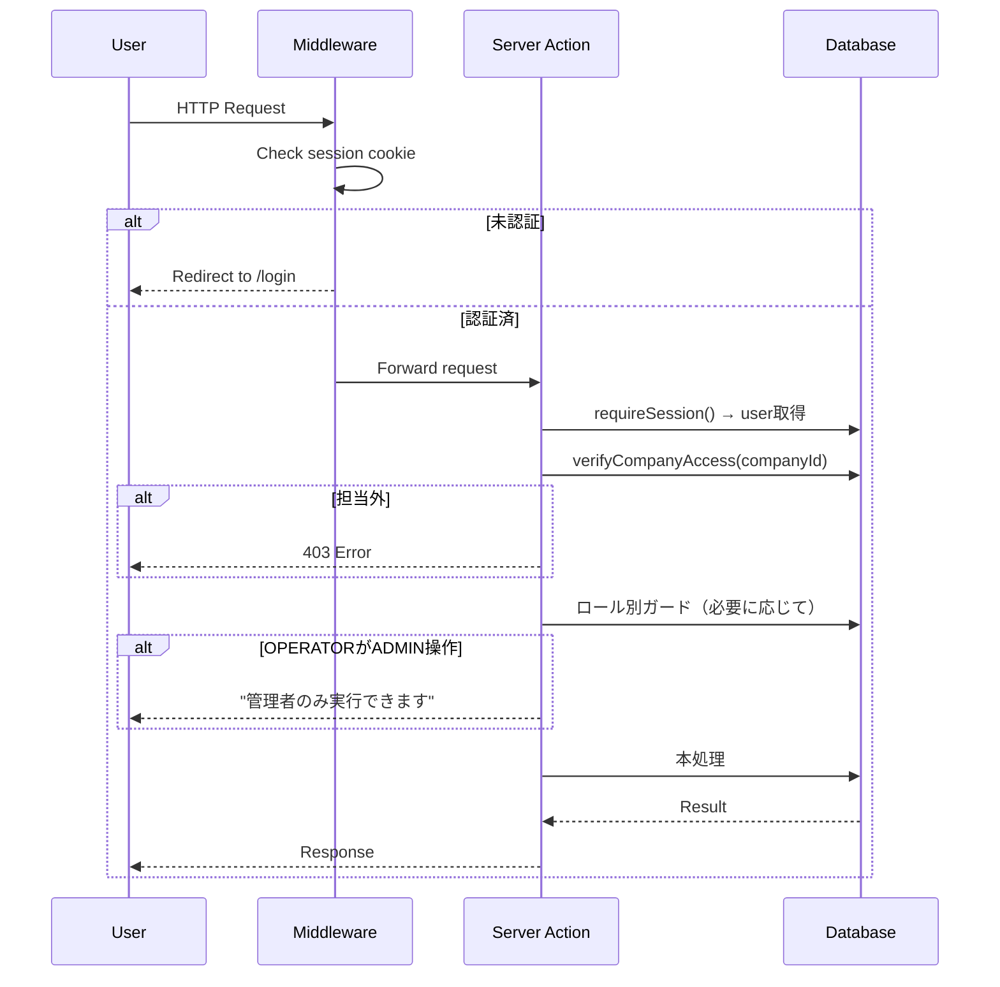

---

## 2. ドメインモデル

出典: db_design.md §4, dashboard-data-design.md

### 2.1 認証・ユーザー

#### UserProfile（ユーザープロファイル）

| フィールド | 型 | 必須 | 制約 | 説明 |
|---|---|---|---|---|
| id | String (cuid) | ○ | PK | – |
| userId | String | ○ | UNIQUE, FK→user.id | Better Authユーザー |
| role | Enum | ○ | ADMIN/OPERATOR/VIEWER | ロール |
| assignedCompanyIds | String[] | – | [要確認] | 担当会社ID（複数 or 単一） |
| name | String? | – | – | 表示名 |
| createdAt/updatedAt | DateTime | ○ | デフォルト | – |

### 2.2 マスタ

#### Company（会社マスタ）

| フィールド | 型 | 必須 | 制約 | 説明 |
|---|---|---|---|---|
| id | String (cuid) | ○ | PK | – |
| name | String | ○ | – | 会社名 |
| nameKana | String? | – | – | フリガナ |
| shortName | String? | – | – | 略称（帳票表示名） |
| industryType | String? | – | – | 業種（旧式、industryMasterIdを推奨） |
| industryMasterId | String? | – | FK→IndustryMaster.id | 業種マスタID |
| representativeTitle | String? | – | – | 代表者役職 |
| representativeName | String? | – | – | 代表者氏名 |
| postalCode | String? | – | – | 郵便番号 |
| addressPrefecture | String? | – | – | 都道府県 |
| addressCity | String? | – | – | 市区町村 |
| addressStreet | String? | – | – | 番地 |
| addressBuilding | String? | – | – | 建物名 |
| phone / fax / email / website | String? | – | – | 連絡先 |
| corporateNumber | String? | – | – | 法人番号（13桁） |
| invoiceNumber | String? | – | – | インボイス登録番号 |
| fiscalMonth | Int | ○ | デフォルト3 | 決算月（1-12） |
| status | String | ○ | ACTIVE/DORMANT/LIQUIDATING | – |
| mainAccountId | String? | – | FK→Account.id | メイン口座 |
| defaultAssigneeId | String? | – | FK→user.id | 経費確定BOXデフォルト担当 |
| displayOrder | Int | ○ | – | 表示順 |
| eTaxNumber | String? | – | – | e-Tax番号（Phase 4追加） |
| capitalAmount | BigInt? | – | – | 資本金（Phase 4追加） |
| accountingManager | String? | – | – | 経理担当（Phase 4追加） |
| establishedDate | DateTime? | – | – | 設立日 |
| logoUrl | String? | – | – | 会社ロゴURL |
| note | String? | – | – | 備考 |

#### Account（口座マスタ）

| フィールド | 型 | 必須 | 制約 | 説明 |
|---|---|---|---|---|
| id | String (cuid) | ○ | PK | – |
| companyId | String | ○ | FK→Company.id | – |
| bankName / bankCode | String? | – | – | 銀行名・コード |
| branchName / branchCode | String? | – | – | 支店名・コード |
| accountNumber | String? | – | – | 口座番号 |
| accountType | Enum | ○ | ORDINARY/TERM/SOCIAL_INSURANCE_RESERVE/CONSUMPTION_TAX_RESERVE | – |
| accountHolder | String? | – | – | 名義カナ（半角） |
| isMain | Boolean | ○ | – | メイン口座フラグ（会社あたり原則1つ） |
| isVirtual | Boolean | ○ | – | 仮想口座フラグ |
| isActive | Boolean | ○ | デフォルトtrue | 有効フラグ |
| isVisible | Boolean | ○ | デフォルトtrue | 表示フラグ |
| displayOrder | Int | ○ | – | 表示順 |
| fbSettings | Json? | – | – | FB出力設定（口座×用途） |
| feeSettings | Json? | – | – | 手数料設定（本支店/他支店/他行×金額帯） |

##### fbSettings JSON型

```typescript
{
  purpose: string                  // GENERAL/SALARY/BONUS
  requesterCode?: string           // 依頼人コード
  commissionerCode?: string        // 委託者コード
}
```

##### feeSettings JSON型

```typescript
{
  sameBranch: [{maxAmount: number, fee: number}],
  otherBranch: [{maxAmount: number, fee: number}],
  otherBank: [{maxAmount: number, fee: number}]
}
```

#### TradingPartner（取引先マスタ）

| フィールド | 型 | 必須 | 制約 | 説明 |
|---|---|---|---|---|
| id | String | ○ | PK | – |
| companyId | String | ○ | FK→Company.id | – |
| name | String | ○ | – | 取引先名 |
| nameKana | String? | – | – | フリガナ |
| type | Enum | ○ | CUSTOMER/VENDOR/BOTH | 種別 |
| tagKey | String | ○ | CUSTOMER/SUBCONTRACTOR/EXPENSE/BANK/GROUP_COMPANY/OTHER | 内部キー固定 |
| tagDisplayName | String? | – | – | 表示名（管理者が任意に変更可） |
| invoiceNumber | String? | – | – | インボイス登録番号 [要確認] |
| isActive | Boolean | ○ | デフォルトtrue | 有効フラグ |
| displayOrder | Int | ○ | – | 表示順 |

#### AccountCategoryMajor / Mid / Sub（勘定科目3階層）

```
AccountCategoryMajor (大項目: 6件)
  └─ AccountCategoryMid (中項目: 36件)
       └─ AccountCategorySub (小項目: 67件)
```

##### Major

| フィールド | 型 | 必須 | 説明 |
|---|---|---|---|
| id | String | ○ | – |
| name | String | ○ | 例: 売上高、販売管理費 |
| direction | Enum | ○ | INCOME / EXPENSE |
| displayOrder | Int | ○ | – |

##### Mid

| フィールド | 型 | 必須 | 説明 |
|---|---|---|---|
| id | String | ○ | – |
| majorId | String | ○ | FK |
| name | String | ○ | 例: 通信費、地代家賃 |
| displayOrder | Int | ○ | – |
| isActive | Boolean | ○ | – |

##### Sub

| フィールド | 型 | 必須 | 説明 |
|---|---|---|---|
| id | String | ○ | – |
| midId | String | ○ | FK |
| name | String | ○ | 例: 電気代、ガス代 |
| displayOrder | Int | ○ | – |
| isActive | Boolean | ○ | – |

### 2.3 トランザクション

#### Transaction（取引データ・親子構造）

中核テーブル。全取引種別（経費/売上/原価/給与/借入/振替）を統一管理。

| フィールド | 型 | 必須 | 制約 | 説明 |
|---|---|---|---|---|
| id | String | ○ | PK | – |
| companyId | String | ○ | FK | – |
| accountId | String | ○ | FK | 対象口座 |
| partnerId | String? | – | FK | 取引先 |
| temporaryVendorName | String? | – | – | 仮取引先名 |
| type | Enum | ○ | EXPENSE/SALES/COST_PAYMENT/SALARY/LOAN/TRANSFER | – |
| status | Enum | ○ | DRAFT/READY/CONFIRMED/CANCELLED | – |
| transactionDate | DateTime? | – | – | 実出納日 |
| scheduledDate | DateTime? | – | – | 予定日 |
| accountingMonth | String | ○ | YYYY-MM | 計上月 |
| receivedDate | DateTime? | – | – | 受領日（証憑添付で自動セット） |
| amount | BigInt | ○ | – | 金額（収入:正、支出:負） |
| estimatedAmount | BigInt? | – | – | 予定金額 |
| actualAmount | BigInt? | – | – | 実績金額 |
| paymentMethod | Enum? | – | BANK_TRANSFER/DIRECT_DEBIT/CASH_WITHDRAWAL | – |
| classification | String? | – | FIXED/VARIABLE/TEMPORARY | 固定/変動/臨時 |
| summary | String? | – | – | 摘要 |
| displayOrder | Int | ○ | – | 資金繰り表内の表示順 |
| confirmedAt | DateTime? | – | – | 確定日時 |
| confirmedBy | String? | – | – | 確定者 |
| invoiceDate | DateTime? | – | – | 売上固有：請求締日 |
| invoiceAmount | BigInt? | – | – | 売上固有：請求額 |
| recordedAmount | BigInt? | – | – | 原価固有：計上額 |
| transferAmount | BigInt? | – | – | 原価固有：振込額 |
| linkedTransactionId | String? | – | FK→Transaction.id | 会社間取引の相手取引 |
| parentId | String? | – | FK→Transaction.id（自己参照） | 親取引 |
| recurringTemplateId | String? | – | FK→RecurringTemplate.id | テンプレ元 |
| hasEvidence | Boolean | ○ | – | 証憑添付フラグ |
| evidenceNotRequired | Boolean | ○ | デフォルトfalse | 証憑なしOK（管理者のみ） |
| isDateException | Boolean | ○ | デフォルトfalse | 今月のみ例外 |
| amountUpdatedAt | DateTime? | – | – | 金額変更日時 |
| createdAt/updatedAt | DateTime | ○ | – | – |
| createdBy/updatedBy | String? | – | – | 操作者 [要確認] |

**複合インデックス**:
- `(companyId, accountId, accountingMonth)`
- `(companyId, type, accountingMonth)`
- `(parentId)`
- `(recurringTemplateId)`

#### TransactionDetail（取引明細）

| フィールド | 型 | 必須 | 説明 |
|---|---|---|---|
| id | String | ○ | – |
| transactionId | String | ○ | FK→Transaction.id（CASCADE削除） |
| midId | String? | – | FK→AccountCategoryMid.id |
| subId | String? | – | FK→AccountCategorySub.id |
| amount | BigInt | ○ | – |
| classification | String? | – | FIXED/VARIABLE/TEMPORARY |
| summary | String? | – | – |
| deductionCategoryId | String? | – | 控除カテゴリID |
| deductionSubType | String? | – | OCCURRENCE/OFFSET（発生/相殺） |
| signMultiplier | Int | ○ | 1 or -1（符号、自動決定） |
| displayOrder | Int | ○ | – |

### 2.4 給与関連

#### SalaryEntry（給与入力データ）

| フィールド | 型 | 必須 | 説明 |
|---|---|---|---|
| id | String | ○ | – |
| payrollGroupId | String | ○ | FK |
| payMonth | String | ○ | YYYY-MM |
| payDate | DateTime? | – | – |
| taxablePayment | BigInt | ○ | 課税支給 |
| transportAllowance | BigInt | ○ | 交通費 |
| miscExpenses | BigInt | ○ | 諸経費 |
| carryoverAdjust | BigInt | ○ | 繰越金調整 |
| advanceExpenses | BigInt | ○ | 立替経費 |
| totalPayment | BigInt | ○ | 総支給（自動計算） |
| socialInsuranceReserve | BigInt | ○ | 社保積立（課税支給×15%） |
| consumptionTaxReserve | BigInt | ○ | 消費税積立（課税支給×10%） |
| totalDeduction | BigInt | ○ | 控除合計 |
| netPayment | BigInt | ○ | 差引支給 |
| headcount | Int | ○ | 人数 |
| status | Enum | ○ | DRAFT/READY/CONFIRMED/CANCELLED |

**一意制約**: `(payrollGroupId, payMonth)`

**整合チェック（必須一致）**:
1. 総支給 − 控除合計 = 差引支給
2. 差引支給 = 支払内訳合計

#### SalaryDeduction（給与控除明細）

| フィールド | 型 | 必須 | 説明 |
|---|---|---|---|
| id | String | ○ | – |
| salaryEntryId | String | ○ | FK |
| itemName | String | ○ | 例: 家賃控除、雇用保険 |
| amount | BigInt | ○ | – |
| midId | String? | – | 勘定科目（中項目） |
| subId | String? | – | 補助科目 |
| contentRows | Json? | – | 内容行 |

##### contentRows JSON型

```typescript
[{ description: string, amount: number }]
```

#### SalaryPaymentDetail（支払内訳）

| フィールド | 型 | 必須 | 説明 |
|---|---|---|---|
| id | String | ○ | – |
| salaryEntryId | String | ○ | FK |
| paymentDate | DateTime | ○ | 出金日（実出納日） |
| paymentMethod | Enum | ○ | BANK_TRANSFER/DIRECT_DEBIT/CASH_WITHDRAWAL |
| accountId | String? | – | 出金口座 |
| amount | BigInt | ○ | – |

### 2.5 借入・リース

#### LoanContract（借入契約）

| フィールド | 型 | 必須 | 説明 |
|---|---|---|---|
| id | String | ○ | – |
| companyId | String | ○ | FK |
| contractName | String | ○ | – |
| partnerId | String? | – | 借入先 |
| principalAmount | BigInt | ○ | 借入金額 |
| executionDate | DateTime | ○ | 実行日 |
| repaymentStartDate | DateTime | ○ | 返済開始日 |
| repaymentMethod | String | ○ | EQUAL_PRINCIPAL/GRACE/BULLET/QUARTERLY/SEMIANNUAL/ANNUAL |
| repaymentFrequency | String | ○ | MONTHLY/QUARTERLY/SEMIANNUAL/ANNUAL |
| repaymentDay | Int? | – | – |
| holidayAdjust | String? | – | PREV_BUSINESS/NEXT_BUSINESS/NONE |
| totalPayments | Int? | – | 回数 |
| interestType | String | ○ | FIXED/VARIABLE |
| interestRate | Decimal | ○ | 金利% |
| interestTiming | String | ○ | ADVANCE/ARREAR（前払/後払） |
| dayCountBasis | Int | ○ | 365 or 360 |
| roundingRule | String | ○ | ROUND_HALF_UP等 |
| principalAdjust | String | ○ | FIRST/LAST（初回/最終回） |
| interestHistory | Json? | – | `[{effectiveDate, rate}]` |
| remainingBalance | BigInt | ○ | 残高 |
| status | String | ○ | ACTIVE/COMPLETED/CANCELLED |
| isGuaranteeAssociation | Boolean | – | 保証協会フラグ（Phase 1） |

#### LoanSchedule

| フィールド | 型 | 説明 |
|---|---|---|
| id | String | – |
| contractId | String | FK |
| paymentNumber | Int | 回数 |
| dueDate | DateTime | 返済日 |
| principalAmount | BigInt | 元金 |
| interestAmount | BigInt | 利息 |
| totalAmount | BigInt | 合計 |
| remainingBalance | BigInt | 残高 |
| isPaid | Boolean | 支払済み |

#### LeaseContract

| フィールド | 型 | 必須 | 説明 |
|---|---|---|---|
| id | String | ○ | – |
| companyId | String | ○ | FK |
| contractName | String | ○ | – |
| partnerId | String? | – | – |
| monthlyAmount | BigInt | ○ | 月額 |
| startDate | DateTime | ○ | – |
| endDate | DateTime? | – | – |
| totalPayments | Int? | – | – |
| paymentDay | Int? | – | – |
| holidayAdjust | String? | – | – |
| accountId | String? | – | – |
| midId | String? | – | – |
| assetCategory | String? | – | VEHICLE/OA/OTHER/REPRESENTATIVE |
| vehicleModel | String? | – | 車種 |
| vehicleNumber | String? | – | 車番 |
| status | String | ○ | ACTIVE/COMPLETED/CANCELLED |

### 2.6 集約境界

ドメイン駆動設計の集約（Aggregate）として以下を提案：

| 集約ルート | 含むエンティティ | 集約内不変条件 |
|---|---|---|
| **Company** | Account, TradingPartner, PayrollGroup, RecurringTemplate, LoanContract, LeaseContract, MonthClose, TaxPaymentSchedule | 全データはcompanyIdで一貫 |
| **Transaction** | TransactionDetail, Evidence | 親金額=子明細合計、削除はCASCADE |
| **SalaryEntry** | SalaryDeduction, SalaryPaymentDetail | 総支給−控除=差引、差引=支払内訳合計 |
| **LoanContract** | LoanSchedule | 残高=借入額−累積元金、再生成はADMINのみ |
| **LeaseContract** | LeaseSchedule | 同上の単純版 |
| **CashWithdrawalBatch** | CashDenomination, 子用途明細 | 引出額=用途合計=金種表合計 |
| **TransferBatch** | TransferBatchItem | 全明細振込済でバッチ完了 |
| **RecurringTemplate** | 生成された Transaction | テンプレ削除時の生成済みTxは保持 |

---

## 3. ユースケース別シーケンス図

### 3.1 経費入力（受領BOX → 確定まで）

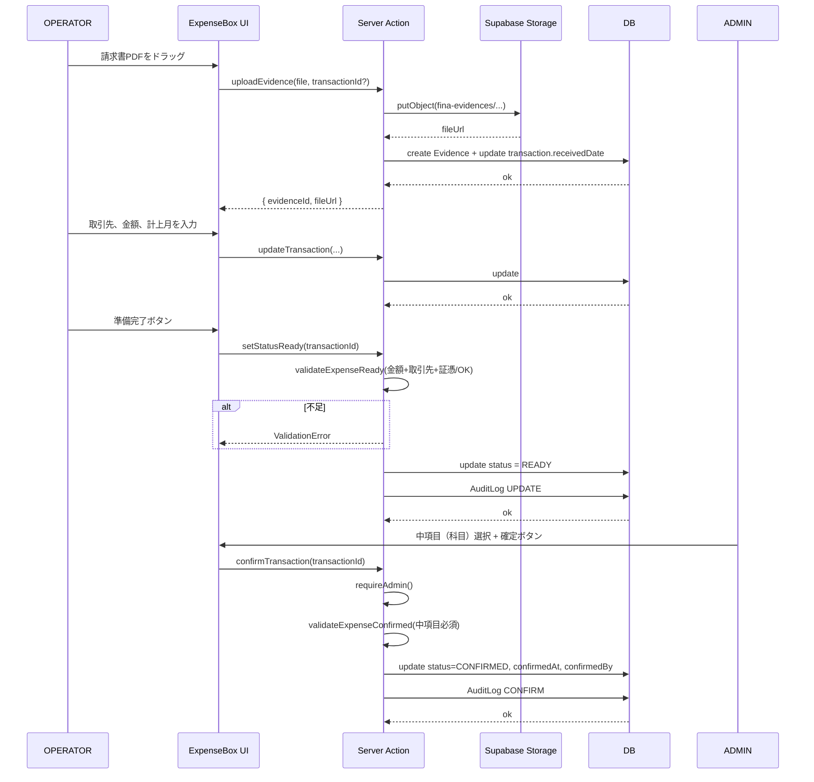

### 3.2 売上の2段階確定

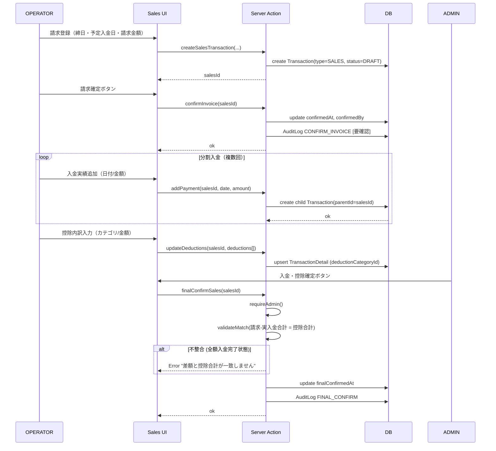

### 3.3 原価支払の確定

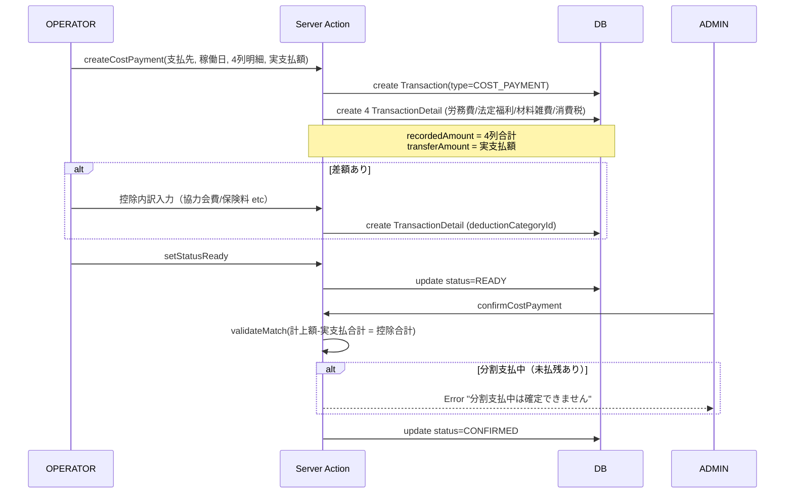

### 3.4 給与入力 → 自動仕訳 → 仮想口座反映

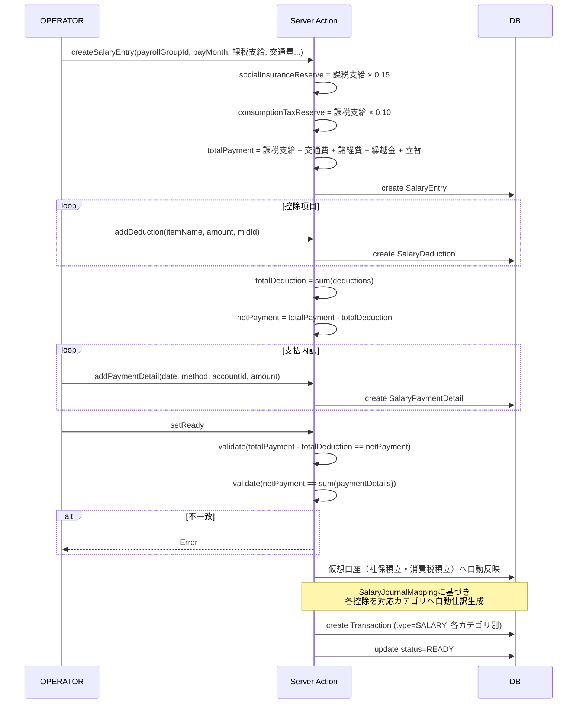

### 3.5 資金繰り表の並べ替え＋残高再計算

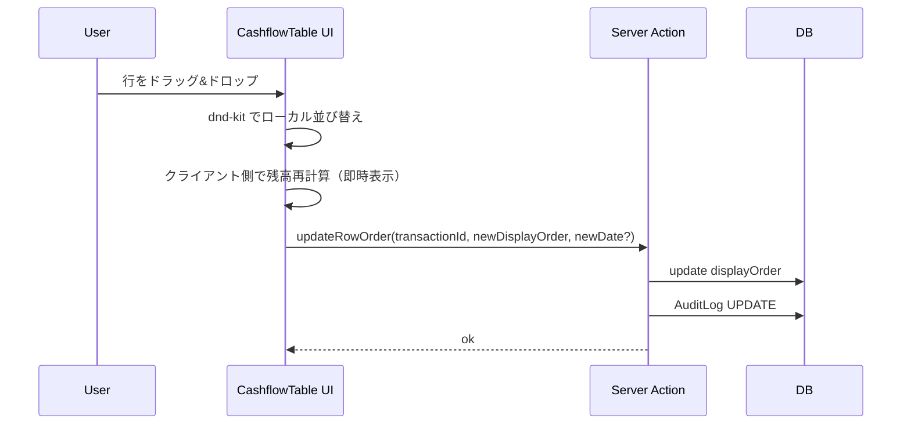

### 3.6 月締めと月締め解除

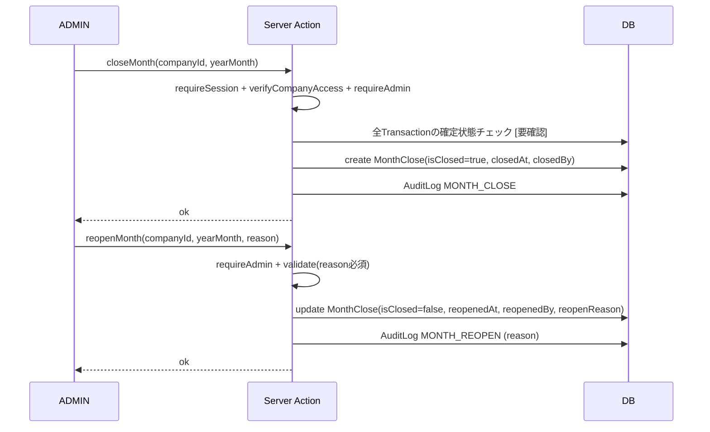

### 3.7 グループ間入力（双方向ミラー）

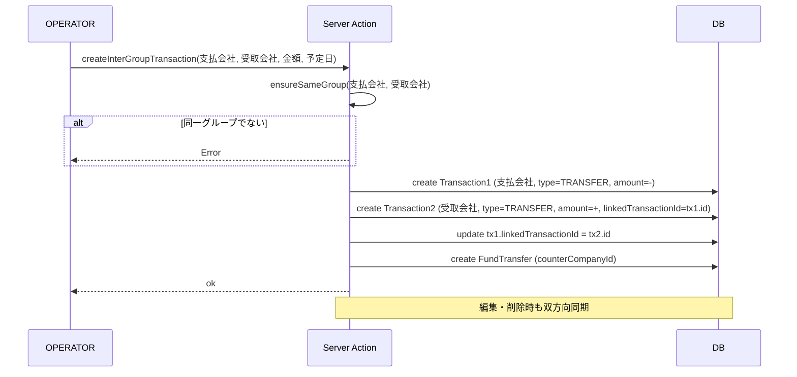

### 3.8 現金引出（親子明細＋金種表）

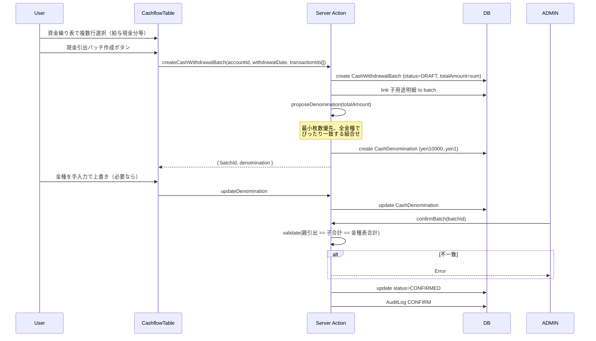

### 3.9 借入返済表の生成

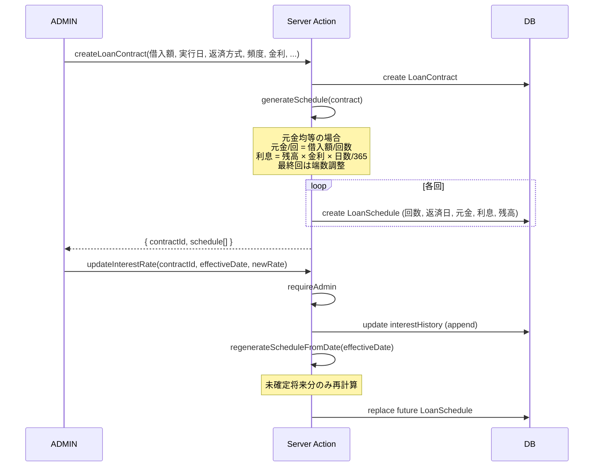

### 3.10 通帳照合点の設定と検証

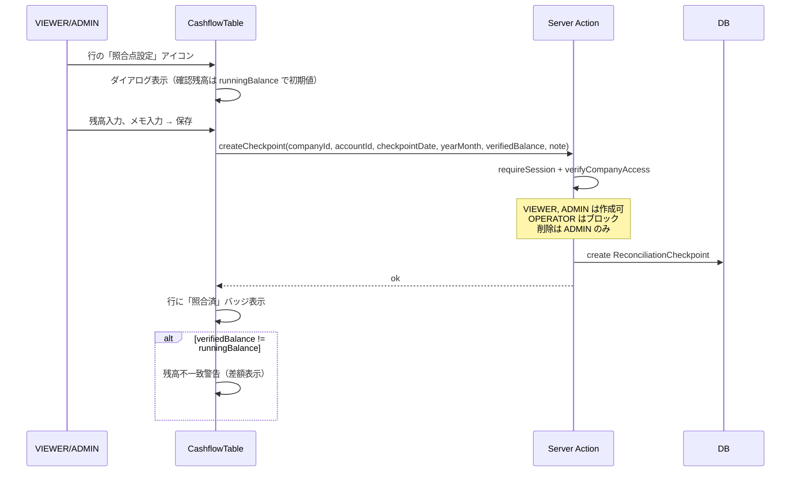

### 3.11 まとめくんへのリアルタイム連携

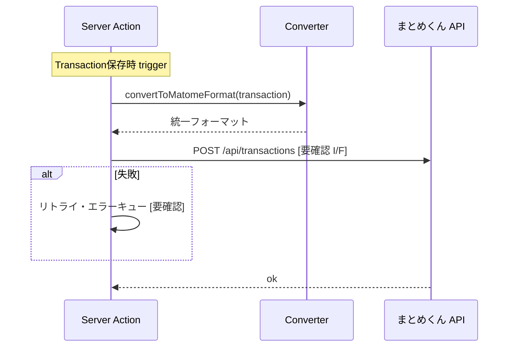

[要確認] まとめくん側のAPI仕様、エラー時のリトライ・補償処理が未定。

---

## 4. API仕様（Server Actions）

経理くんは Next.js App Router の Server Actions ベースで実装される。以下は主要なAPIエンドポイントの一覧。

### 4.1 認証 (Better Auth)

| メソッド | パス | 認可 | 概要 |
|---|---|---|---|
| POST | `/api/auth/sign-up` | – | 新規登録 |
| POST | `/api/auth/sign-in` | – | ログイン |
| POST | `/api/auth/sign-out` | 認証済 | ログアウト |
| GET | `/api/auth/session` | – | セッション取得 |
| POST | `/api/auth/forget-password` | – | パスワードリセット [要確認 未実装] |

### 4.2 ダッシュボード

#### `getDashboardSummary(companyId: string)`
- **認可**: 認証済 + 担当会社
- **入力**: companyId
- **出力**:
  ```typescript
  {
    accountCount: number
    partnerCount: number
    monthlyTransactionCount: number
    pendingExpenseCount: number
    mainAccount: { id, name, balance: string }
    recentTransactions: CashFlowRow[] // 前3+後5行
  }
  ```

#### `getGroupDashboardSummary(yearMonth: string)`
- **認可**: 認証済
- **出力**:
  ```typescript
  {
    totalBalance: string
    totalDeposit: string
    totalWithdrawal: string
    groups: [{ id, name, companies: [{...}] }]
  }
  ```

### 4.3 資金繰り表 (`app/actions/cashflow-table.ts`)

#### `getCashFlowTable(params)`
- **入力**: `{ companyId, accountId, yearMonth, filters? }`
- **出力**:
  ```typescript
  {
    openingBalance: string
    closingBalance: string
    monthlyDeposit: string
    monthlyWithdrawal: string
    interGroupDeposit: string
    interGroupWithdrawal: string
    forecastEndBalance: string
    rows: CashFlowRow[]
    checkpoints: ReconciliationCheckpoint[]
    isClosed: boolean
  }
  ```
- **CashFlowRow型**:
  ```typescript
  {
    id: string
    transactionDate: string | null
    scheduledDate: string | null
    type: string
    classification: string | null
    partnerName: string | null
    isTemporaryPartner: boolean
    deposit: string | null      // 入金
    withdrawal: string | null   // 支払
    runningBalance: string
    summary: string | null
    midName: string | null
    subName: string | null
    diff: string | null         // 予定vs実績
    amountUpdatedAt: string | null
    paymentMethod: string | null
    status: string
    isOverdue: boolean
    isInterGroup: boolean
    displayOrder: number
  }
  ```

#### `updateRowOrder(transactionId, newDisplayOrder, newDate?)`
- **認可**: 認証済 + 担当会社 + 月締め未済（金額変更を伴う場合）

#### `closeMonth(companyId, yearMonth)`
- **認可**: 認証済 + 担当会社 + **ADMIN必須**
- **エラー**: 「管理者のみ実行できます」

#### `reopenMonth(companyId, yearMonth, reason)`
- **認可**: 認証済 + 担当会社 + **ADMIN必須**
- **入力**: `reason: string` 必須
- **副作用**: AuditLog `MONTH_REOPEN` に reason 記録

### 4.4 取引 (`app/actions/transactions.ts`)

#### `createTransaction(data)`
- **入力**:
  ```typescript
  {
    companyId: string
    accountId: string
    partnerId?: string
    temporaryVendorName?: string  // partnerIdなしの場合に使用
    type: TransactionType
    scheduledDate?: string
    transactionDate?: string
    accountingMonth: string
    amount: string  // BigInt as string
    paymentMethod?: PaymentMethod
    classification?: string
    summary?: string
    details?: TransactionDetail[]
    evidenceIds?: string[]
  }
  ```
- **バリデーション**: `partnerId` または `temporaryVendorName` のいずれか必須
- **出力**: `{ id, ...createdTransaction }`

#### `updateTransaction(id, companyId, data)`
- **入力**: 部分更新パラメータ
- **特殊**: `receivedDate` は月締め後でも変更可（メタデータ扱い）
- **月締め後の制約**: 金額・取消変更は拒否、摘要・科目は許可（AuditLog `UPDATE_AFTER_CLOSE`）

#### `deleteTransaction(id, companyId)`
- **認可**: 確定前のみ、月締め後不可

#### `confirmTransaction(id, companyId)`
- **認可**: 認証済 + ADMIN
- **副作用**: AuditLog `CONFIRM`

#### `unconfirmTransaction(id, companyId)`
- **認可**: ADMIN
- **副作用**: AuditLog `UNCONFIRM`

#### `normalizePartner(transactionId, newPartnerId)`
- **認可**: ADMIN
- **副作用**: AuditLog `PARTNER_NORMALIZED`

### 4.5 経費確定BOX (`app/actions/user-profile.ts` 内)

#### `getExpenseBoxItems(filters, page, pageSize)`
- **対象**: 担当会社のみ
- **フィルタ**: `{ receivedDateRange, evidenceStatus, partnerSearch, summarySearch, scheduledDateRange }`
- **対象明細条件（OR）**: 証憑1件以上 / 受領日あり / 証憑なしOK
- **出力**: `{ data: Transaction[], total, totalPages }`

### 4.6 売上 (`app/actions/sales.ts` [要確認]）

| 関数 | 概要 |
|---|---|
| `createSalesTransaction` | 請求作成 |
| `confirmInvoice` | 請求確定（入力者可、解除はADMIN） |
| `addPayment` | 入金実績追加（子取引） |
| `updateDeductions` | 控除内訳更新 |
| `finalConfirmSales` | 入金・控除確定（ADMIN） |
| `copyPreviousDeductions` | 前月控除項目の自動コピー |

### 4.7 原価支払

| 関数 | 概要 |
|---|---|
| `createCostPayment` | 原価支払作成（4列明細） |
| `updateCostPayment` | 更新 |
| `confirmCostPayment` | 確定（差額=控除合計の整合チェック） |

### 4.8 給与

| 関数 | 概要 |
|---|---|
| `createSalaryEntry` | 給与入力作成、社保15%/消費税10%自動計算 |
| `updateSalaryEntry` | 更新 |
| `setSalaryReady` | 準備完了（整合チェック2件必須一致） |
| `confirmSalary` | 確定（給与管理者ロール） |
| `importSalaryExcel` | Excel取込 |

### 4.9 グループ間入力

| 関数 | 概要 |
|---|---|
| `createInterGroupTransaction` | 双方向取引作成 |
| `updateInterGroupTransaction` | 双方向更新 |
| `deleteInterGroupTransaction` | 双方向削除 |
| `ensureSameGroup` | 同一CompanyGroupチェック |
| `getGroupCompaniesFor` | グループ会社一覧取得 |

### 4.10 借入・リース

| 関数 | 概要 |
|---|---|
| `createLoanContract` | 借入契約作成 |
| `generateLoanSchedule` | 返済スケジュール生成 |
| `updateLoanInterestRate` | 金利変更（未確定将来分のみ再計算） |
| `printLoanContract` | A4印刷HTML生成 |
| `createLeaseContract` | リース契約作成 |
| `getVehicleLeaseMatrix` | 車両分類の月別マトリクス |

### 4.11 定期テンプレート (`app/actions/recurring.ts`)

| 関数 | 概要 |
|---|---|
| `createRecurringTemplate` | テンプレート作成 |
| `getDueDate(yearMonth, dueDayRule, holidayAdjust)` | 予定日算出（休日調整適用） |
| `generateRecurringTransactions(month)` | 月初一括生成 |
| `autoGenerateRecurringTransactions` | 自動生成（cron想定） |

### 4.12 証憑 (`app/actions/evidence.ts`)

| 関数 | 概要 |
|---|---|
| `uploadEvidence(file, transactionId?)` | アップロード、受領日自動セット |
| `deleteEvidence(id)` | 削除 |
| `updateEvidenceMeta(id, { transactionDate, vendorName, amount })` | メタ情報更新 |
| `searchEvidenceByMeta(query)` | メタ情報検索 |
| `getSignedUrl(id)` | 署名付きURL取得 |

### 4.13 マスタ

| 関数 | ADMIN必須 | 概要 |
|---|---|---|
| `getCompanies` | – | 会社一覧 |
| `createCompany` / `updateCompany` | ○ | 会社作成・更新 |
| `getAccounts` / `createAccount` / `updateAccount` | ○ (mutation) | 口座 |
| `getPartners` / `createPartner` / `updatePartner` | ○ (mutation) | 取引先 |
| `getCategories` | – | 科目一覧 |
| `createMidCategory` / `updateMidCategory` | ○ | 中項目 |
| `createSubCategory` / `updateSubCategory` | ○ | 小項目 |
| `getBanks` / `getBranches` | – | 銀行・支店 |
| `getIndustries` / `createIndustry` / `updateIndustry` | ○ (mutation) | 業種 |
| `getCompanyGroups` / `createCompanyGroup` / `updateCompanyGroup` | ○ (mutation) | 会社グループ |
| `getSalesItems` / `createSalesItem` / `getSalesItemsForCompany` | ○ (mutation) | 売上項目 |

### 4.14 監査ログ

| 関数 | 概要 |
|---|---|
| `getAuditLogs(filters)` | 取得（ADMIN） |

### 4.15 照合点

| 関数 | 認可 | 概要 |
|---|---|---|
| `getCheckpoints(companyId, accountId, yearMonth)` | 認証済 | 取得 |
| `createCheckpoint(data)` | VIEWER/ADMIN | 作成 |
| `updateCheckpoint(id, companyId, data)` | VIEWER/ADMIN | 更新 |
| `deleteCheckpoint(id, companyId)` | ADMIN | 削除 |

### 4.16 エラーコード体系

| カテゴリ | コード/メッセージ例 | HTTPステータス |
|---|---|---|
| 認証 | 「ログインが必要です」 | 401 |
| 認可 | 「管理者のみ実行できます」 | 403 |
| 認可 | 「担当外の会社です」 | 403 |
| バリデーション | 「金額を入力してください」 | 400 |
| バリデーション | 「取引先または仮取引先名を入力してください」 | 400 |
| バリデーション | 「中項目（科目）を選択してください」 | 400 |
| 月締め制約 | 「月締め後は金額変更できません」 | 400 |
| 月締め制約 | 「解除理由を入力してください」 | 400 |
| 整合性 | 「差額と控除合計が一致しません」 | 400 |
| 整合性 | 「分割支払中は確定できません」 | 400 |
| 整合性 | 「金種表合計が引出金額と一致しません」 | 400 |
| 重複 | 「同一月の給与エントリが既に存在します」 | 409 |
| 存在しない | 「該当データが見つかりません」 | 404 |
| サーバー | 「内部エラーが発生しました」 | 500 |

[要確認] エラーコード体系の標準化（数値コード採用、i18n対応）。

---

## 5. バッチ・ジョブ仕様

### 5.1 月初一括生成（定期テンプレート）

| 項目 | 内容 |
|---|---|
| 起動 | 手動 / 自動（cron）[要確認] |
| 関数 | `generateRecurringTransactions(yearMonth)` / `autoGenerateRecurringTransactions()` |
| 入力 | 対象月（YYYY-MM） |
| 処理 | 全RecurringTemplate（isActive=true）について、当月分Transactionを生成（status=DRAFT、`recurringTemplateId` セット） |
| 重複防止 | `lastGeneratedMonth` で生成済みチェック |
| 休日調整 | `holidayAdjust` パラメータで PREV_BUSINESS / NEXT_BUSINESS / NONE |
| 金額タイプ | FIXED / VARIABLE（前月の同テンプレIDのTxを参照）/ MANUAL（金額0で生成） |
| 期限超過 | 期限超過は赤表示、支払漏れ検知一覧 |

### 5.2 中間納税自動生成（納税予定表）

| 項目 | 内容 |
|---|---|
| 関数 | `generateInterimTaxSchedules(companyId, year, prevYearTaxAmount)` |
| 法人税 | 前年税額 ≥ 20万円 → 中間納税1回（半期） |
| 消費税 | 48万 / 400万 / 4800万 閾値で 年1/年3/年11回 |
| 出力 | `TaxPaymentSchedule` レコード（status=予定、scheduledDate設定） |

### 5.3 月締め

| 項目 | 内容 |
|---|---|
| 関数 | `closeMonth(companyId, yearMonth)` |
| 認可 | ADMIN |
| 副作用 | MonthClose作成、AuditLog `MONTH_CLOSE` |
| 制約 | [要確認] 全Transaction確定済みか事前チェックするか |

### 5.4 月締め解除

| 項目 | 内容 |
|---|---|
| 関数 | `reopenMonth(companyId, yearMonth, reason)` |
| 認可 | ADMIN |
| 必須 | reason |
| 副作用 | MonthClose更新、AuditLog `MONTH_REOPEN` |

### 5.5 まとめくん連携

| 項目 | 内容 |
|---|---|
| トリガー | Transaction CREATE / UPDATE / DELETE |
| 関数 | [要確認] |
| 形式 | コンバーター層でまとめくん統一フォーマットに変換 |
| 配信 | リアルタイムAPI送信 |
| エラー | [要確認] リトライ・補償処理 |

### 5.6 Excel/CSV取込

| 種別 | 列仕様 | 重複排除 |
|---|---|---|
| 売上 | 予定入金日 / 元請会社名 / 請求金額（+任意: 実入金日/実入金金額/摘要） | – |
| 原価 | 予定支払日 / 支払先 / 計上額（+任意: 実支払日/振込額/摘要） | – |
| カード明細 | 利用日 / 利用店名 / 金額（+任意: カテゴリ/摘要） | `{cardId, statementDate, storeName, amount}` ハッシュ |
| 給与 | 会社×支給月×給与グループ | – |

**未登録マスタ**:
- インポートを一旦停止
- 自動作成 or マッピング選択（プレビュー → 管理者承認）
- 売上→CUSTOMER、原価→SUBCONTRACTOR で自動作成

### 5.7 FB（全銀）データ出力

[要確認] Phase 2 想定。

| 項目 | 内容 |
|---|---|
| 用途 | 総合振込 / 給与 / 賞与 |
| フォーマット | 全銀協フォーマット |
| 対象 | 確認済バッチのみ |
| 制約 | FB出力後は編集不可、取消→再作成のみ（取消はADMIN） |
| 文字種 | [要確認] |
| テスト手順 | [要確認] |

---

## 6. 権限・ロール定義

出典: USER_MANUAL.md §3, expense_implementation_audit.md §3.1

### 6.1 ロール一覧

| ロール | 内部キー | 説明 |
|---|---|---|
| 管理者 | ADMIN | 全機能操作可 |
| 経費入力者 | OPERATOR | 取引データの入力・編集・証憑添付。マスタ閲覧のみ |
| 資金繰り閲覧者 | VIEWER | 閲覧のみ + 通帳照合点設定 |
| 給与管理者 | [要確認] | 給与確定のみADMIN相当（独立ロール vs ADMIN包含） |

### 6.2 操作権限マトリクス

| 操作 | ADMIN | OPERATOR | VIEWER |
|---|---|---|---|
| **取引** | | | |
| 経費作成・編集 | ○ | ○ (確定前) | ✕ |
| 経費削除 | ○ | ○ (確定前、月締め前) | ✕ |
| 経費確定 / 解除 | ○ | ✕ | ✕ |
| 売上請求確定 | ○ | ○ | ✕ |
| 売上請求確定解除 | ○ | ✕ | ✕ |
| 売上入金・控除確定 | ○ | ✕ | ✕ |
| 原価確定 | ○ | ✕ | ✕ |
| 給与確定 | ○ (給与管理者) | ✕ | ✕ |
| 取引閲覧 | ○ | ○ (自社) | ○ |
| **マスタ** | | | |
| 会社作成・編集 | ○ | ✕ | ✕ |
| 口座作成・編集 | ○ | ✕ | ✕ |
| 取引先作成・編集 | ○ | ✕ | ✕ |
| 取引先正規化 | ○ | ✕ | ✕ |
| 科目作成・編集 | ○ | ✕ | ✕ |
| マスタ閲覧 | ○ | ○ | ○ |
| **月締め** | | | |
| 月締め | ○ | ✕ | ✕ |
| 月締め解除（理由必須） | ○ | ✕ | ✕ |
| **証憑** | | | |
| 証憑添付 | ○ | ○ | ✕ |
| 証憑なしOKフラグ付与 | ○ | ✕ | ✕ |
| **その他** | | | |
| 通帳照合点設定 | ○ | ✕ | ○ |
| 通帳照合点削除 | ○ | ✕ | ✕ |
| 監査ログ閲覧 | ○ | ✕ | ✕ |
| 資金繰り表ドラッグ並替 | ○ | ○ | ✕ |
| 帳票印刷 | ○ | ○ | ○ |

### 6.3 UI上の表示差分

| UI要素 | ADMIN | OPERATOR | VIEWER |
|---|---|---|---|
| 科目列（経費入力） | 表示 | 非表示 | 表示 |
| 「⚠科目未設定」バッジ | – | 表示 | – |
| 月締めボタン | 表示 | 非表示 | 非表示 |
| 確定ボタン | 表示 | 非表示 | 非表示 |
| 削除ボタン | 表示 | 表示 | 非表示 |
| 照合点設定ボタン | 表示 | 非表示 [要確認] | 表示 |
| 全マスタメニュー | 表示 | 閲覧のみ | 閲覧のみ |
| FB出力ボタン | 表示 | 非表示 | 非表示 |
| 取引先正規化ボタン | 表示 | 非表示 | 非表示 |

---

## 7. バリデーションルール

出典: requirements.md, expense_implementation_audit.md §3.4, dashboard-data-design.md

### 7.1 共通

| ルール | 適用 |
|---|---|
| 金額型 | BigInt（円単位、小数点なし） |
| 金額符号 | 収入は正、支出は負 |
| 日付フォーマット | ISO 8601（YYYY-MM-DD） |
| 計上月フォーマット | YYYY-MM |
| 文字数（摘要） | [要確認] |
| 文字数（取引先名） | [要確認] |
| URL | http/https形式 |
| メール | RFC 5322 [要確認] |
| 郵便番号 | XXX-XXXX形式 |
| 法人番号 | 13桁数字 |

### 7.2 経費

| ルール | 状態 |
|---|---|
| 必須: 会社、口座、計上月、金額 | DRAFT→READY |
| 必須: 取引先 (正規 or 仮) | DRAFT→READY |
| 必須: 証憑 OR 証憑なしOK | DRAFT→READY |
| 必須: 中項目（科目）正規取引先 | READY→CONFIRMED |
| 月締め後の金額変更 | 拒否 |
| 月締め後の取消 | 拒否 |
| 月締め後の摘要・科目変更 | 許可（AuditLog UPDATE_AFTER_CLOSE） |

### 7.3 売上

| ルール | 状態 |
|---|---|
| 整合チェック: 差額 = 控除合計 | 全額入金完了時にエラー（確定不可） |
| 分割入金中の整合不一致 | 警告のみ |
| 許容差額 | 0円（厳格） |

### 7.4 原価支払

| ルール | 状態 |
|---|---|
| 分割支払中（未払残あり） | 確定不可 |
| 整合チェック: 差額（計上−実支払）= 控除合計 | 一致必須 |
| 4列固定 | 労務費 / 法定福利 / 材料雑費 / 消費税 |

### 7.5 給与

| ルール | 状態 |
|---|---|
| 整合1: 総支給 − 控除合計 = 差引支給 | 必須一致 |
| 整合2: 差引支給 = 支払内訳合計 | 必須一致 |
| 自動計算: 社保積立 = 課税支給 × 0.15 | – |
| 自動計算: 消費税積立 = 課税支給 × 0.10 | – |
| 一意制約 | (payrollGroupId, payMonth) |

### 7.6 現金引出

| ルール | 状態 |
|---|---|
| 整合: 親引出金額 = 子用途合計 = 金種表合計 | 確定必須一致（厳格） |
| 金種範囲 | 1円〜1万円の全金種 |
| 自動提案 | 最小枚数優先、金額ぴったり |

### 7.7 資金移動

| ルール | 状態 |
|---|---|
| 会社間: 双方向リンク | linkedTransactionId 必須 |
| 同一会社内: 二重保持なし | 参照表示 |
| グループ間: 同一CompanyGroup所属 | `ensureSameGroup` チェック |

### 7.8 借入

| ルール | 状態 |
|---|---|
| 金利変更 | 未確定将来分のみ再計算 |
| スケジュール再生成 | ADMINのみ |
| 元利均等 | 初期対象外 |

### 7.9 月締め

| ルール | 状態 |
|---|---|
| 認可 | ADMIN必須 |
| 解除 | ADMIN必須 + 理由必須 |
| 一意制約 | (companyId, yearMonth) |

### 7.10 仮想口座

| ルール | 状態 |
|---|---|
| 自動付与 | 会社登録時に2口座（社保積立・消費税積立） |
| 表示 | デフォルト非表示、フィルタで切替可 |

### 7.11 マスタ

| ルール | 状態 |
|---|---|
| 削除 | 物理削除不可（isActive=falseで無効化） |
| 紐づきデータあり | 削除不可 |
| 表示順 | 必須 |

---

## 8. 監査ログ要件

出典: db_design.md 4.8, expense_implementation_audit.md §3.10

### 8.1 AuditOperation 型

```typescript
type AuditOperation =
  | "CREATE"
  | "UPDATE"
  | "UPDATE_AFTER_CLOSE"   // 月締め後の摘要・科目変更
  | "DELETE"
  | "CONFIRM"
  | "UNCONFIRM"
  | "MONTH_CLOSE"
  | "MONTH_REOPEN"          // 理由必須
  | "PARTNER_NORMALIZED"    // 取引先正規化
```

### 8.2 AuditLog テーブル

| カラム | 型 | 説明 |
|---|---|---|
| id | String (cuid) | – |
| tableName | String | 対象テーブル |
| recordId | String | 対象レコードID |
| operation | AuditOperation | – |
| userId | String | 操作ユーザー |
| timestamp | DateTime | 自動 |
| beforeData | Json? | UPDATE/DELETE時 |
| afterData | Json? | CREATE/UPDATE時 |
| reason | String? | 月締め解除時必須 |

### 8.3 対象テーブル（Prisma Middleware自動記録）

| 対象 | 操作 |
|---|---|
| transactions | CREATE/UPDATE/DELETE/CONFIRM/UNCONFIRM |
| transaction_details | CREATE/UPDATE/DELETE |
| salary_entries | CREATE/UPDATE/DELETE/CONFIRM |
| salary_deductions | CREATE/UPDATE/DELETE |
| monthly_balances | CREATE/UPDATE |
| month_closes | MONTH_CLOSE/MONTH_REOPEN |
| accounts | CREATE/UPDATE/DELETE |
| trading_partners | CREATE/UPDATE/DELETE/PARTNER_NORMALIZED |
| payroll_groups | CREATE/UPDATE/DELETE |

### 8.4 除外対象

- audit_logs（無限ループ防止）
- evidences（ファイルメタのみ）

### 8.5 インデックス

| インデックス | 目的 |
|---|---|
| (tableName, recordId) | 特定レコードの変更履歴取得 |
| (userId, timestamp) | ユーザー別操作履歴 |
| (timestamp) | 時系列検索 |

### 8.6 保持期間

無期限。

---

## 9. テスト戦略

### 9.1 単体テスト（Unit）

[要確認] 現在のテストカバレッジ状況。推奨フレームワーク: Jest / Vitest。

| 対象 | テスト範囲 |
|---|---|
| `lib/holidays.ts` | 営業日判定、休日調整（祝日マスタ） |
| `lib/audit-log.ts` | AuditOperation型 |
| Server Action各種 | 入力バリデーション、認可、副作用 |
| ドメインロジック | 残高再計算、社保/消費税積立計算、整合チェック |

### 9.2 結合テスト（Integration）

| 対象 | テスト範囲 |
|---|---|
| Prisma + 実DB | マイグレーション、Seed、Middleware |
| Server Action + DB | CRUD一連 |
| Better Auth + DB | ログイン/セッション |
| Supabase Storage | アップロード/署名URL/削除 |

### 9.3 E2Eテスト

[要確認] 推奨: Playwright。

| シナリオ | 検証 |
|---|---|
| 経費フロー | 受領BOX→準備完了→確定 |
| 売上分割入金 | 3回分の入金で整合確認 |
| 給与計算 | 課税支給入力→社保15%・消費税10%自動表示 |
| 月締め/解除 | ADMINロール限定確認 |
| グループ間入力 | 双方の資金繰り表に反映 |
| 同日同時ルール | 引落→振込→入金の順 |
| ドラッグ並替 | 残高即時再計算 |
| 通帳照合点 | 残高不一致警告 |

### 9.4 テストデータ

| 種別 | 内容 |
|---|---|
| Seed: 銀行・支店マスタ | 全銀コード一覧 |
| Seed: 大項目 | 売上高 / 売上原価 / 販売管理費 / 営業外収益 / 営業外費用 / その他費用 |
| Seed: 中項目・小項目 | requirements.md / dashboard-data-design.md §10-2 の科目一覧 |
| Seed: 給与自動仕訳マッピング | requirements.md §6.5 |
| Seed: 12社 | 各社にメイン口座 + 仮想口座2つ |
| Seed: 業種 | 建設 / 広告 / その他 |
| Seed: ロール | ADMIN / OPERATOR / VIEWER |

---

## 10. 既知のリスクと対応方針

出典: pdf_vs_implementation_diff.md 主要ギャップ, requirements.md §16

| リスク | 内容 | 対応方針 |
|---|---|---|
| **R-01** | DX外部API連携の仕様未定 | Excel/CSV取込で代替実装済み（Phase 2）。本物のAPI連携は次フェーズ |
| **R-02** | 借入計算式の精密検証未完 | PDF P8 の `借入額÷回数=100未満切捨` 等の検証が必要。経理責任者と仕様確認 |
| **R-03** | まとめくんI/F詳細未定 | 連携先と合同設計セッション必要。リトライ・補償処理含む |
| **R-04** | パスワードリセット未実装 | Better Auth標準機能の有効化、または管理者リセットの実装 |
| **R-05** | 取引先のグループ共通化 | 現状 `companyId` で会社別分離。グループ共通化はスキーマ変更が必要 |
| **R-06** | 作業員給与の原価自動反映 | 給与モジュールと原価モジュールの自動連携ロジック詳細 |
| **R-07** | データ移行（freee/弥生→経理くん） | マッピングテーブル設計と試験運用 |
| **R-08** | サムネイル生成未実装 | PDF.js等で対応可、優先度低 |
| **R-09** | Vercel Hobbyのタイムアウト | Pro以上を契約（30秒タイムアウト） |
| **R-10** | 同時編集競合（楽観ロック未実装） | [要確認] `updatedAt` ベースのチェック追加 |
| **R-11** | BigInt JSON送受信 | string型でJSONハンドリング（JS Number精度問題回避） |
| **R-12** | 確定線基準の支払予定表示 | 現状日付基準。要望に応じて照合点基準に変更可 |
| **R-13** | 監査ログ容量肥大化 | アーカイブ戦略 [要確認] |
| **R-14** | 給与管理者ロールの実装 | 独立ロール vs ADMIN包含、業務側で確定 |
| **R-15** | インボイス制度経過措置（80%/50%控除） | [要確認] 取引先側のインボイス番号管理含む |

---

## 11. 関連ドキュメント

- 業務要求 → `01_user_requirements.md`
- システム全体像 → `02_system_requirements.md`
- 画面詳細 → `03_screen_design.md`
- DB詳細 → `docs/db_design.md`（既存）
- デプロイ → `docs/DEPLOYMENT.md`（既存）
- 操作マニュアル → `docs/USER_MANUAL.md`（既存）
- 実装履歴 → `docs/pdf_vs_implementation_diff.md`（既存）

---

**出典:**
- docs/db_design.md（§2、§4、§5、§6、§7）
- docs/requirements.md（§4-§15、追補）
- docs/dashboard-data-design.md（§2-§12）
- docs/expense_implementation_audit.md（§3、§4、§6）
- docs/expense_implementation_plan.md（§2-§5）
- docs/expense_fix_tasks.md（T-01〜T-14）
- docs/pdf_vs_implementation_diff.md（Phase 1-4、主要ギャップ）
- docs/USER_MANUAL.md（§3、§5）
- docs/DEPLOYMENT.md（§3、§5）
