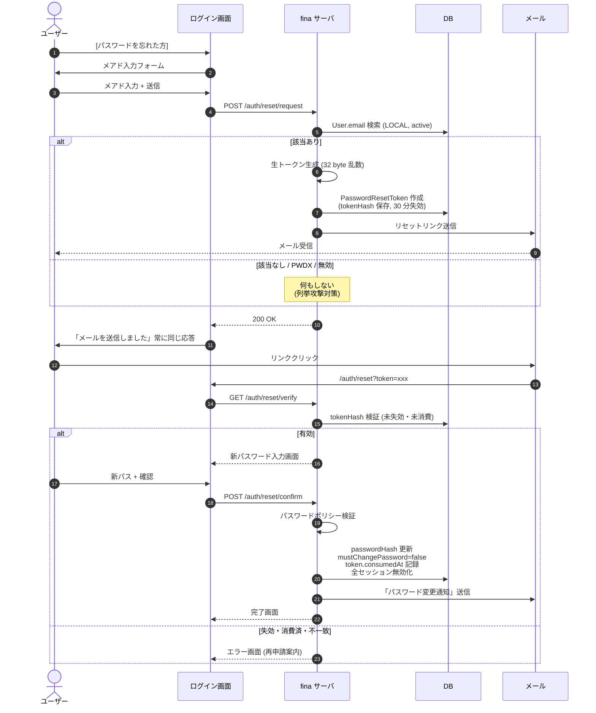

# 管理者画面・認証・権限設計

| 項目 | 値 |
|---|---|
| ステータス | **設計ドラフト**（実装保留） |
| 作成日 | 2026-05-20 |
| 最終更新 | 2026-05-20 (パスワードリセットを「セルフサービス自動化」に変更) |
| 関連 | [USER_MANUAL.md](./USER_MANUAL.md) / [db_design.md](./db_design.md) |

---

## 1. 背景と目的

現状の fina は次の弱点を抱えている。

| 弱点 | 影響 |
|---|---|
| 公開 `/register` から誰でもアカウントを作れる | アクセス制御として弱い |
| ロールが `ADMIN / OPERATOR / VIEWER` の 3 段のみ | 「経費だけ入力させたい」等の細かい制御不可 |
| ユーザー管理画面なし | 招待・無効化・パスリセットを DB 直叩きで運用 |
| 会社スコープなし | OPERATOR は全社データを横断閲覧可能 |
| 監査ログなし | 誰がいつ確定・月締めしたかを画面で追えない |
| PWDX 等の外部システムとの連携設定を持つ場所がない | 連携要否や同期状態を集中管理できない |

これらを解消するために、本ドキュメントで **管理者画面 / 認証方式 / 権限モデル** を一括設計する。

### 達成したいこと

1. **fina-only ユーザー** と **PWDX 連携ユーザー** の 2 タイプを並走させる
2. ユーザー作成は **fina の管理画面に閉じる**（公開 register を廃止し、代わりに **「申請 + 許可」モデル** を導入）
3. 管理者が **ユーザーごとに使える機能** を制御できる
4. **PWDX のログイン情報で fina にもログイン** できる（SSO）
5. **SUPER_ADMIN（システム管理者）** と **COMPANY_ADMIN（企業管理者）** を分ける
6. **PWDX と fina の連携は「会社」を境界に確立する**。メールアドレスでの紐付けは行わない
7. **会社の追加は申請者起点**。SUPER_ADMIN は申請内容を確認して **「許可」ボタンを押すだけ** で済むようにし、SUPER_ADMIN 側の入力コストを最小化する
8. **同一会社内に LOCAL と PWDX 認証ユーザーが混在可能**。ユーザー個別に認証方式を選べる（経理担当が PWDX を持っていなければ LOCAL、持っていれば PWDX）
9. **パスワードリセットはセルフサービス**。ユーザー自身がログイン画面から自動でリセットメールを受け取れる。管理者の手動操作不要（管理者代行は補助手段としてのみ残す）

---

## 2. スコープ

### 本ドキュメントが扱う範囲

- 認証（ローカル認証 / PWDX SSO）
- ロール・権限モデル
- ユーザー招待・管理フロー
- 管理者画面の UI 構成
- PWDX 連携の設定画面（連携処理本体は対象外）
- データモデル（Prisma スキーマ）

### 扱わない範囲

- PWDX → fina の実際のデータ同期処理（別ドキュメント）
- 弥生会計への出力（別ドキュメント）
- OCR / スキャン自動入力（別ドキュメント）
- 既存ユーザーのマイグレーション具体手順（実装時に検討）

---

## 3. 用語定義

| 用語 | 意味 |
|---|---|
| **スコープロール** | 触れる範囲（system / company / self）を表す縦軸のロール |
| **機能パーミッション** | 各機能で何ができるか（view/create/edit/confirm/lock）を表す横軸の権限 |
| **権限テンプレート** | fina 標準のプリセット権限セット（経理マネージャー等） |
| **認証プロバイダ** | LOCAL（fina 独自）または PWDX_OIDC（PWDX SSO） |
| **IdP** | Identity Provider。身元保証を担うシステム。PWDX SSO では Keycloak Realm `pwdx` |
| **OIDC** | OpenID Connect。OAuth2 上で動く認証プロトコル |
| **招待状（UserInvitation）** | 管理者が事前に作る、認証成立時にユーザーを有効化するためのレコード（**会社内のユーザー追加**で使う） |
| **申請（CompanyApplication）** | 公開フォームから「fina を使いたい」会社の担当者が起こす申請。SUPER_ADMIN が許可すると Company と初期 COMPANY_ADMIN が作られる（**会社追加**で使う） |
| **パスワードリセットトークン（PasswordResetToken）** | LOCAL ユーザーがパスワードリセットを要求した時に発行される短期・ワンタイムのトークン。30 分失効、メール内のリンクで使用 |

---

## 4. 認証方式

### 4.1 全体像

```
┌─────────────────────────────────────────────────────────────┐
│                    fina ログイン画面                          │
├─────────────────────────────┬───────────────────────────────┤
│   メール + パスワード         │   [ PWDX でログイン ]          │
│        ↓                    │           ↓                    │
│   (A) fina-only ユーザー      │   (B) PWDX 連携ユーザー         │
│   authProvider: LOCAL       │   authProvider: PWDX_OIDC      │
│   fina 管理者が招待発行       │   fina 管理者が招待発行 +       │
│   メール+初期パスを通知       │   PWDX 認証成立で紐付け         │
│   fina に passwordHash 保管  │   fina に passwordHash 保管せず │
└─────────────────────────────┴───────────────────────────────┘
                  ↓                          ↓
              認証経路の違いはここまで。
        ロール・権限テンプレート・会社割当 はどちらも同じ機構を使う。
```

### 4.2 (A) fina-only ユーザー（LOCAL）

#### 想定ケース

- PWDX を使わない経理担当
- 業務委託先（PWDX のアカウントを持たない人）
- システムの非常用バックアップアカウント（SUPER_ADMIN を含む）

#### 認証フロー

```
ユーザー: ログイン画面でメール+パスワード入力
fina:    passwordHash を照合
fina:    セッショントークン発行 → Cookie に保存
```

#### パスワード管理（招待時・初回ログイン）

- 初期パスワードは招待時に管理者が指定（または自動生成）
- 初回ログイン時に **強制変更**（`User.mustChangePassword=true`）
- パスワードポリシー: 8 文字以上 / 英数字混在（最小限）
- bcrypt または argon2id でハッシュ化（better-auth デフォルト準拠）

#### パスワードリセット（セルフサービス・自動）

ユーザー自身がログイン画面の「パスワードを忘れた方」リンクから完結する。**管理者の手動操作は不要**。

##### フロー

```
1. ユーザー: ログイン画面で [パスワードを忘れた方] をクリック
2. fina:   メアド入力フォームを表示
3. ユーザー: メアド入力 → [送信]
4. fina:   User.email で LOCAL アクティブユーザーを検索
   ├ 該当あり
   │   → PasswordResetToken 作成（生トークン 32 byte 乱数、tokenHash 保存、30 分失効）
   │   → リセットリンク付きメール送信
   ├ 該当なし / PWDX_OIDC / 無効化済
   │   → 内部的にはスキップ（メアド列挙攻撃対策）
5. fina:   いずれの場合も「リセット用メールを送信しました（該当があれば）」と表示
6. ユーザー: メール内リンクをクリック
7. fina:   トークン検証（未失効・未消費・ハッシュ一致）
   ├ OK → 新パスワード入力画面
   └ NG → エラー（再申請を促す）
8. ユーザー: 新パスワード + 確認入力 → [更新]
9. fina:   パスワードポリシー検証
10. fina:  passwordHash 更新
           mustChangePassword=false
           PasswordResetToken.consumedAt 記録
           **既存セッションを全無効化**
11. fina:  ユーザーに「パスワードが変更されました」セキュリティ通知メール送信
12. fina:  AuditLog に password.reset_completed を記録
13. ユーザー: 新パスワードでログイン
```

##### シーケンス図



##### セキュリティ要件

| 項目 | 方針 |
|---|---|
| トークン形式 | 32 byte 暗号学的乱数を base64url エンコード |
| DB 保存形式 | **生トークンは保存しない**。SHA-256 ハッシュのみ保存 |
| 有効期限 | **30 分** |
| 使用回数 | **ワンタイム**（`consumedAt` で管理） |
| 同一メアド宛のレート制限 | 1 時間に **3 回** まで |
| 同一 IP からのレート制限 | 1 時間に **5 回** まで |
| メアド列挙攻撃対策 | レスポンス内容を「該当があれば送信」で常時固定 |
| パスワード変更時の影響 | 該当ユーザーの **全セッションを無効化** |
| セキュリティ通知 | 変更完了時に必ずメール送信（攻撃の早期発見） |
| 監査ログ | `password.reset_requested` / `password.reset_completed` を記録 |
| reCAPTCHA | リクエスト送信フォームに必須 |

##### PWDX_OIDC ユーザーへの対応

- 「パスワードを忘れた方」をクリックしたメアドが PWDX_OIDC ユーザーだった場合、内部的には何もしない
- レスポンスは LOCAL と同じ「メールを送信しました」で統一（列挙攻撃対策）
- ユーザーには別途、ヘルプページに「PWDX 連携ユーザーは PWDX 側でパスワードリセットしてください」と案内

##### 管理者代行リセット（補助手段）

セルフサービスが基本だが、次のケース向けに COMPANY_ADMIN・SUPER_ADMIN は代行発火も可能:

- ユーザーがメアドにアクセスできなくなった（退職メアド等）
- ユーザーが操作に不慣れで電話サポート中

操作:
- ユーザー詳細画面の「パスワードをリセット」ボタンをクリック
- 確認ダイアログ → 同じ PasswordResetToken を発行 + メール送信
- AuditLog には `password.reset_requested_by_admin` として記録（誰の代行か明記）

### 4.3 (B) PWDX 連携ユーザー（PWDX_OIDC）

#### 想定ケース

- PWDX を日常使う営業・現場担当者で、経理画面も触る人
- 会計閲覧のみ必要な経営者・役員

#### 大前提

**会社対会社の連携が事前に確立されていること**（`PwdxIntegration.enabled = true` かつ `pwdxCompanyId` が設定済み）。連携が無い fina 会社には PWDX ユーザーを招待できない。

#### 認証フロー

```
ユーザー:  fina ログイン画面の [ PWDX でログイン ]
ブラウザ:  Keycloak Realm pwdx の認証画面へリダイレクト
ユーザー:  PWDX の ID + パスワード入力（必要なら MFA）
Keycloak: 認証成立 → id_token を fina にリダイレクトで返す
fina:    id_token を検証し sub / pwdx_company_id を取り出す
fina:    UserInvitation を (externalSub または externalUserId) で検索
         ├ 見つかる、status=PENDING、未失効
         │   ├ 招待状の pwdxCompanyId と id_token の pwdx_company_id が一致
         │   │   → User レコード作成・externalSub を保存
         │   └ 不一致 → 「所属会社が変わっています」エラー
         └ 見つからない → 「招待されていません」エラー表示
fina:    セッショントークン発行
```

**重要**: email Claim は **照合に使わない**。fina 側には表示用・連絡用として保管はするが、認証境界の判定材料にはしない。

#### Claims（PWDX 側に依頼する返却情報）

| Claim | 用途 | 必須 |
|---|---|---|
| `sub` | Keycloak ユーザー一意 ID。招待状との照合キー | ✅ |
| `pwdx_user_id` | PWDX 内部のユーザー ID。`sub` と別管理されていれば送付 | 推奨 |
| `pwdx_company_id` | PWDX 側企業 ID。**会社対会社の境界判定に使う** | ✅ |
| `name` | fina ユーザー名（表示用） | ✅ |
| `email` | fina 側の表示・通知用のみ。**認証境界には使わない** | 任意 |

#### PWDX 側に依頼する Keycloak 設定

```
Realm:          pwdx
Client:         fina
Client Type:    confidential
Grant Type:     authorization_code
Redirect URI:   https://fina-five.vercel.app/api/auth/callback/pwdx
                http://localhost:3003/api/auth/callback/pwdx (dev)
Scopes:         openid email profile
```

`Client ID` と `Client Secret` を fina の環境変数で保管。

---

## 5. 権限モデル

### 5.1 スコープロール（縦軸）

| ロール | 触れる範囲 | 典型ユーザー | ユーザー作成権 |
|---|---|---|---|
| **SUPER_ADMIN** | 全企業横断。システム本体（プラン、認証プロバイダ設定、企業追加） | システム管理者 | 全ロール作成可 |
| **COMPANY_ADMIN** | 自社内のユーザー管理・権限割当・月締め | 経理責任者 | OPERATOR / VIEWER のみ |
| **OPERATOR** | 割り当てられた機能だけ操作 | 経理担当・営業担当・給与担当 | 不可 |
| **VIEWER** | 割り当てられた機能を read のみ | 監査・経営者 | 不可 |

### 5.2 機能パーミッション（横軸）

各機能に次の 5 アクションを定義。

| アクション | 説明 |
|---|---|
| `view` | 一覧・詳細を見られる |
| `create` | 新規登録できる |
| `edit` | 既存レコードを編集できる |
| `confirm` | 取引を確定（ステータス変更）できる |
| `lock` | 月締めなど、ロック操作ができる |

機能の対象キー（例）:

```
expenses, sales, costs, salary, inter_group, cashflow_table,
cash_withdrawal, loans, leases, tax_schedule, card_statements, recurring,
journal, reports,
master.partners, master.accounts, master.companies, master.categories, ...
```

パーミッション文字列の形式: `<feature>:<action>`

```
expenses:view
expenses:create
expenses:edit
expenses:confirm
month:lock
master.partners:edit
```

### 5.3 権限テンプレート（プリセット）

fina 標準で提供する 5 種類。COMPANY_ADMIN は **テンプレートから選ぶだけ**（カスタム機能は v2 で検討）。

| キー | 表示名 | 含まれる権限の概要 |
|---|---|---|
| `ACCOUNTING_OPERATOR` | 経理オペレーター | 経費・売上・原価・給与の view/create/edit。confirm/lock 不可 |
| `ACCOUNTING_MANAGER` | 経理マネージャー | 経理オペレーター + 全機能の confirm + 月締め (lock) |
| `SALES_STAFF` | 営業担当 | sales:view/create/edit、master.partners:view、cashflow_table:view |
| `PAYROLL_STAFF` | 給与担当 | salary:view/create/edit/confirm、master.payroll_groups:view |
| `EXECUTIVE_VIEWER` | 役員（閲覧） | 全機能の view のみ |

#### スコープロール × テンプレートの組み合わせ例

| スコープロール | テンプレート | 結果 |
|---|---|---|
| OPERATOR | ACCOUNTING_OPERATOR | 自社の経費・売上・原価・給与を入力できるが確定はできない |
| OPERATOR | SALES_STAFF | 自社の売上だけ触れる |
| VIEWER | EXECUTIVE_VIEWER | 自社の全機能を閲覧のみ |
| COMPANY_ADMIN | ACCOUNTING_MANAGER | 自社の全機能 + ユーザー管理・月締め |
| SUPER_ADMIN | (テンプレート不問) | 全企業・全機能・システム設定 |

---

## 6. データモデル（Prisma スキーマ案）

### 6.1 enum

```prisma
enum ScopeRole {
  SUPER_ADMIN
  COMPANY_ADMIN
  OPERATOR
  VIEWER
}

enum AuthProvider {
  LOCAL
  PWDX_OIDC
}

enum InvitationStatus {
  PENDING
  ACCEPTED
  EXPIRED
  REVOKED
}
```

### 6.2 User

```prisma
model User {
  id              String        @id @default(cuid())
  email           String        @unique
  name            String
  scopeRole       ScopeRole
  authProvider    AuthProvider  @default(LOCAL)

  // LOCAL のみ
  passwordHash    String?
  passwordChangedAt DateTime?
  mustChangePassword Boolean    @default(false)

  // PWDX_OIDC のみ
  externalSub     String?       @unique  // Keycloak の sub
  externalProvider String?                // "pwdx" 固定（将来拡張用に文字列）

  // 共通
  companyId       String?       // 原則 1人=1会社。SUPER_ADMIN は null
  templateKey     String?       // 権限テンプレ。SUPER_ADMIN/COMPANY_ADMIN 以外は必須
  permissionsOverride Json?     // 将来のカスタム権限拡張用（v1 では未使用）

  isActive        Boolean       @default(true)
  invitedBy       String?
  lastLoginAt     DateTime?
  createdAt       DateTime      @default(now())
  updatedAt       DateTime      @updatedAt

  company         Company?      @relation(fields: [companyId], references: [id])
  inviter         User?         @relation("UserInviter", fields: [invitedBy], references: [id])
  invitees        User[]        @relation("UserInviter")
  auditLogs       AuditLog[]

  @@index([companyId])
  @@index([authProvider])
  @@schema("fina")
  @@map("users_fina")
}
```

### 6.3 UserInvitation

```prisma
model UserInvitation {
  id                  String           @id @default(cuid())
  authProvider        AuthProvider                             // LOCAL or PWDX_OIDC
  scopeRole           ScopeRole
  templateKey         String?                                  // OPERATOR/VIEWER の場合必須
  companyId           String                                   // 招待対象の fina 会社（1 つ）
  displayName         String                                   // 招待時に管理者が入力する表示名

  // LOCAL のみ（メアドが認証識別子）
  email               String?                                  // LOCAL の場合必須
  initialPasswordHash String?
  initialPasswordHint String?                                  // 通知メールに載せるヒント文

  // PWDX_OIDC のみ（sub / pwdx_user_id が認証識別子。会社対会社で境界を引く）
  pwdxCompanyId       String?                                  // PWDX 側企業 ID（PwdxIntegration と一致）
  externalSub         String?                                  // Keycloak の sub（事前に分かれば指定）
  externalUserId      String?                                  // PWDX 側 user_id（一覧 API で取得できる場合）
  notifyEmail         String?                                  // 招待通知の送信先（表示用、認証には使わない）

  invitedBy           String
  invitedAt           DateTime         @default(now())
  expiresAt           DateTime                                 // 通常 14 日
  status              InvitationStatus @default(PENDING)
  acceptedAt          DateTime?
  acceptedUserId      String?                                  // 承認されたら User.id

  inviter             User             @relation(fields: [invitedBy], references: [id])

  @@index([authProvider, status])
  @@index([companyId, status])
  @@index([pwdxCompanyId, externalSub])
  @@index([pwdxCompanyId, externalUserId])
  @@index([email, status])
  @@index([status, expiresAt])
  @@schema("fina")
  @@map("user_invitations_fina")
}
```

**識別子の整理:**

| authProvider | 招待状の識別キー | 初回ログイン時の照合 |
|---|---|---|
| `LOCAL` | `email` | メール + 初期パスワード |
| `PWDX_OIDC` | `(pwdxCompanyId, externalSub)` または `(pwdxCompanyId, externalUserId)` | id_token の `sub` / `pwdx_user_id` と `pwdx_company_id` |

PWDX_OIDC では **email は識別に使わない**。会社境界 (`pwdxCompanyId`) とユーザー識別子 (`sub` または `pwdx_user_id`) のペアで一意性を担保する。

### 6.4 PermissionTemplate

```prisma
model PermissionTemplate {
  key           String   @id            // "ACCOUNTING_OPERATOR" 等
  name          String                  // 表示名
  description   String?
  permissions   Json                    // ["expenses:view","expenses:create",...]
  isBuiltIn     Boolean  @default(true) // 標準テンプレは編集不可
  displayOrder  Int      @default(0)
  createdAt     DateTime @default(now())

  @@schema("fina")
  @@map("permission_templates_fina")
}
```

### 6.5 PwdxIntegration

```prisma
model PwdxIntegration {
  id                String   @id @default(cuid())
  companyId         String   @unique
  enabled           Boolean  @default(false)
  pwdxCompanyId     String                            // PWDX 側企業 ID
  apiBaseUrl        String?
  credentialKey     String                            // KMS等への参照キー（生クレデンシャルは保存しない）
  syncFeatures      Json                              // {partners:true, invoices:true, ...}
  lastSyncedAt      DateTime?
  lastSyncStatus    String?                           // "SUCCESS"|"FAILED"|"RUNNING"
  lastSyncMessage   String?
  createdAt         DateTime @default(now())
  updatedAt         DateTime @updatedAt

  company           Company  @relation(fields: [companyId], references: [id])

  @@schema("fina")
  @@map("pwdx_integrations_fina")
}
```

### 6.6 CompanyApplication（新規）

```prisma
model CompanyApplication {
  id                String           @id @default(cuid())
  status            InvitationStatus @default(PENDING)  // PENDING / APPROVED / REJECTED / EXPIRED

  // 申請者情報（公開フォームで入力された自己申告）
  applicantName     String                                   // 申請者氏名
  applicantEmail    String                                   // 連絡先メアド（必須）
  applicantPhone    String?                                  // 電話番号（任意）
  notes             String?                                  // 補足メモ

  // 会社情報（自己申告）
  companyName       String                                   // 会社名

  // PWDX 連携の希望
  usePwdx           Boolean          @default(false)

  // PWDX 認証データ（usePwdx=true 時のみ。申請時に PWDX で認証済の場合に格納される）
  pwdxCompanyId     String?                                  // 申請時に取得した PWDX 会社 ID
  pwdxCompanyName   String?                                  // PWDX 会社名（表示用）
  externalSub       String?                                  // Keycloak の sub
  externalUserId    String?                                  // PWDX 内部 user_id
  pwdxClaimsSnapshot Json?                                   // 申請時 claims の完全スナップショット（監査用）

  // 監査・処理結果
  createdAt         DateTime         @default(now())
  reviewedAt        DateTime?
  reviewedBy        String?                                  // SUPER_ADMIN の User.id
  reviewComment     String?                                  // 却下理由など
  expiresAt         DateTime                                 // 30 日（PENDING のみ意味あり）

  // 承認時に作られたレコード（参照用）
  createdCompanyId  String?                                  // 承認後に作られた Company.id
  createdUserId     String?                                  // 承認後に作られた User.id（COMPANY_ADMIN）

  @@index([status, createdAt])
  @@index([externalSub])
  @@index([pwdxCompanyId])
  @@schema("fina")
  @@map("company_applications_fina")
}
```

**ポイント:**
- `applicantEmail` は連絡先用。PWDX 連携時の認証識別子にはしない（識別キーは `externalSub`）
- `pwdxClaimsSnapshot` を完全保存しておくことで、承認時に最新値で再検証できる
- 承認後に作った `Company.id` / `User.id` を逆引きできるよう参照を残す

### 6.7 PasswordResetToken（新規）

```prisma
model PasswordResetToken {
  id            String   @id @default(cuid())
  userId        String                                  // 対象ユーザー
  tokenHash     String   @unique                        // 生トークンの SHA-256 ハッシュ
  expiresAt     DateTime                                // 通常 now + 30 分
  consumedAt    DateTime?                               // ワンタイム使用済の印
  requestedBy   String?                                 // null = セルフ, userId = 管理者代行
  requestIp     String?                                 // 監査用
  userAgent     String?
  createdAt     DateTime @default(now())

  user          User     @relation(fields: [userId], references: [id])

  @@index([userId, consumedAt])
  @@index([expiresAt])
  @@schema("fina")
  @@map("password_reset_tokens_fina")
}
```

**ポイント:**
- DB には**生トークンを保存しない**（漏洩時の被害を最小化）
- `requestedBy` で「セルフ要求」と「管理者代行」を区別できる
- ワンタイム使用は `consumedAt` の null/非 null で判定

### 6.8 AuditLog

```prisma
model AuditLog {
  id           String   @id @default(cuid())
  userId       String?
  companyId    String?
  action       String                                   // "user.create" "transaction.confirm" "month.lock" etc.
  targetType   String?                                  // "User" "Transaction" "Company" ...
  targetId     String?
  payload      Json?                                    // 変更内容のスナップショット
  ipAddress    String?
  userAgent    String?
  createdAt    DateTime @default(now())

  user         User?    @relation(fields: [userId], references: [id])

  @@index([companyId, createdAt])
  @@index([userId, createdAt])
  @@index([action, createdAt])
  @@schema("fina")
  @@map("audit_logs_fina")
}
```

### 6.9 既存 UserRole enum との関係

既存の `UserRole`（ADMIN / OPERATOR / VIEWER）は **`ScopeRole` に名前変更し、ADMIN を SUPER_ADMIN / COMPANY_ADMIN に分割**。マイグレーション時:

- 既存 ADMIN → 暫定的に COMPANY_ADMIN として扱う
- システム運用担当 1 名を手動で SUPER_ADMIN に昇格
- 既存 OPERATOR は `templateKey = ACCOUNTING_OPERATOR` を付与
- 既存 VIEWER は `templateKey = EXECUTIVE_VIEWER` を付与

---

## 7. 会社追加フロー（申請 + 許可）

### 7.0 設計の意図

「fina を使いたい会社」が出てきた時に、SUPER_ADMIN が会社情報・代表者情報・PWDX 情報を聞き取って入力する運用だと SUPER_ADMIN の手間が大きい。代わりに、**申請者本人が情報を入力 → SUPER_ADMIN は「許可」ボタンを押すだけ** という運用にする。

### 7.1 全体フロー

```
[公開] fina ログイン画面
         ↓
       [新規申請] ボタン
         ↓
  ┌──────────────────────────────────┐
  │ Q. PWDX を使っていますか？           │
  │   (●) はい    ( ) いいえ            │
  └──────────────────────────────────┘
         │                    │
         │ はい               │ いいえ
         ▼                    ▼
  [ PWDX で認証 ]      [手入力フォーム]
         ↓                    │
  Keycloak で認証              │
  sub / pwdx_company_id        │
  pwdx_company_name 等取得      │
         ↓                    │
  申請フォーム                  │
  (PWDX claims で pre-fill)    │
         │                    │
         └────────┬───────────┘
                  ▼
         [ 申請を送信 ]
                  ↓
       CompanyApplication 作成 (PENDING)
                  ↓
       SUPER_ADMIN に通知
                  ↓
  [SUPER_ADMIN] 申請一覧で内容確認
                  ↓
       ┌────────┴────────┐
       ▼                 ▼
    [ 許可 ]          [ 却下 ]
       │                 │
       ▼                 ▼
   ┌──────────────┐   申請者に却下通知メール
   │ Company 作成   │
   │ (PWDX なら) PwdxIntegration 作成 │
   │ User 作成 (COMPANY_ADMIN)       │
   │ 申請者に許可通知                  │
   └──────────────┘
       │
       ▼ (PWDX なし)        ▼ (PWDX あり)
   パスワード設定リンク   「PWDX でログインしてください」
   申請者がメール経由     申請者が [PWDX でログイン]
   でパス設定 → ログイン   sub 一致で即ログイン
```

### 7.2 申請画面（公開、ログイン画面の [新規申請] から遷移）

```
┌────────────────────────────────────────────────────────┐
│ fina 利用申請                                            │
├────────────────────────────────────────────────────────┤
│                                                          │
│ Q. PWDX を使っていますか？                                  │
│    (●) はい：PWDX のアカウントで申請する                    │
│    ( ) いいえ：fina 単体で使いたい                          │
│                                                          │
│ ── PWDX あり選択時 ──────────────────────────────────── │
│                                                          │
│   [ PWDX で認証して続行 ] ボタン                            │
│                                                          │
│   ※ クリックすると PWDX のログイン画面に飛びます。            │
│      認証後、申請フォームに自動で情報が入ります。              │
│                                                          │
│ ── PWDX なし選択時 ──────────────────────────────────── │
│                                                          │
│   会社名（必須）:      [_____________________]              │
│   申請者氏名（必須）:   [_____________________]              │
│   連絡先メアド（必須）:  [_____________________]              │
│   電話番号:           [_____________________]              │
│   補足メモ:           [_____________________]              │
│                                                          │
│   [ 申請を送信 ]                                            │
│                                                          │
└────────────────────────────────────────────────────────┘
```

PWDX で認証して続行後の画面（pre-fill 済み）:

```
┌────────────────────────────────────────────────────────┐
│ fina 利用申請（PWDX 認証済み）                              │
├────────────────────────────────────────────────────────┤
│                                                          │
│ PWDX で認証された情報:                                      │
│   会社名:     起グループ (PWDX 会社 ID: okigroup_001)        │
│   申請者氏名:  大室 春人                                     │
│   PWDX ID:    u_12345                                     │
│                                                          │
│ ── 追加情報 ──────────────────────────────────────────── │
│                                                          │
│   連絡先メアド: [h.oomuro@winners.jp]  ← pre-fill 編集可     │
│   補足メモ:    [_____________________]                      │
│                                                          │
│   [ 申請を送信 ]                                            │
│                                                          │
└────────────────────────────────────────────────────────┘
```

### 7.3 SUPER_ADMIN の申請承認画面

`/admin/system/applications`（SUPER_ADMIN のみ閲覧可）

#### 一覧

| 申請日 | 会社名 | 申請者 | 連絡先 | PWDX | 状態 | 操作 |
|---|---|---|---|---|---|---|
| 2026-05-20 | 起グループ | 大室 春人 | h.oomuro@winners.jp | 連携希望 (okigroup_001) | 承認待ち | [詳細] |
| 2026-05-19 | サンプル商事 | 田中 太郎 | tanaka@sample.jp | なし | 承認待ち | [詳細] |
| 2026-05-18 | 旧株式会社 | 佐藤 一郎 | sato@old.jp | なし | 却下 | [詳細] |

#### 詳細画面（許可前）

```
┌────────────────────────────────────────────────────────┐
│ 申請詳細                                                   │
├────────────────────────────────────────────────────────┤
│ 申請日:        2026-05-20 14:32                            │
│ 状態:          承認待ち                                     │
│                                                          │
│ ── 申請者情報 ────────────────────────────────────────── │
│   氏名:        大室 春人                                    │
│   連絡先:      h.oomuro@winners.jp                         │
│   電話:        -                                          │
│                                                          │
│ ── 会社情報 ─────────────────────────────────────────── │
│   会社名:      起グループ                                   │
│   補足メモ:    -                                          │
│                                                          │
│ ── PWDX 連携 ───────────────────────────────────────── │
│   連携希望:    あり                                        │
│   PWDX 会社:   okigroup_001 (起グループ)                    │
│   認証 sub:    kc_8f2a3d4e... (検証済)                     │
│   PWDX User ID: u_12345                                   │
│                                                          │
│ ── 許可時のアクション（プレビュー） ─────────────────────── │
│   ☑ Company レコード作成（会社名: 起グループ）                 │
│   ☑ PwdxIntegration 作成 (enabled=true, pwdx_company_id=okigroup_001) │
│   ☑ User 作成 (COMPANY_ADMIN, authProvider=PWDX_OIDC)      │
│   ☑ 申請者に許可通知メール送信（h.oomuro@winners.jp）         │
│                                                          │
│ コメント（却下理由など）: [____________________]              │
│                                                          │
│ [ ← 戻る ]    [ 却下 ]    [ 許可 ]                          │
└────────────────────────────────────────────────────────┘
```

**ポイント**: SUPER_ADMIN は「許可」を押すだけで、内部的に Company / PwdxIntegration / User が自動作成される。手入力は不要（必要に応じてコメントだけ書ける）。

### 7.4 許可後のアクション

#### PWDX 連携あり

```
fina: Company レコード作成
fina: PwdxIntegration 作成（enabled=true, pwdxCompanyId=申請の値）
fina: User 作成
       - scopeRole = COMPANY_ADMIN
       - authProvider = PWDX_OIDC
       - externalSub = 申請時の sub
       - companyId = 作成した Company.id
fina: 申請者にメール通知
       件名: 「fina の利用が許可されました（PWDX 連携）」
       本文: 「fina ログイン画面で [ PWDX でログイン ] を押してください」
申請者: fina ログイン → [PWDX でログイン] → 即ダッシュボード
```

#### PWDX 連携なし

```
fina: Company レコード作成
fina: User 作成
       - scopeRole = COMPANY_ADMIN
       - authProvider = LOCAL
       - passwordHash = null（初回ログインで設定）
       - mustChangePassword = true
       - email = 申請者メアド
fina: 申請者にパスワード設定リンクをメール送信
       件名: 「fina の利用が許可されました」
       本文: 「下記リンクからパスワードを設定してください」
申請者: メールリンク → パスワード設定 → ログイン
```

### 7.5 申請の却下・取消

- SUPER_ADMIN は「却下」ボタン + コメントで却下可能。申請者に通知メール送信
- 申請者が同一 PWDX 会社 ID で再申請した場合、既存却下を SUPER_ADMIN が確認できるよう履歴に表示
- 30 日経過した PENDING 申請は cron で EXPIRED に変更

### 7.6 重複チェック

許可前に SUPER_ADMIN が確認できるよう、次の重複を検出して警告表示する:

| 重複種別 | 検出方法 | 表示 |
|---|---|---|
| 同一 PWDX 会社 ID で既に Company 登録済 | `PwdxIntegration.pwdxCompanyId` 一致 | 警告: 「同じ PWDX 会社が既に登録されています」 |
| 同一会社名で既に Company 登録済 | `Company.name` 完全一致 | 警告: 「同名の会社が既に存在します」 |
| 同一 sub で既に User 登録済 | `User.externalSub` 一致 | エラー: 「この PWDX ユーザーは既に別会社で使われています」（1人=1会社原則） |
| 同一メアドで既に User 登録済 | `User.email` 一致 | 警告: 「同じメアドのユーザーが別会社にいます」 |

---

## 8. 招待フロー（会社内のユーザー追加）

### 8.0 設計の意図

**第 7 章の「会社追加フロー」と本章は役割が違う**。

| 章 | 対象 | 発信元 | 受信者 |
|---|---|---|---|
| 第 7 章 | **会社の追加** | a 会社の担当者（公開フォーム） | SUPER_ADMIN（許可ボタン） |
| 第 8 章（本章） | **既存会社へのユーザー追加** | COMPANY_ADMIN | 追加されるユーザー |

つまり「a 会社が fina を使い始める」ときは第 7 章のフロー。「a 会社の COMPANY_ADMIN が経理担当を追加する」ときは本章のフロー。

### 8.1 認証方式は招待時にユーザー単位で選ぶ

会社対会社の PWDX 連携が有効でも、配下のユーザー一人ひとりは「LOCAL / PWDX」を選べる。

| 状況 | 推奨される選択 |
|---|---|
| 経理担当が PWDX のアカウントを持っていない | LOCAL（fina で新規発行） |
| 経理担当が既に PWDX で働いている | PWDX_OIDC（同じ ID で fina にも入れる） |
| 監査人など外部の人 | LOCAL（PWDX に巻き込まない） |

会社の PWDX 連携が無効な場合は、PWDX_OIDC を選ぶ選択肢自体が画面に出ない。


### 8.2 招待状作成画面

`/admin/users/new` に管理者がアクセス。**認証タイプによって入力フィールドが切り替わる**。

#### LOCAL 招待

```
┌──────────────────────────────────────────────────┐
│ ユーザーを招待                                     │
├──────────────────────────────────────────────────┤
│ 認証タイプ: (●) fina ローカル                       │
│             ( ) PWDX 連携                          │
│                                                  │
│ 名前:      [____________]                         │
│ メアド:    [____________]   ← 認証 ID として使用    │
│ 会社:      [起グループ ▼]                          │
│ スコープ:  [OPERATOR ▼]                           │
│ テンプレ:  [経理オペレーター ▼]                    │
│                                                  │
│ 初期パスワード:                                     │
│   (●) 自動生成（推奨）                              │
│   ( ) 手動指定: [____________]                     │
│                                                  │
│ 有効期限: [2026-06-03] (招待後 14 日)               │
│                                                  │
│ [ キャンセル ]   [ 招待状を発行 ]                    │
└──────────────────────────────────────────────────┘
```

#### PWDX 連携招待

**前提**: 選択した fina 会社が PWDX 連携を有効化済みであること。連携されていない会社は「会社」プルダウンに出ない、または選択時に警告表示。

```
┌──────────────────────────────────────────────────┐
│ ユーザーを招待                                     │
├──────────────────────────────────────────────────┤
│ 認証タイプ: ( ) fina ローカル                       │
│             (●) PWDX 連携                          │
│                                                  │
│ fina 会社:        [起グループ ▼]                    │
│ 連携先 PWDX 会社: okigroup_001 (起グループ) ← 自動表示│
│                                                  │
│ PWDX ユーザー指定:                                  │
│   (●) PWDX ユーザー一覧から選ぶ                     │
│       [山田 太郎 (u_12345) ▼ 検索]                  │
│                                                  │
│   ( ) PWDX user_id を手動入力                       │
│       [____________]                              │
│                                                  │
│   ( ) Keycloak sub を手動入力                       │
│       [____________]                              │
│                                                  │
│ 表示名:        [____________] ← fina 内で使う名前   │
│ 通知メール:    [____________] (任意。認証には使わない)│
│ スコープ:      [OPERATOR ▼]                        │
│ テンプレ:      [営業 ▼]                            │
│                                                  │
│ 有効期限: [2026-06-03] (招待後 14 日)               │
│                                                  │
│ [ キャンセル ]   [ 招待状を発行 ]                    │
└──────────────────────────────────────────────────┘
```

**ポイント:**
- **会社が認証境界**：fina 会社を選ぶと連携先 PWDX 会社が自動決定される
- 「PWDX ユーザー指定」の選び方は 3 通り（PWDX 側 API の有無で運用が変わる）
  1. PWDX 一覧 API がある → ドロップダウンで選択（理想）
  2. API はないが PWDX user_id を業務側で知っている → 手動入力
  3. sub だけ事前共有できる場合 → sub を直接入力
- **通知メールは認証に使わない**。招待状の URL を伝える純粋な連絡手段
- 1 ユーザー = 1 会社のため、複数会社選択はなし（前回設計から変更）

### 8.3 LOCAL 招待フロー

```
管理者: 招待状作成（タイプ: fina ローカル）
        - 名前・メアド・会社・スコープ・テンプレを入力
fina:   UserInvitation 作成
        - email を識別子として保存
        - 初期パスワードを自動生成（または管理者指定）
        - initialPasswordHash に保存
        - companyId 確定（1 つの会社）
fina:   招待メール送信
        件名: 「fina へのご招待」
        本文: 招待リンク + 初期パスワード
ユーザー: メール内リンクをクリック
        → fina ログイン画面（招待トークンが URL に付く）
ユーザー: メアド + 初期パスでログイン
fina:   UserInvitation 検証（email で照合）
        → User レコード作成（authProvider=LOCAL, companyId=招待状の会社）
        → UserInvitation.status = ACCEPTED
fina:   強制パスワード変更画面（mustChangePassword=true）
ユーザー: 新パスワードを設定
fina:   ダッシュボードへ
```

### 8.4 PWDX_OIDC 招待フロー

```
事前:    [会社対会社の連携] PwdxIntegration.enabled=true、pwdxCompanyId 設定済み

管理者: 招待状作成（タイプ: PWDX 連携）
        - fina 会社を選択 → 連携先 PWDX 会社が自動決定
        - PWDX ユーザー指定（一覧選択 / user_id 手動 / sub 手動 のいずれか）
        - 表示名・スコープ・テンプレを入力
fina:   UserInvitation 作成
        - pwdxCompanyId / externalSub または externalUserId を保存
        - companyId（fina 側会社）も保存
        - email は識別に使わず、notifyEmail として表示用にのみ保管
fina:   招待通知送信（任意）
        件名: 「fina へのご招待（PWDX 連携）」
        本文: 「fina ログイン画面で [ PWDX でログイン ] を押してください」
        ※ メアド不明の場合は管理者から口頭/Slack で URL を伝える運用も可
ユーザー: fina ログイン画面 → [ PWDX でログイン ]
ブラウザ: Keycloak の認証画面
ユーザー: PWDX 認証
Keycloak: id_token 返却（sub, pwdx_company_id, pwdx_user_id, name）
fina:   id_token を検証
fina:   UserInvitation 検索（次の優先順位）
        1. externalSub == id_token.sub
        2. externalUserId == id_token.pwdx_user_id
        いずれかが (pwdxCompanyId == id_token.pwdx_company_id) と一致する PENDING を探す
        ├ 見つかる
        │   → User 作成（authProvider=PWDX_OIDC, externalSub=sub, companyId=招待状の会社）
        │   → UserInvitation.status = ACCEPTED
        │   → externalSub が事前未指定だった場合はここで確定
        ├ 見つからない / 会社不一致 / 失効
        │   → エラー画面「招待されていないか、所属会社が変わっています」
fina:   ダッシュボードへ（会社選択は不要。招待時に会社が確定済み）
```

**変更点（前案からの主な差分）:**
- 会社選択画面が **不要に**（招待時点で会社が 1 つに確定）
- 識別キーが **メアドから sub / pwdx_user_id へ**
- 会社対会社の連携 (`PwdxIntegration`) が**前提条件**として追加された
- id_token の `pwdx_company_id` を**境界チェック**に使う

### 8.5 招待状の失効・取消

- 14 日以上経過した PENDING 招待は cron で `EXPIRED` に変更
- 管理者は招待状一覧画面から `REVOKED` に変更可能
- ACCEPTED 済み招待状は履歴として残す（取消不可）

---

## 9. ログイン画面

### 9.1 UI 構成

```
┌─────────────────────────────┐
│         経理くん              │
│                               │
│   ┌─────────────────────┐    │
│   │  PWDX でログイン      │    │
│   └─────────────────────┘    │
│                               │
│      ── または ──             │
│                               │
│   メールアドレス               │
│   [______________________]   │
│                               │
│   パスワード                   │
│   [______________________]   │
│                               │
│   [ ログイン ]                 │
│                               │
│   パスワードを忘れた方         │
│                               │
│   ─────────────────────────  │
│                               │
│   fina を新たに使いたい方は    │
│   [ 新規申請 ]                 │
└─────────────────────────────┘
```

- 上に PWDX ログインボタンを配置（推奨経路を上に）
- 区切り線 `── または ──` で視覚的に分離
- 公開 `/register` ページは **削除**。即時アカウント発行は不可
- 「パスワードを忘れた方」リンクから **セルフサービスでパスワードリセット**（§4.2 参照）。メアド入力 → 自動でリセットメールが届く → 30 分以内にリンクをクリックして新パスワード設定。管理者の介在は不要
- **[ 新規申請 ] ボタン**は **§7 会社追加フロー** の起点。クリックすると申請画面（§7.2）に遷移
- 即時にはアカウントは作られず、SUPER_ADMIN の許可後にメール案内が届く

### 9.2 PWDX 連携が会社単位で無効な場合

- 「PWDX でログイン」ボタンは常時表示する
- クリック → Keycloak 認証成立後、`UserInvitation` が無ければエラー
- これにより PWDX 連携 ON の会社のユーザーだけが入れる

---

## 10. 管理者画面の構成

### 10.1 サイドバー

`COMPANY_ADMIN` 以上のみ「管理者」セクションが表示される。`SUPER_ADMIN` のみ「システム」セクションが追加表示。

```
（無印）                          全員
├─ ダッシュボード
├─ 資金繰り表
├─ 財務レポート
└─ 仕訳帳

入力 / 管理 / マスタ              機能パーミッションで個別出し分け

管理者                            COMPANY_ADMIN 以上
├─ ユーザー管理                    招待・編集・無効化
├─ 招待状一覧                      未承認・失効の一覧
├─ PWDX 連携                       会社単位の連携設定
├─ 監査ログ                        誰がいつ何を
└─ 月締め状況                      自社の月締めカレンダー

システム                          SUPER_ADMIN のみ
├─ 申請管理                        会社追加申請の一覧・許可・却下 (NEW)
├─ 全企業一覧                      企業追加・無効化
├─ 認証プロバイダ設定               Keycloak Realm URL / Client ID 等
├─ 権限テンプレート閲覧             プリセット内容の確認
└─ 全社監査ログ                    横断検索
```

### 10.2 主要画面の機能

#### 10.2.1 ユーザー管理（`/admin/users`）

##### 一覧

| 名前 | 識別子 | 認証 | 会社 | スコープ | テンプレ | 状態 | 最終ログイン | 操作 |
|---|---|---|---|---|---|---|---|---|
| 大室 春人 | sub: kc_8f2a... | PWDX | 起グループ | COMPANY_ADMIN | - | 有効 | 2026-05-19 18:42 | [編集] |
| 山田 太郎 | yamada@example.jp | fina | 起工業 | OPERATOR | 経理オペレーター | 有効 | 2026-05-18 09:11 | [編集][無効化] |
| 佐藤 一郎 | sato@example.jp | fina | 松村建設 | OPERATOR | 営業 | 招待中 | - | [再送][取消] |
| 鈴木 花子 | u_12345 (PWDX) | PWDX | 起工業 | OPERATOR | 営業 | 招待中 | - | [再送][取消] |

**識別子列の表示ルール:**

| 認証 | 主表示 | 補足 |
|---|---|---|
| LOCAL | メアド | 唯一の識別子 |
| PWDX | `sub: <prefix>...` または `u_<pwdx_user_id>` | メアドが分かっていれば副表示で出すが、編集 UI では識別キーを優先 |

- フィルタ: 認証タイプ / 会社 / スコープ / 状態（有効・無効・招待中）
- 検索: 名前・メアド

##### 詳細編集

- スコープロール変更（COMPANY_ADMIN は OPERATOR/VIEWER 間のみ）
- テンプレート変更
- 会社割当変更（変更時は再ログイン要求）
- 無効化 / 再有効化
- LOCAL のみ: パスワードリセット送信

#### 10.2.2 招待状一覧（`/admin/invitations`）

| 招待先 | 認証 | 会社 | スコープ | テンプレ | 招待日 | 有効期限 | 状態 | 操作 |
|---|---|---|---|---|---|---|---|---|
| new@example.jp | fina | 起グループ | OPERATOR | 経理オペレーター | 2026-05-20 | 2026-06-03 | 承認待ち | [再送][取消] |
| u_12345 (PWDX) | PWDX | 起工業 | OPERATOR | 営業 | 2026-05-19 | 2026-06-02 | 承認待ち | [再送][取消] |
| done@example.jp | fina | 松村建設 | OPERATOR | 経理オペレーター | 2026-05-10 | 2026-05-24 | 承認済 | - |

**「招待先」列の表示ルール:**

| 認証 | 表示 |
|---|---|
| LOCAL | email |
| PWDX | `u_<externalUserId>` または `sub:<externalSub>`（持っている方を優先） |

#### 10.2.3 PWDX 連携（`/admin/pwdx`）

会社一覧と、各会社の連携状況サマリ。

```
会社               | 連携 | 同期対象             | 最終同期        | 状態
起グループ          | 有効 | 取引先, 請求          | 2026-05-20 03:00 | 成功
起工業             | 有効 | 取引先                | 2026-05-20 03:00 | 成功
WINNERS           | 無効 | -                    | -               | -
松村建設           | 有効 | 取引先, 請求, 発注     | 2026-05-20 02:55 | 失敗 (詳細)
```

各会社をクリックすると詳細設定:

```
┌─────────────────────────────────────────────────────────┐
│ PWDX 連携: 起グループ                                      │
├─────────────────────────────────────────────────────────┤
│ [☑] PWDX 連携を有効化                                      │
│                                                          │
│ PWDX 企業 ID:     [okigroup_001]                          │
│ API URL:         [https://pwdx.example.jp/api/v1]         │
│ API キー:         [********]  [回転]                       │
│                                                          │
│ 同期対象:                                                  │
│   [☑] 取引先マスタ        最終: 2026-05-20 03:00 (成功)     │
│   [☑] 請求 → 売上         最終: 2026-05-20 03:05 (3件)      │
│   [☐] 発注 → 原価支払                                       │
│   [☐] 案件マスタ                                            │
│                                                          │
│ [ 今すぐ同期 ]  [ 同期履歴 ]                                 │
└─────────────────────────────────────────────────────────┘
```

#### 10.2.4 監査ログ（`/admin/audit`）

| 日時 | ユーザー | 会社 | アクション | 対象 | 詳細 |
|---|---|---|---|---|---|
| 2026-05-20 14:32 | 大室 春人 | 起グループ | `month.lock` | 2026-04 | [JSON] |
| 2026-05-20 12:11 | 山田 太郎 | 起工業 | `transaction.confirm` | tx_abc123 | [JSON] |
| 2026-05-19 18:45 | 大室 春人 | - | `user.invite` | new@example.jp | [JSON] |

- フィルタ: 期間 / ユーザー / アクション / 対象タイプ
- CSV エクスポート

#### 10.2.5 月締め状況（`/admin/month-close`）

各会社 × 各月の月締め状況をマトリクスで表示。

| 会社 | 2025-12 | 2026-01 | 2026-02 | 2026-03 | 2026-04 | 2026-05 |
|---|---|---|---|---|---|---|
| 起グループ | 締済 | 締済 | 締済 | 締済 | **未** | - |
| 起工業 | 締済 | 締済 | 締済 | 締済 | 締済 | - |
| WINNERS | 締済 | 締済 | 締済 | **未** | **未** | - |

「未」をクリックすると該当の資金繰り表へ。

#### 10.2.6 申請管理（`/admin/system/applications`） — SUPER_ADMIN のみ

§7.3 で詳述した会社追加申請の一覧と詳細画面。本セクションでは管理者画面サイドバー上の位置づけのみ示す。

- サイドバー「システム」グループに配置
- PENDING の件数をバッジ表示
- 一覧画面のフィルタ: 状態（承認待ち / 承認済 / 却下 / 失効）, PWDX 連携有無, 申請日範囲
- 詳細画面の操作: [許可] / [却下] / コメント記入

---

## 11. PWDX 連携の取り扱い

### 11.1 設定の保管場所

`PwdxIntegration` テーブル（会社 1 対 1）。`credentialKey` には KMS / Vercel KV / Vault 等への参照キーのみ保存し、生 API キーを DB に置かない。

### 11.2 同期対象 ON/OFF

会社単位で次のチェックボックス管理:

- 取引先マスタ
- 請求 → 売上
- 発注 → 原価支払
- 案件マスタ

実際の同期ロジックは別ドキュメント（`pwdx_sync_design.md` 仮）で扱う。本ドキュメントでは「画面と保管」のみ規定。

### 11.3 同期ジョブ履歴

`SyncJob` / `SyncJobLog` テーブルを今後追加（実装フェーズで具体化）。本ドキュメントでは未定義のまま残す。

---

## 12. SSO 実装ステップ

| Phase | 内容 | PWDX 側依存 |
|---|---|---|
| **P1** | User モデル拡張（authProvider, externalSub）+ 公開 `/register` 削除 | なし |
| **P2** | 管理者画面：ユーザー管理（LOCAL 招待のみ動作） | なし |
| **P3** | 管理者画面：PWDX 連携設定（UI のみ。同期処理は別） | なし |
| **P4** | OIDC プロバイダ実装 + 「PWDX でログイン」ボタン | **あり** |
| **P5** | PWDX 招待フロー有効化（初回ログインで User 作成） | あり |
| **P6** | 既存 LOCAL ユーザーの SSO 紐付けツール（メール一致で変換） | あり |

**P1〜P3 は PWDX 側準備ゼロで完走可能**。P4 で初めて PWDX 側に Keycloak Client 登録を依頼する。

---

## 13. セキュリティ上の注意点

| 項目 | 方針 |
|---|---|
| パスワードハッシュ | bcrypt または argon2id（better-auth デフォルト準拠） |
| 招待トークン | 短期失効（14 日）+ ワンタイム |
| 初期パスワード | 自動生成時は 16 文字以上 / 大小英数字記号混在 |
| **パスワードリセットトークン** | **30 分失効 + ワンタイム + SHA-256 ハッシュ保存（生トークンは DB に置かない）** |
| **リセット要求のレート制限** | **同一メアド: 1h で 3 回、同一 IP: 1h で 5 回。reCAPTCHA 必須** |
| **メアド列挙攻撃対策** | **レスポンスを「該当があれば送信」で統一。存在の有無を漏らさない** |
| **パスワード変更後** | **該当ユーザーの全セッション無効化 + セキュリティ通知メール** |
| 監査ログ改ざん防止 | 当面は append-only（DELETE 禁止の RLS）。将来 hash chain を検討 |
| OIDC nonce/state 検証 | 必須 |
| PWDX API キー | DB に平文保存禁止。KMS 参照キーのみ |
| RLS（Row Level Security） | 会社スコープを DB レイヤでも徹底（OPERATOR が他社データを取れないことを保証） |
| Brute-force 対策 | 連続失敗で一定時間ロック（LOCAL のみ） |
| MFA | LOCAL では v2 で検討。PWDX では Keycloak 側に委譲 |

---

## 14. 残課題と要決定事項

| ID | 課題 | 仮の方針 |
|---|---|---|
| Q-1 | 会社割当は招待時に管理者が確定する（1招待=1会社）。会社選択画面は廃止。 | 確定。`UserInvitation.companyId` 必須 |
| Q-2 | 「会社の切替」は許す？ | v1 では不可（1人=1会社確定運用）。v2 で再考 |
| Q-3 | カスタム権限の上書き機能 | v1 ではテンプレ選択のみ。`permissionsOverride` カラムは将来用に確保 |
| Q-4 | パスワードリセットの自動化 | **セルフサービス自動化を v1 から採用**（§4.2 参照）。ユーザーが「パスワードを忘れた方」から完結。管理者代行は補助手段として残す。SMTP は別途準備 |
| Q-5 | SUPER_ADMIN の初期登録方法 | DB シードまたは CLI コマンド（管理者画面からは作れない） |
| Q-6 | PWDX 連携で同社所属が解除されたユーザーの fina 側無効化 | 当面は手動。将来は cron で PWDX を polling、または id_token の `pwdx_company_id` 変化を検知して自動無効化 |
| Q-7 | 監査ログの保管期間 | v1 では永続保管。将来は会社設定で期間指定 |
| Q-8 | 招待状の再送制限 | v1 では 1 日 3 回まで |
| Q-9 | PWDX 連携時の OIDC スコープ | `openid profile` + カスタムスコープ `pwdx_company` （`pwdx_company_id`, `pwdx_user_id` を含む）。email は補助情報として `email` スコープも要求するが認証には使わない |
| Q-10 | better-auth の OIDC プラグイン採用 vs 自前実装 | プラグインがあれば優先 |
| Q-11 | **PWDX 側にユーザー一覧 API は存在するか** | 招待 UI で「PWDX 会社内ユーザーから選ぶ」を実現するには必須。無い場合は v1 で `user_id` / `sub` 手動入力運用。PWDX 側に確認要 |
| Q-12 | **`sub` と `pwdx_user_id` は同一値か別か** | Keycloak の `sub` は内部UUID、PWDX 業務側の user_id は別系統の場合あり。両方扱える設計にするが、PWDX 側仕様の確認要 |
| Q-13 | **PWDX 会社が解約された場合の挙動** | `PwdxIntegration.enabled=false` に切り替え、既存 PWDX_OIDC ユーザーは強制無効化 or 警告表示。要決定 |
| Q-14 | **同一 PWDX ユーザーが複数 fina 会社に招待されるケース** | 1人=1会社原則のため、後発の招待は拒否。`(externalSub, status=ACCEPTED)` でユニーク制約 |
| Q-15 | **会社対会社の連携を解く操作の責務** | SUPER_ADMIN のみ可。COMPANY_ADMIN は連携設定の編集のみ。連携解除時の PWDX ユーザーの扱いは Q-13 と連動 |
| Q-16 | **公開申請フォームのレート制限・スパム対策** | reCAPTCHA + IP 単位の頻度制限。1 IP あたり 1 日 5 件まで |
| Q-17 | **申請者メアドの実在性検証** | LOCAL 申請時はメアド検証メール（クリックで PENDING 申請を有効化）を挟む。PWDX 申請時は PWDX 側で検証済とみなす |
| Q-18 | **承認時の sub と申請時の sub が変わっていた場合** | 承認時に id_token を再取得する仕組みはないため、申請時 snapshot を信用する。承認後の初回ログイン時に再検証 |
| Q-19 | **申請時に PWDX 側で取得した会社名が、承認後 PWDX 側で変更された場合** | fina 側の Company.name は申請時の値で固定。PWDX 側の最新名は同期画面で参照表示のみ |
| Q-20 | **却下後の再申請の扱い** | 同一 sub または同一メアドでの再申請は許容。前回の却下履歴は SUPER_ADMIN に警告表示 |
| Q-21 | **「新規申請」ボタンの可視性** | ログイン画面の下部に小さく配置。露骨なセールス導線は避ける |
| Q-22 | **COMPANY_ADMIN が自身を削除しないようガード** | 同一会社の COMPANY_ADMIN が 1 名のみの場合、削除・無効化・LOCAL→PWDX 変換を禁止 |

---

## 15. 実装フェーズ案（参考）

実装着手時の参考用。本ドキュメント承認後に別タスクで詳細化する。

| Phase | 規模感 | 内容 | PWDX 側依存 |
|---|---|---|---|
| P1 | 小 | スキーマ追加（User 拡張 + UserInvitation + CompanyApplication + PermissionTemplate + PwdxIntegration + AuditLog + **PasswordResetToken**）/ 既存 UserRole の rename / 公開 register 削除 / マイグレーション | なし |
| P2 | 中 | **公開申請フォーム（LOCAL のみ）+ SUPER_ADMIN 申請承認画面 + セルフサービス・パスワードリセット（メアド入力→自動メール→新パス設定の一連フロー）** | なし |
| P3 | 中 | COMPANY_ADMIN 用のユーザー招待画面（LOCAL のみ）+ 招待状一覧 + 管理者代行リセット | なし |
| P4 | 小 | 監査ログ・月締め状況画面 | なし |
| P5 | 中 | PWDX 連携設定 UI（会社対会社のマッピング、UI のみ） | なし |
| P6 | 大 | OIDC プロバイダ統合・PWDX ログインボタン・`pwdx_company_id` 境界チェック | **あり** |
| P7 | 中 | **公開申請フォームに PWDX 認証選択肢を追加** + PWDX 申請ルート | あり |
| P8 | 中 | COMPANY_ADMIN の招待画面に PWDX タイプを追加（sub/user_id 照合） | あり |
| P9 | 小 | PWDX ユーザー一覧 API があれば、招待 UI のドロップダウン連携 | あり |

**依存関係:**

```
P1 → P2 → P3 → P4 → P5 (PWDX設定UI)
                          ↓
                       P6 (OIDC)
                          ↓
                ┌─────────┴─────────┐
                ▼                    ▼
          P7 (公開申請PWDX)     P8 (招待PWDX)
                                     ↓
                                P9 (一覧API)
```

**P1〜P5 は PWDX 側の準備ゼロで完走可能**。LOCAL ユーザーだけで「申請→許可→運用」が回る状態を先に作る。P6 から PWDX 側に Keycloak Client 登録を依頼する。

---

## 16. 関連メニューのマニュアル更新（実装時）

実装に進む際には [USER_MANUAL.md](./USER_MANUAL.md) を以下のとおり更新する。

- ユーザー権限の章を `ScopeRole × テンプレート` で書き直し
- 「管理者」メニュー群の使い方追加
- 「PWDX でログイン」のユーザー手順追加
- パスワードリセット手順を「DB 直叩き」から「管理者画面ボタン」に修正
- 公開 register が無くなったことを明記

---

## 付録 A: 用語マッピング表

PWDX 側との会話用に統一しておく用語。

| 概念 | fina 内表記 | PWDX 側表記（想定） |
|---|---|---|
| 認証境界 | 認証プロバイダ | Realm |
| 一意ユーザー ID | `externalSub` | `sub` |
| 企業 | Company | Company / Tenant |
| 企業 ID（PWDX 側） | `PwdxIntegration.pwdxCompanyId` | Company ID |
| ロール | ScopeRole | Realm Role |
| 機能権限 | PermissionTemplate | Client Role |

---

*本ドキュメントは設計ドラフトです。実装着手前に再レビューしてください。*
